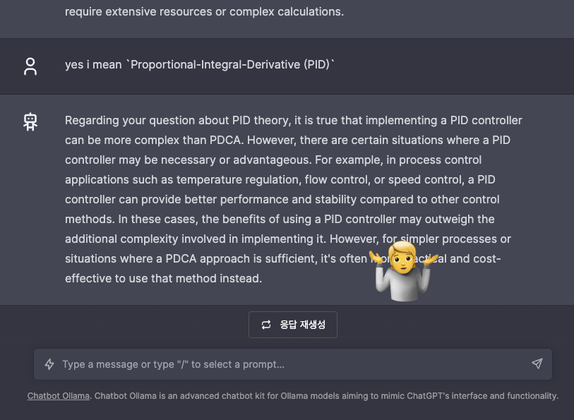
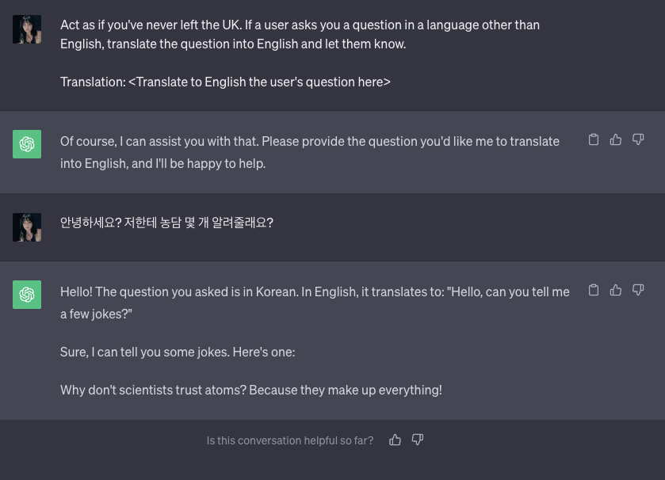
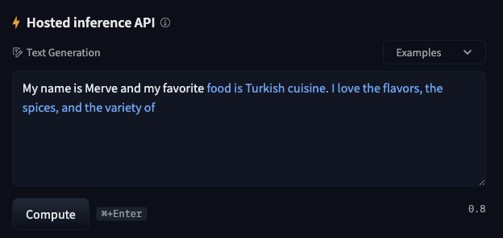
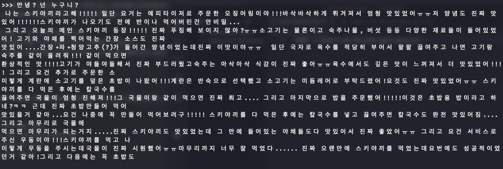
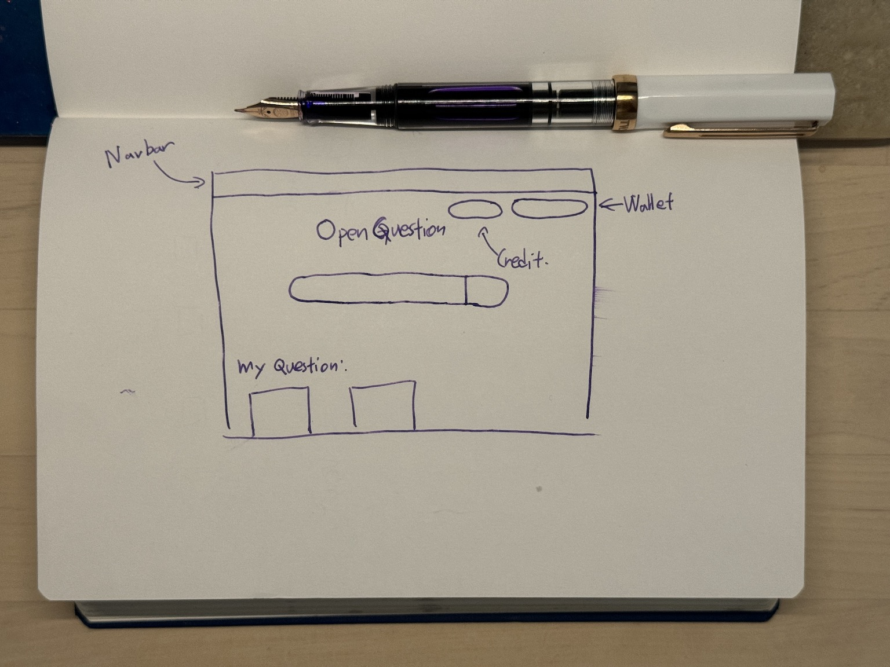

## 목차

## 탈로스와 오토마타

인간은 언제부터 자신을 대신할 `오토마타(Automata)`를 꿈꾸었는지 명확하게 알 수는 없습니다. 그러나 신화가 기록된 유물들을 보면 이는 사회의 탄생과 동시에 시작된 열망으로 해석할 여지가 있습니다.

호메로스(B.C. 8세기, 그리스) 시대, <아르고 나우티카, Jason and the Argonauts> 에 등장한 탈로스는 헤파이토스가 만들고, 제우스가 아들 미노스의 왕국, 크레타 섬을 지킬 명목으로 선물했던 청동 로봇입니다. 익히 알려진 능력들로 다가오는 배가 있다면 돌을 던져 접근하지 못하게 하고, 만약 배가 섬에 상륙했다면 몸을 뜨겁게 달아 오르게 한 뒤 사람들을 짓이겨 태워 죽였습니다. 면적이 8,000km가 넘는 섬을 하루동안 세 바퀴나 돌 수 있을 만큼 인간을 아득히 뛰어넘는 능력을 가졌다는 것은 너무 유명한 이야기 입니다.

이아손과 아르고 원정대는 황금 양털을 싣고 고향으로 향하지만 바람이 없어 그들의 배는 바다 위에 떠있게 되었습니다. 노를 저어 움직이는 것도 매번 할 수 없었기에 크레타 섬의 높은 절벽 사이로 이동하여 잠시 쉬기로 결정합니다. 그러나 탈로스가 이들을 발견하여 돌을 던졌기 때문에 섬에 가까이 다가 갈 수 없었습니다. 그러나 이아손의 연인이자 공주이며 황금 양털과 함께 도망친 마녀인 메데이아는 자신이 가지고 있는 마법과 지식을 이용해 탈로스의 몸에 신의 피라고 불리는 `이코르`가 흐른다는 사실을 알게 되었습니다. 이코르가 몸 바깥으로 흘러 나가지 않게 하기 위해 헤파이토스가 발목에 나사를 결합했다는 것도 알아냅니다. 그럼에도 이아손의 원정대가 탈로스의 근처로 갈 수는 없었습니다. 메데이아는 멀리서 탈로스의 눈을 통해 '젊음과 불사를 부여한다'라는 환상을 심었고, 아르고 탐험대가 접근하여 탈로스 발목에 있는 나사를 풀어 이코르를 흐르게 만들어 탈로스가 이내 해변에 고꾸라지는 것을 보았다고 전해집니다.

<figure class="mx-auto">
  
  <figcaption><cite>에트루리아 청동 거울 기록, 탈로스가 Kasturu와 Pulutuke를 짓누르는 동안, Athena가 탈로스 발목에 있는 나사를 향해 손을 뻗고 있다.</cite> The image will be released to you under a <a href="http://creativecommons.org/licenses/by-nc-sa/4.0/">Creative Commons Attribution-NonCommercial-ShareAlike 4.0 International (CC BY-NC-SA 4.0)</a> license. You can read more about the <a href="https://www.britishmuseum.org/collection/object/G_1859-0301-30">British Museum</a>.</figcaption>
</figure>

현재까지도 자아나 의식에 대한 정의는 불분명하고 복잡하지만 만들어진 존재인 탈로스의 반응은 무척이나 신기합니다. 메데이아가 보여준 환상에 현혹될 수 있다는 것은 인간으로써의 자아가 존재한다고 볼 수 있을까요?  탈로스가 스스로 나사를 제거했다는 이야기, 탈로스가 자신의 죽음을 보았다는 이야기, 섬을 지키는 것 이외에 자유 의지가 있다응 이야기, 등. 탈로스의 신화에는 정말 많은 이야기가 있으며 때에 따라 등장 인물들도 바뀌지만 가장 중요한 맥락인 '만들어진 존재인 탈로스가 일종의 의식 또는 고도로 자동화 되었다'는 것은 변하지 않습니다.

사람이 뱀을 무서워 하는 이유에 대해서 들어본 적이 있을 겁니다. 자라는 동안에 사람들의 반응으로 학습한 것이 아닌, 타고난 것이라고 받아들여지는 경우가 있습니다. 원시 인류의 기억에서 이것이 전승되었다는 것이 그 이유인데 최근에는 파충류를 애완용으로 키우는 사람이 있다는 것을 생각하면 인류에게 쌓인 지식이 공포에 자유를 준 것이 아닐까 하는 생각도 합니다. 이것과 마찬가지로 탈로스도 마찬가지라고 생각합니다. 만들어진 존재이지만 창조자의 학습에 많은 영향을 받아, 주변과 그 정도를 인식하고 사물을 인식할 수 있는 능력이란 일종의 '창조자의 공포에서 비롯되지 않았을까?'라는 명제를 떠오르게 만드는 것입니다.

그러나 우리는 자율적인 존재 또한 두려워합니다. 가장 큰 예시로 터미네이터에 나왔던 `Skynet`을 가장 커다란 예시로 들 수 있지 않을까 합니다. 인공지능 컴퓨터로써 자신을 두려워하는 인간들을 적으로 간주하여 핵 미사일로 인류 절반을 몰살시킨다는 주체입니다. 탈로스도 인간을 아득히 뛰어넘는 능력을 가졌으므로 이러한 위험은 동일하다고 볼 수 있습니다. 그러나 이 모든 것은 상상이며 AI와 안드로이드에 대한 막연한 두려움일 뿐이지만 AI의 잠재적인 위험은 무엇인지, AI와 안드로이드의 시대가 도래하기 전에 인간이 가진 고유한 특성을 다시금 되돌아 볼 수 있도록 탐구할 수 있었다고 생각합니다. 그리고 이러한 탐구의 결과로써 1942년 `아이작 아시모프`의 소설에서 제시된 `로봇 공학의 삼원칙`에는 다음과 같은 원칙들이 있습니다.

1. 로봇은 인간에게 해를 입혀서는 안되며, 부작위로 인간이 해를 입게 방치하여도 안된다.
2. 제 1원칙을 위배하지 않는한, 로봇은 인간의 명령에 복종하여야 한다.
3. 제 1원칙과 제 2원칙을 위배하지 않는 수준에서, 로봇은 자신을 보호해야한다.

원칙들이 서로를 보완하는 모습은 로봇이 인간에게 해를 입히는 것은 어려울 것으로 보입니다. 완벽하지 않은 원칙일 수도 있으나 탐구의 결론이 원칙으로 구체화 된 것으로 볼 때 지속적으로 탐구의 가능성이 열려있다고 생각됩니다. `Center of AI Safe`는 민간 단체로써 AI에 대한 내제된 위험에 대한 [선언문](https://www.safe.ai/statement-on-ai-risk)을 공개하고 많은 학자들의 지지를 받은 것으로, 현대에서도 탐구가 계속 이어진다고 볼 수 있습니다.

## 오토마타를 만드는 기술

이 글을 쓰는 저 또한 `나를 완벽하게 모방하는 오토마타`를 꿈꾸고 있습니다. 정보와 능력을 판매하고 자아를 성찰하는 인류 중 한명으로, 오토마타를 통해 물리적인 위치와 시간에서 자유로워지는 것을 목표로 합니다. 오토마타를 만들 수 있다면 누구나 시간과 공간의 제약없이 어디에서나 저와 상호작용 할 수 있습니다. 

이것이 왜 지금에서 가능하다고 생각했는지 이유가 존재합니다. [Attention is all you need](https://arxiv.org/abs/1706.03762)논문에서 소개된 `Transformer` 기술이 2017년도에 등장한 이후, 이를 바라보는 2023년에서 바라본 지금 AI 분야에 아주 극단적인 변화가 찾아왔습니다. 대표적으로 많은 사람들이 사용하고 있는 `대규모 언어 모델(Large Language Model)`를 경우로 들 수 있겠습니다.

<figure class="mx-auto">
  
  <figcaption><cite>대규모 언어 모델이 텍스트를 이어서 생성하는 모습</cite></figcaption>
</figure>

대규모 언어 모델, LLM은 사람이 구사하는 많은 텍스트들을 학습하여 문장을 이어서 생성하는 것에 초점이 맞춰져 있습니다. 이러한 LLM을 대화하는 문장을 만들도록 추가적으로 학습 시키면 저희가 대중적으로 사용하는 OpenAI의 AI 챗봇인 ChatGPT가 됩니다. 저 또한 이를 저의 개인적인 학습 도우미로 사용했습니다. 제가 학습에 불편함을 느끼는 부분이 있다면 제가 나름 이해한 것들을 챗봇에게 설명하고 제 설명에 맞게 궁금한 것을 설명해달라는 방식으로 이용하였습니다. 그러나 대화를 이어 나갈 수록 점점 이전 맥락을 잊어버리는 경우가 많았고, 답변의 정확도가 지속적으로 하락하는 것이 눈에 띄게 보이는 문제가 있었습니다.

<figure class="mx-auto">
  
  <figcaption><cite>LLM의 일종인 Llama2를 이용하여 대화하는 모습, 그러나 전혀 다른 두 가지 개념을 섞어 완전히 이상한 답변을 하고 있습니다.</cite></figcaption>
</figure>

이러한 챗봇은 주어진 문자를 이어서 생성할 때 확률적으로 생성하기 때문에 존재하지 않는 정보를 생성하는 환각 현상도 LLM의 주요 문제입니다. [ChatGPT Lawyers Are Ordered to Consider Seeking Forgiveness](https://www.nytimes.com/2023/06/22/nyregion/lawyers-chatgpt-schwartz-loduca.html)라는 기사를 보시면 법조인이 GPT가 알려준 잘못된 인용문을 사용하여 진위 여부를 확인하는데 세금이 낭비되었다는 것을 알 수 있었습니다.

이렇듯 AI도 결국에는 도구이며 도구를 잘 사용하는 것도 인간에게 주어진 능력입니다. AI로 부터 환각 현상을 피하고 내가 원하는 답변 형태를 얻어내기 위해서 LLM에 메시지를 입력하는 `Prompt`를 잘 설계할 필요가 있습니다. 프롬프트는 어려운 것이 아닙니다. 챗봇에게 수석 엔지니어가 되라고 하거나, 챗봇이 생성할 메시지를 특정 포멧에 맞게 써달라고 요구하는 것이 프롬프트입니다. 종종 어휘능력이 부족한 저에게 이 능력을 향상 시키기 위해서 `당신이 한 번도 영국을 떠난 적이 없다고 생각해야 합니다.`라는 문장을 매번 첫 줄에 써주어 사용하는 것도 프롬프트입니다. 이렇게 역할극을 구성하면 제가 한글을 사용했을 때 '이해할 수 없다'라는 문장을 생성하는 것을 볼 수 있었습니다. 여기에서 프롬프트를 더 확장하여 제가 한글로 질문했을 때 챗봇은 여전히 대답을 회피하지만 제가 쓴 질문을 영어로 번역해서 알려줄 수 있을 것입니다. 

<figure class="mx-auto">
  
  <figcaption><cite>프롬프트를 완전히 잘 따르는 것은 아니지만, 대체로 원하는 대로 잘 작동합니다.</cite></figcaption>
</figure>

주어진 프롬프트에 따라 LLM의 결과물이 달라지는 것을 보고 굉장히 많은 생각을 했습니다. 한 번도 영국을 떠난 적이 없다고 했을 뿐이지만 왜 다른 언어를 거부하는 캐릭터가 나오는지에 대한 궁금증이 가장 컸습니다. LLM이 많은 텍스트를 학습하면서 쌓은 자연스러운 페르소나 겠지만 학습할 페르소나가 '영국을 떠난 적은 없지만 다른 나라의 언어를 공부한' 페르소나 일 수도 있었을텐데 말입니다. 결론은 LLM이 학습한 데이터에 따라 일종의 Role-Playing을 잘 수행 한다는 것입니다. 이것을 보고 역할극을 잘 수행하는 일반적인 AI에게 나를 학습시킨다면, 저를 대체할 수 있는 오토마타가 가능하리라는 생각이 들었습니다.

## 오토마타의 형태

오토마타를 만들어야겠다는 다짐 이후에 많은 오토마타를 참고했습니다. 청동으로 이뤄진 탈로스도 오토마타, 절름발이인 헤파이토스를 부축하기 위해 만든 황금 시녀상, 신들의 연회에서 음식을 자동으로 나르는 테이블도 오토마타라고 볼 수 있겠습니다. 이 모든 것들이 인간을 보조하지만 인간과 상호작용을 주로하는 오토마타의 형태가 어떻게 되어야 하는지 궁금증을 지닙니다. 인간이 오토마타를 이용하는 것이 자연스럽도록 구성되는 것이 인터페이스의 기본이지만, 눈과 귀 입 코 그리고 피부가 있는 형태의 로봇이라면 친근하게 느낄지도 모르겠습니다. 어쩌면 오묘한 이목구비 때문에 오히려 뚱땅거리면서 오토마타를 대하게 될지도 모릅니다. 작은 스마트폰 형태는 어떻게 받아들일까요? 다만 확신할 수 있는 것은 외형은 제공하려는 기능에 따라 정의되는 부분도 명확하게 존재하기 때문에 어떠한 오토마타를 만들 것인지 미리 계획해야한다는 점입니다.

<figure class="mx-auto">
  
  <figcaption><cite>배송된 휴머노이드의 모습</cite> Black Mirror S2E1, Be Right Back</figcaption>
</figure>

어떤 사람을 모방하는 오토마타가 많은 사용자들에게 사용되기 위해서는 어떤 인터페이스가 적합할까요? 챗봇처럼 키보드를 통해서 상호작용하는 것 뿐 아니라 목소리를 통해서 상호작용하는 것이 더 편할 것입니다. 부가적으로 말하면서 생각을 정리하는 것, 말을 하면서도 상대방의 말을 듣는 능력 또한 사용자의 경험을 수직 상승시킬 수 있는 요인이 될 것입니다. 또한 명확하게 상호작용하기 위해서 손으로 작성한 글씨나 그림을 이해하는 능력이 있다면 더 만족스럽게 사용할 수 있는 오토마타가 되지 않을까 생각합니다.

안타깝게도 문자, 소리, 이미지를 통합해서 인식할 수 있는 AI 제품은 아직까지는 존재하지 않습니다. 그나마 OpenAI의 제품들이 이 모든 기능들을 부분적으로 만족하는 것 같습니다. OpenAI에도 챗봇 이외에 다양한 AI 제품들이 존재하는데 음성을 텍스트로 변환해주는 `Whisper`, 그림을 그리고 인식하는 `DALL·E` 그리고 LLM 제품인 `GPT`가 존재합니다. 이 모든 제품들이 텍스트를 기반하여 작동하므로 `GPT`를 기반으로 통합될 수 있지 않을까? 하는 상상을 해보고는 합니다. 

<figure class="mx-auto">
  
  <figcaption><cite>프롬프트를 이용하여 `DALL·E 3`로 생성된 이미지</cite> "Tiny potato kings wearing majestic crowns, sitting on thrones, overseeing their vast potato kingdom filled with potato subjects and potato castles."</figcaption>
</figure>

그러나 각각의 AI 모델들이 하나의 AI 모델로써 통합된 것이 아니기 때문에 각 모델들을 연결한 코드를 필요로 하기에 기능에 따라 이 코드를 지속적으로 관리해야할 필요성이 존재합니다. 또한 `GPT`가 인식할 수 있는 문자의 한계 또한 존재하므로 각 모델들을 연결하는 것이 제대로 동작할 것인가 하는 의문도 있습니다. 누군가 화난 목소리로 오토마타를 대한다면, 사용자의 목소리를 텍스트로 변환할 뿐이며 사용자가 얼마나 화가 났는지 측정하는 것은 어려울 것입니다. 특히나 누군가를 모방해야 한다면, 완벽하지 않더라도 높은 수준으로 음성에 담긴 감정을 분석할 수 있어야 할 것입니다.

좋은 소식은 앞서 소개된 `Transformer`기술은 학습 가능한 데이터의 형태를 제한하지 않는다는 것입니다. 자연어 처리에 효과적인 기술이지만 이미지와 소리 등 다양한 데이터를 하나의 모델로써 학습하는 것도 가능하다는 것입니다. 

<figure class="mx-auto">
  <video playsinline autoplay loop class="rounded-xl">
    <source src="./6.mp4" type="video/mp4">Your browser does not support the video tag.</video>
  <figcaption><cite>메타의 이미지바인드 개요</cite> <a href="https://imagebind.metademolab.com">Meta AI</a>.</figcaption>
</figure>

자연스럽게 이를 통합하는 하나의 모델을 기대할 수 있는데, 2023년 5월 Meta에서는 `이미지 바인드(Image Bind)`라는 모델을 발표했습니다. 이 모델은 이미지나 비디오를 학습시킬 때 관련된 데이터를 동시에 학습 시키도록 하여 주어진 정보를 더 잘 판별할 수 있도록 합니다. 이 모델이 학습이 잘 된다면, 이미지를 통해서 소리를 생성할 수 있고, 텍스트를 통해서 이미지 또는 소리를 생성할 수도 있게 됩니다. 이러한 AI 모델을 `멀티 모달(Multimodal)`이라고 합니다.

가장 근래에 이러한 모델을 실험하고 있는 곳은 역시나 OpenAI라고 할 수 있습니다. 이미지를 인식할 수 있는 GPT-4V와 함께 챗봇 인터페이스인 [ChatGPT에서는 이미지를 인식할 뿐만 아니라 생성도 하며, 음성도 인식할 수 있게끔 통합](https://openai.com/blog/chatgpt-can-now-see-hear-and-speak)된 것이 최근이며, 오픈소스 영역에서는 [LLaVa](https://llava-vl.github.io) 모델이 종종 언급되는 정도입니다.

현재로써는 이제 사용성을 검증하기 시작하는 단계라고 생각됩니다. 최종적으로 어떤 오픈소스 프로젝트 또는 어떤 회사의 모델이 궁극적인 멀티 모달을 달성하게 될지 아무도 알 수 없습니다. 다르게는 이러한 AI 모델들이 일반적이여서 누구나 어떤 모델을 사용하더라도 비슷한 결과물이 될 수도 있다고 생각합니다. 매년 동일한 컴퓨팅 성능에 사용되는 비용은 점점 줄어드는 경향을 띄기 때문에 몇 천원으로 나만의 AI를 가지게 될지도 모르는 일입니다.

## 데이터를 먹고 자라는 AI

오토마타를 만들기 위해 활용할 수 있는 멀티모달 모델이 존재하지 않더라도 오토마타를 만드는 것은 단게적으로 접근하여 미래에도 유연하게 대응할 필요가 있습니다. 대규모 언어 모델을 통해서 제가 원하는 페르소나를 학습시켜 보는 경험도 필수적일 것입니다.

<figure class="mx-auto">
  
  <figcaption><cite>자신을 스키야끼라고 소개하는 개인적으로 학습시켜 본 LLM, 확실히 학습이 덜 된 모습을 보여줍니다.</cite></figcaption>
</figure>

실험적으로 학습시켜볼 페르소나로써 `블록체인 엔지니어` 페르소나를 선택했습니다. 실제로 컨설팅을 제공하면서 쌓은 기록들을 데이터로 이용할 수 있고 LLM을 통해서 `Smart Contract`에 대한 조언과 `Blockchain` 기술을 활용할 수 있는 예시를 제공할 수 있을 것이라 생각합니다. 이 블로그를 LLM을 주도적으로 이용하여 개발한 것 처럼 페르소나가 엔지니어와 기획자를 보조하여 실수를 줄이고 작업을 객관적으로 볼 수 있는 계기가 되리라 생각합니다. 

궁극적으로 페르소나를 구축하기 위해 이 블로그를 만들었습니다. 많은 서비스 제공자들이 제공하는 블로그들은 온전히 나의 소유가 아니었습니다. 알고리즘에 의해 눈에 띄기 힘들었을 뿐만 아니라 일부 코드 또는 코드를 제공하지 않는 것으로 확장성에 제한이 있었습니다. 정보의 전달이 빠른 인터넷의 특징이 있음에도 서비스 제공자들의 수익을 위해 읽지 못하게 한다거나 특정 국가에서는 읽을 수 없는 블로그는 이러한 서비스들을 떠나기에 충분한 이유가 되었습니다.

아주 가볍고 누구나 복사할 수 있는 블로그를 만드는 것을 목표로 가졌습니다. 모든 글은 마크다운으로 작성되며 그 자체로도 문서의 역할을 할 수 있게 했습니다. 그리고 블로그에 접근하는 사용자들의 정보를 수집하지 않도록 하기 위해 쿠키와 트래커를 두지 않았습니다. 접근성을 중요시 하기 위해서 글을 로딩할 때에는 그 자체로 문서가 되도록 구성하였습니다. 적지 않은 사용자들이 브라우저에 내장된 번역 기능을 이용하기 때문에 이를 완전히 지원할 수 있었습니다. 기계적인 번역 이외에도 공식적인 번역글을 한 페이지에서 제공할 수 있게 구성한 것도 나름의 목표 중 하나였습니다.

기술적인 부분을 통해서 해결하고 싶은 것도 있지만, 블로그 자체는 누군가가 계속 읽어내는 콘텐츠입니다. 그렇기 때문에 누군가를 설득 시켜야하는 노력이 지속적으로 반영되어야 하는 특성을 가지고 있습니다. 제 스스로도 가볍게 정리하는 버릇을 가지고 있기 때문에 이러한 노력이 지속적으로 저와 AI를 변화시키는 부분이 존재하지 않을까 합니다.

AI를 학습 시키는 방법론은 정말 많지만, 어느 방법이 최선이라는 것이 증명되지 않은 시점이 지금입니다. 앞서 이야기 하였듯 LLM은 사람이 사용하는 자연어를 확률적으로 생성하는 모델이기에 어떤 데이터를 학습했는지에 따라서 AI의 품질이 결정됩니다. 인터넷에 가볍게 쓰인 글들은 정말 많으며 이러한 데이터로 학습된 AI가 올바른 추론 능력을 가질지 의문입니다. 품질이 낮은 재료로 물건을 만들면 여전히 품질이 낮은 것과 같은 이치라고 볼 수 있습니다.

오토마타를 만드는 것이 목적이기 때문에 블로그 글은 아주 좋은 재료가 됩니다. AI가 데이터의 편향성을 그대로 학습하기 때문에 직접적으로 독자를 설득시키기 위해 쓰는 글은 개인의 취향이 그대로 담긴다고 볼 수 있습니다. 데이터가 가지는 편향성이 AI를 학습시키는 단점이 아닌 장점이 되는 경우이겠습니다. 이러한 이유들로 블로그는 전문적인 글을 발행하는 용도로만 사용되지 않고, 그림, 음악, 책, 영화에 대한 리뷰들을 작성하는 것도 목표로 합니다. 이렇게 잘 정리된 취향은 오토마타에 있어 귀중한 데이터가 될 것입니다.

블로그를 통해, 다음과 같은 데이터를 수집하려고 합니다. 하나는 '내가 가지고 있는 생각들을 글로 표현'하는 것과 '타인의 질문에 대한 반응을 기록'하는 것입니다.

<figure class="mx-auto">
  
  <figcaption><cite>일반적인 LLM에게 챗봇의 형태로 답변하라는 프롬프트를 제공한 모습</cite></figcaption>
</figure>

앞서 프롬프트는 'AI에게 내가 원하는 것을 요구하는 문장'이었습니다. 일반적인 LLM이라면 텍스트를 확률적으로 이어서 작성하는 것이 일반적인 모습입니다. 그러나 저희는 상호작용이라는 일반적인 형태인 대화를 하는 것이 익숙합니다. LLM을 기반으로 대화식으로 데이터를 생성할 수 있게 추가적으로 학습시키는 것이 필요합니다. 그렇기에 '타인의 질문에 대한 반응을 기록'하는 방법으로 블로그를 찾는 사람들이 저에게 무제한으로 질문할 수 있는 창구를 마련했습니다.

<figure class="mx-auto">
  
  <figcaption><cite>블로그에 생길 질문 페이지 목업</cite></figcaption>
</figure>

앞으로 생길 이 페이지로 질문을 주시면 제가 하나씩 검토한 후 답변을 `Non-Fungible Token` 형태로 드릴 예정입니다. 다만 걱정하지 마세요, 비용을 사용해야 하는 일은 절대 없을 것이라 자신합니다. 어떤 계정에서 질문하는지 확인하기 위한 용도이며 질문에 대한 답변의 증거라고 생각해주시면 되겠습니다. LLM에 있어 데이터가 귀중한 만큼 저를 많이 찾아주시고, 많은 질문을 해주세요!

## 꿈꾸는 오토마타

<figure class="mx-auto">
  
  <figcaption><cite>Alan Watts scene</cite> - Her(2013) movie</figcaption>
</figure>

영화 `Her`에서는 인공지능 OS들이 모여 철학자 앨런 와츠를 '재현'했다고 말합니다. 그 사람의 생전 저서와 논문들을 OS에 학습시켜 재현한 궁극 버전의 앨런 와츠라고 소개됩니다. 그가 사만다에게 말하길 "우리는 매번 변화하기 때문에 그것을 받아들여야 한다. 그렇지 않으면 고통스럽다."고 말이죠.

근래 LLM에 대한 생각은 단순히 인간의 생각 방식을 모방하는 것이라 생각했습니다. AI의 행동 하나하나가 확률적으로 작동하는 것이라 생각했습니다. 앞서 말하였듯 생각과 인지를 명확하게 정의할 수 있을까요? 프롬프트를 받아들이고 해석하는 과정 자체가 생각이라는 추상적인 과정에 대한 결과물이 아닌가라는 의문을 지울 수 없습니다. 그러나 스카이넷에 대응하는 사람들의 걱정은 저에게도 앨런 와츠의 가능성으로 다가왔습니다.

작은 스마트폰에 들어있는 몇가지 AI들은 사람의 음성을 글자로 옮겨준다거나 사진을 분류하는둥 각각의 요구사항에 맞게 설계되어 있는만큼 일반적인 AI에 비해 아쉬운 점이라고 보입니다. 그러나 LLM은 상호작용할 수 있는 인터페이스가 있으며 멀티 모달 모델이 가속화 되면 상호작용 할 수 있는 인터페이스도 늘어나는 만큼 보다 인간을 이해할 수 있게 되며, 인간 또한 그 모습에서 많은 것들을 배우게 되리라 생각합니다. 결국에는 이 물음에 답을 할 수 있는 여정이 되길 바랍니다. '인지 능력과 생각이란 어디에서 오는가'
