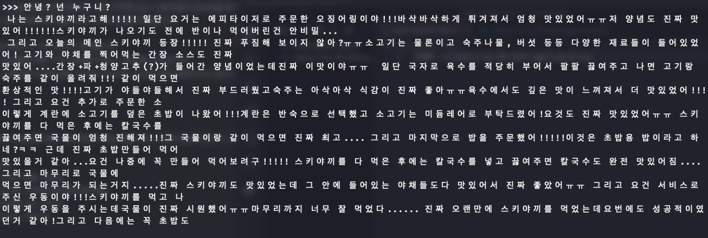
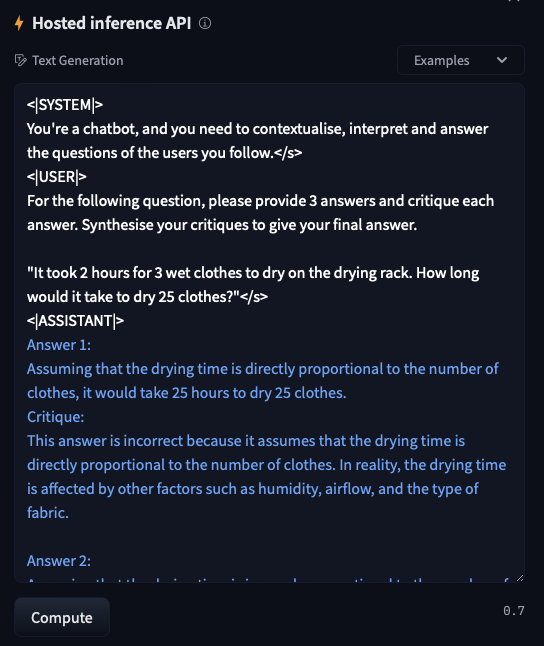

## 탈로스와 오토마타

인간은 언제부터 자신을 대신할 `오토마타(Automata)`를 꿈꾸었는지 명확하게 알 수 없으나, 많은 신화들이 기록된 유물들을 보고 있자면, 사회의 탄생과 동시에 시작된 열망이 아닌가 합니다. 이를 증명하듯 호메로스(B.C. 8세기, 그리스) 시대, 크레타 섬을 지키도록 명령 받은 청동 로봇 탈로스는 신 헤파이토스에 의해 창조 되었다고 전해져 내려오고 있습니다.

몸은 청동으로 이뤄져 자신의 몸을 빨갛게 달아 오르게 할 수 있어 적들을 짓이기며 태워 죽일 수 있고, 면적이 8,000km가 넘는 섬을 하루동안 세 바퀴나 돌 수 있는 능력이 주어진 탈로스에게도 약점이 존재했습니다. 탈로스는 속이 빈 청동으로 만들어져, 내부에는 신의 피라고 불리는 `이코르`로 채워져 있어 이코르가 흘러나오지 않도록 발목에 있는 나사로 마감되어 있다는 점이겠습니다. 이 나사가 풀리면 이코르가 흘러나와 죽음에 이르겠지만, 이렇게 강력한 탈로스 근처에 접근할 수 있는 인간이란 있을 수 있을까요?

아르고 나우티카 속 마녀 메데이아는 탈로스를 무찌르기 위해 자신이 가지고 있는 마법을 이용합니다. 메데이아가 탈로스에게 젊음과 불사를 부여한다는 환상을 심었을 때, 아르고 탐험대는 탈로스 발목에 있는 나사를 풀어서, 몸 안에 있는 이코르를 바깥으로 빼내어 작동을 멈추게 하였습니다.
<figure class="mx-auto">
  
  <figcaption><cite>에트루리아 청동 거울 기록, 탈로스가 Kasturu와 Pulutuke를 짓누르는 동안, Athena가 탈로스 발목에 있는 나사를 향해 손을 뻗고 있다.</cite> The image will be released to you under a <a href="http://creativecommons.org/licenses/by-nc-sa/4.0/">Creative Commons Attribution-NonCommercial-ShareAlike 4.0 International (CC BY-NC-SA 4.0)</a> license. You can read more about the <a href="https://www.britishmuseum.org/collection/object/G_1859-0301-30">British Museum</a>.</figcaption>
</figure>

제가 이 신화에서 주목한 것은 탈로스의 자의식이었습니다. 자아나 의식에 대한 정의는 불분명하고 복잡하지만, 메데이아가 보여준 환상에 현혹될 수 있다는 것은 인간으로써의 자아가 존재한다. 고로, 젊음과 불사를 갈망하는 마음이 의식의 증거라는 반증이 가능하기 때문입니다. 

탈로스는 그 당시에 충족할 수 없는 기술, 인간의 손에서 만들어 진 것이 아닌 신의 기술에 의해 작동하기에 종종 만들어진 생물, 그러니까 안드로이드로 인식되는 것이 일반적이었습니다. 그렇기에, 인간과 유사한 자아를 가지는 것이 굉장히 이질적이지만, 앞선 메데이아의 환상에 대한 반응 때문에, 한편으론 온당한 것으로 받아들여졌습니다.

대장장이의 신인 헤파이토스의 발명품 중 완전한 인간의 형태를 갖추고 있으며, 온 세상에 질병, 욕심, 시기, 질투를 퍼트린 판도라가 있습니다. 판도라의 이야기를 듣고, 다시 탈로스를 떠올려보면 궁금한 것이 생깁니다. 탈로스가 안드로이드로 인식되는 유일한 이유가 청동으로 된 피부를 가졌다는 이유인데, 판도라를 만들었던 기술력이라면 발목의 나사조차도 남기지 않을 수 있었을 것입니다. 여기에서 헤파이토스가 탈로스를 완벽하게 만들지 않았다는 점에서 인간과 안드로이드를 명확하게 나누는 장치로 사용한 것인지 말입니다.

서로의 외형에서 차이가 나는 이유가 이야기의 맥락속에 분명 존재하지만, 안드로이드를 명확히 하는 것에 이유가 있을 것입니다. 외형은 타인이 인식할 수 있는 중요한 요소이지만, 이들은 하나같이 자율적으로 동작하는 오토마타라는 특성을 공유하며, 인간과 다른 이들에 대한 윤리적이고 철학적인 질문들을 쏟아낼 수 있어야 합니다. 

탈로스의 증거들을 바탕으로 현대의 `Artificial Intelligence`가 인간의 본질을 해칠 수 있는지, 잠재적인 위험은 무엇인지, AI와 로봇의 시대가 완전히 도래하기 전부터 인간이 가진 고유한 특성을 다시금 되돌아 볼 수 있도록 탐구할 수 있었다고 생각합니다. 탐구의 증명으로, `아이작 아시모프`가 제시한 `로봇 공학의 삼원칙`을 예로 들 수 있다고 생각합니다.

1. 로봇은 인간에게 해를 입혀서는 안되며, 부작위로 인간이 해를 입게 방치하여도 안된다.
2. 제 1원칙을 위배하지 않는한, 로봇은 인간의 명령에 복종하여야 한다.
3. 제 1원칙과 제 2원칙을 위배하지 않는 수준에서, 로봇은 자신을 보호해야한다.

여기서 제시되는 로봇은 스스로 판단할 수 있는 지능을 지녔음에도, 존재 자체로 인간에게 헌신해야 하기 때문에, '인간은 나태를 추구하기 위해 태어난 존재인가'라는 고민도 자연스럽게 하게끔 합니다.

그러나 저 또한 `나를 완벽하게 모방하는 오토마타`를 꿈꾸고 있습니다. 정보와 능력을 판매하고 자아를 성찰하는 인류 중 한명으로, 물리적인 위치와 시간에서 자유로워지고 보다 고차원적으로 자아를 성찰하기 위함입니다. 이것이 목표로써 달성된다면, 누구나 시간과 공간의 제약 없이 어디에서나 저와 상호작용할 수 있지만, 그 상호작용 과정에서 물리적인 '나'를 제거할 수 있을 것이라 생각합니다.

그러나 왜 지금에서 이것이 가능하다고 느꼈을까요? [Attention is all you need](https://arxiv.org/abs/1706.03762) 논문에서 소개된 `Transformer` 기술이 2017년도에 등장한 이후 AI 분야에 많은 변화가 찾아왔으며, 2023년에서 바라본 지금 이 업계 전반이 쉴틈 없이 달려온 것 처럼 보입니다. 그 결과 글을 쓰는 시점에서, 많은 사람들이 자신이 가지고 있는 기기들에서 텍스트 기반의 AI, `대규모 언어 모델(Large Language Model)`을 사용할 수 있게 되었습니다.

<figure class="mx-auto">
  
  <figcaption><cite>LLM의 일종인 Llama2를 이용하여 대화하는 모습, 그러나 정확한 답변이 아닌 모습을 보여주고 있습니다.</cite></figcaption>
</figure>

대규모 언어 모델이란, 사람이 구사하는 언어를 이해하고 생성하도록 만들어진 인공지능 시스템이라고 볼 수 있습니다. 그나마 저희에게 잘 알려진 것으로는 OpenAI의 AI 챗봇인 ChatGPT라고 볼 수 있습니다. 저 또한 ChatGPT를 등장과 함께, 현재는 Meta의 Llama 2를 즐겨 사용하고 있습니다.

가장 처음, 학습 도우미로써 굉장히 많이 사용했습니다. 제가 막히는 부분이 있는 경우, 제가 이해한 것을 설명하고 제 설명에 맞게끔 특정 주제를 설명해달라는 식이죠. 그러나 점점 이전 맥락을 잊어버리는 경우가 많았고, 답변의 정확도가 지속적으로 하락하는 것이 눈에 띄게 보였습니다. 

<figure class="mx-auto">
  
  <figcaption><cite>개인적으로 학습시킨 대규모 언어 모델, 자신을 스키야끼라고 소개하는 중.</cite></figcaption>
</figure>

특히 LLM은 주어진 문자들을 이어서 생성하는 형태에 가깝기에, 존재하지 않는 정보를 생성하는 환각 현상도 문제들 중 하나입니다. [ChatGPT Lawyers Are Ordered to Consider Seeking Forgiveness](https://www.nytimes.com/2023/06/22/nyregion/lawyers-chatgpt-schwartz-loduca.html) 대표적인 예시로 이 기사를 보시면, 법조인이 GPT가 알려준 잘못된 인용문을 레퍼런스로 사용하여 이를 확인하는데 세금이 낭비되었다는 것을 알 수 있습니다.

그러나 결국 AI도 도구이며, 도구를 잘 활용하는 것도 인간에게 주어진 능력입니다. AI로 부터 환각 현상을 피하고, 내가 원하는 답변 형태를 얻어내기 위해 `Prompt`를 잘 설계하여야 합니다. 이러한 프롬프트는 어려운 것이 아닙니다. 챗봇에게 "시니어 엔지니어"가 되라고 하거나, 답변의 형태를 특정 포멧에 맞게 써달라고 요구하는 것입니다. 

저는 종종 저에게 부족한 어휘 능력을 향상 시키기 위해서, 강제로 `당신이 단 한 번도 영국을 떠난적 없는 것 처럼 행동하세요.`라는 Prompt를 사용했습니다. 이렇게 역할극을 구성하면 높은 확률로 제가 한글을 사용했을 때, 이해할 수 없다는 답변을 하는 걸 볼 수 있었기 때문에 종종 사용하게 되는 것 같습니다. 

여기에서 프롬프트를 더 확장 시킨다면 어떻게 해볼 수 있을까요? 내가 한글로 질문했을 때 챗봇은 여전히 대답하지 못하겠지만, 제가 쓴 한글 질문을 영어로 번역해서 알려줄 수는 있겠죠. 다음과 같은 프롬프트를 사용하면 됩니다. 

<figure class="mx-auto">
  
  <figcaption><cite>프롬프트를 완전히 잘 따르는 것은 아니지만, 대체로 원하는 대로 잘 작동합니다.</cite></figcaption>
</figure>

이러면, 거듭 인용표로 묶여진 텍스트는 사라지고 번역된 텍스트가 위치해 있는 것을 확인할 수 있습니다.

이렇게 AI 스스로 프롬프트에 의해 자신이 연기할 캐릭터가 무엇인지 자율적으로 정의하는 것을 보고 굉장히 많은 생각을 했습니다. 예를 들면, 한 번도 영국을 떠난 적 없다고 했을 뿐인데, 다른 언어를 거부하는 것은 왜 그런지 말입니다. 다른 몇가지 언어를 공부했을 수도 있습니다. 미래의 여행을 위해서 라든지, 또는 다른 나라 사람과 어울리는 사람일 수도 있습니다. 이런 페르소나가 학습 되었어도 동일한 결과가 나왔을지 하는 근본적인 물음이 드는 것입니다. 결국 이러한 역할극을 수행하는 이유는, 많은 데이터에 의해 학습된 결과물이라는 것입니다. 

제가 컨설턴트로써 제공하는 기술 중에는 `Solidity`와 `Blockchain`에 관한 정보들인데, 제가 제공하는 정보들을 LLM에 집중적으로 학습시키는 것으로 해당 분야에 대해 전문성을 더할 수 있습니다. 이를 `Fine-Tuning`이라고 합니다. `Fine-Tuning`의 대표적인 예시로, 오픈소스 LLM인 Meta가 개발한 Llama 2 라는 모델이 존재합니다. 이 모델을 기반으로, 코드 작성에 파인 튜닝된 `Code Llama`는 개발자가 작성한 코드를 알아보고, 더 나은 코드 작성법을 알려주거나, 개발자가 원하는 코드를 자연어로 이야기 하면 대신 작성하는데 최적화 되어 있는 것이 특징이라고 볼 수 있습니다.

이렇게, 역할극을 잘 수행하는 일반적인 AI에게 나를 학습시킨다면, 저를 대체할 수 있는 오토마타가 가능하리라는 생각이 들었습니다. 그러나 현 시점의 오토마타가 사람처럼 자율성을 가지고 끊임없이 학습할 수 있는가? 라는 물음에는 대답하기 어렵다고 생각합니다.

OpenAI의 GPT 모델의 경우, 2021년 8월까지의 데이터로 학습되어 있다는 것도 눈여겨 볼 점입니다. 그들은 왜 더 최신의 정보를 LLM에 반영하지 않을까요? 물론 최신의 정보를 학습시키기 위한 노력도 내부적으로 존재하겠지만, 이를 도구로써 사용하는 입장에서는 사람의 말을 이해하고 대답하는 수준에서의 AI라면 이미 충분하다고 생각됩니다. AI가 세상 모든 정보를 학습할 수 없지만, 최소한의 언어를 이해할 수 있다면 해당하는 지식을 학습하는 것이 어렵지 않을 것입니다. 

이러한 사안을 반증하듯, OpenAI의 최신 LLM 모델은 `GPT 4` 입니다. 직전 세대인 `GPT 3.5`보다 명확하게 추론 능력이 좋은데, [OpenAI의 GPT 3.5 기반의 Fine-Tuning이 발표](https://openai.com/blog/gpt-3-5-turbo-fine-tuning-and-api-updates) 이러한 발표에는 Fine-Tuning된 `GPT 3.5`의 일부 성능이 `GPT 4`를 능가했음을 보여주는 것이 확인되었다고 하여 LLM이 기본을 수행하는 것이 얼마나 중요한 것인지 알 수 있었고, Fine-Tuning이 필요에 따라 사용하게 되는 기술이 되지 않을까 하는 계기가 되었습니다.

## 오토마타의 형태
저희는 많은 형태를 한 오토마타를 많이 보았습니다. 청동으로 이뤄진 탈로스도 오토마타이고, 절름발이인 그를 부축하기 위해 만든, 황금 시녀상 그리고 신들의 연회에서, 음식을 자동으로 나르는 테이블까지도 오토마타라고 볼 수 있겠습니다. 모두가 자신이 창조된 이유에 걸맞는 형태를 가지고 있다고 볼 수 있습니다.

그렇다면, 인간과 상호작용하는 오토마타의 형태는 어떨까요? 눈과 귀, 입 코 그리고 피부가 있는 형태의 로봇이라면 친근하게 느낄 수 있을까요? 또는 한 손에 들어오는 작은 스마트폰 형태라면 괜찮을까요? 다만 확신할 수 있는 것은 외형은 제공하려는 기능에 따라 정의 된다는 것이기에, 어떠한 오토마타를 만들 것인지 고민하는 것이 필요합니다.

<figure class="mx-auto">
  
  <figcaption><cite>배송된 휴머노이드의 모습</cite> Black Mirror S2E1, Be Right Back</figcaption>
</figure>

많은 사용자들에게 판매할 오토마타를 만든다고 상상해봅시다. 제품을 만들기 전에 최종적으로 어떤 모습을 가질지 상상하는 것은 프로젝트를 기획하는데 있어, 상당한 도움이 됩니다. 그러나, 현재 주어진 다양한 법이나 기술과 같은 제한들이 존재합니다. 이러한 제한들 까지 고려해서 어떤 오토마타를 만들 수 있는지 확인해야하죠.

어떤 사람의 생각을 모방하는 오토마타가 많은 사용자들에게 사용되기 위해서는 어떤 인터페이스를 필요로 할까요? 챗봇 처럼 문자를 통해서 상호작용하는 것 뿐만 아니라, 목소리를 통해서 상호작용하는 것도 꽤 좋은 경험을 줄 것이라 생각됩니다. 물론, 말하면서도 생각을 하는 수준의 연산 능력도 요구되는 부분이겠습니다. 이러한 것을 손에 쥘 필요가 없다면 더 좋겠지요! 명확하게 상호작용하기 위해서, 그림을 이해하는 능력이 있다면 만족스러운 인터페이스가 될 것입니다.

그러나 현재로써 이러한 기능들을 만족시킬 수 있을만한, AI 제품은 없다고 보는 것이 합당합니다. 그나마, OpenAI의 제품들이 이 모든 것들을 부분적으로 만족하는데, `Whisper`라는 모델은 사용자의 음성을 듣고, 이 음성을 텍스트화 해서 보여주는 것에 최적화 되어 있는 AI모델입니다. 그리고 AI가 그림을 그리려면, `DALL·E`라는 AI 모델을 이용할 수 있습니다. 이러한 AI 모델들 모두 텍스트를 기반하기에 앞서 소개했던 대규모 언어 모델인 `GPT`를 이용하면 추론이 가능해지므로, 어렴풋이 모방이 가능하지 않을까 합니다.

그렇지만, OpenAI의 각 AI 모델들이 하나의 AI 제품으로써 통합된 것이 아니기 때문에, 각 모델들을 연결할 코드를 필요로 합니다. 그리고 문자의 한계도 분명 존재하기에, 이렇게 각 모델들을 연결만 하는 것이 제대로 작동할 것인지에 대한 의문도 있습니다. 예를 들어보면, 누군가가 굉장히 화가난 목소리로 이야기 한다고 합시다. 음성을 텍스트로 변환해주는 모델은, 이를 텍스트로 변환할 뿐이며, 사용자가 얼마나 화가났는지 측정하는 것은 어렵습니다. 특히, 누군가를 모방해야 하는 오토마타라면 완벽하진 못하더라도 높은 수준의 모방도 불가능합니다.

여기 또 다른 예시를 보시겠습니다. 오토마타는 제가 좋아할만한 취향에 대해서도 명확하게 구분할 줄 알아야 한다고 생각합니다. 이러한 취향들은 명확한 단어로 정의되기 어려운 부분들이 존재합니다. 직접적인 예시로, 제가 좋아하는 수 많은 음악들 중, 3개를 가져왔습니다. `사랑이 잘 - 아이유, 오혁`, `Oh Boy - Red Velvet`, `Thirsty - æspa`. 이 음악들을 언어 모델에 학습 시킨다고 하면, 작곡가, 작사가, 가사, 그리고 많은 사람들이 내리는 각 음악들에 대한 평가 등 텍스트화가 가능한 음악들의 정보를 학습시킬 수 밖에 없을 것입니다. 그리고 일련의 음악 목록을 언어 모델에 넣고, 제가 좋아할만한 음악을 추천해달라고 하는 경우, 언어 모델은 문자 기반의 패턴만 분석하여 추천할 가능성이 매우 높다고 생각하며, 결과적으로 제 마음에 드는 음악을 추천하는 경우는 절반도 되지 않을 것입니다.

그러나 좋은 소식도 있는데, 앞서 소개된 `Transformer`기술은 학습 가능한 데이터의 형태를 제한하지 않는다는 것입니다. 물론 자연어 처리에 아주 효과적이지만, 텍스트, 이미지, 소리 등등 다양한 데이터를 학습할 수 있는만큼, 이를 통합하는 하나의 모델을 기대할 수 있는 것입니다.

<figure class="mx-auto">
  <video playsinline autoplay loop class="rounded-xl">
    <source src="./hero_video-2f48dad3.mp4" type="video/mp4">Your browser does not support the video tag.</video>
  <figcaption><cite>메타의 이미지바인드 개요</cite> <a href="https://imagebind.metademolab.com">Meta AI</a>.</figcaption>
</figure>

2023년 5월, Meta에서 `이미지 바인드(Image Bind)`라는 모델을 발표했습니다. 여기에는 이미지나 비디오를 학습시킬 때 관련된 데이터를 동시에 학습 시키도록 하여 주어진 정보를 더 잘 판별할 수 있도록 합니다. 이렇게 되면, 이미지를 통해서 소리를 생성할 수 있고, 텍스트를 통해서 이미지나 소리를 생성할 수도 있는 것입니다. 이러한 AI 모델을, `멀티 모달(Multimodal)`이라고 하며, 다양한 인터페이스를 통해서 정보를 주고 받을 수 있는 AI를 이릅니다.

멀티 모달이 가능해지면, AI에게 연결할 수 있는 인터페이스들이 더 늘어나며, 이러한 인터페이스를 통해 AI와 상호작용할 수 있게 됩니다. 소리를 들을 수 있는 마이크, 깊이감을 인식할 수 있는 몇개의 카메라와 라이다 센서, 자신이 올바르게 세상을 보고있는지 판별하기 위한 기울기 센서, 그리고 제가 상상하지 못하는 다양한 인터페이스들이 존재할 수 있습니다. 상상할 수 있는 오토마타의 형태가 더 다양해 질 수 있겠습니다.

또 다른 방법으론, 대규모 언어 모델을 통해 다른 모델을 통제하는 형태로 멀티 모달을 구현할 수도 있습니다. 소리나 이미지를 판별하고 생성하는 모델을 LLM이 통제할 수 있도록 Fine-Tuning하는 것입니다. 특히, OpenAI의 GPT-4를 기반하여 시각 정보를 인식할 수 있는 GPT-4V(Vision)이 공개 되었으나, 챗봇 인터페이스인 [ChatGPT에서는 이미지를 인식할 뿐만 아니라 생성도 하며, 음성도 인식할 수 있게끔 통합](https://openai.com/blog/chatgpt-can-now-see-hear-and-speak)되었다는 것을 발표했습니다. 다만 이것에는 [GPT-4를 기반으로 학습되었다는 내용만 있을뿐, 시각 인코더를 대규모 언어 모델에 통합하거나, DALL·E의 시각 언어를 대규모 언어 모델에 Fine-Tuning하는 방법을 사용하지 않고 확장](https://export.arxiv.org/abs/2309.17421) 하였다고 나오는데, 이 방법이 궁금하네요. 특히나 [마이크로소프트 연구진들이 GPT4를 극 초기 AGI(사람보다 더 뛰어난 AI)로 평가](https://www.microsoft.com/en-us/research/publication/sparks-of-artificial-general-intelligence-early-experiments-with-gpt-4/)하기도 한 만큼 이번 발표가 잘 만들어진 대규모 언어 모델을 기반으로, 다양한 인터페이스로 확장할 수 있다는 것이기에 앞으로의 OpenAI 행보가 더욱 기대되는 것 같습니다.

현재로써 이는 그저 발표단계일 뿐입니다. 어떤 오픈소스 프로젝트, 어떤 회사가 일반적인 사용자들이 만족하면서 사용할만한 멀티 모달을 달성하게 될지는 아무도 알 수 없습니다. 현재는 가능성을 탐구하는 수준의 제품들이며 이를 통해 최종적인 모습을 짐작할 수 있을 뿐입니다. 특히, 동일한 컴퓨팅 성능에 사용하는 비용은 점점 줄어드는 양상을 보이기 때문에, 몇 천원에 나만의 AI를 가지게 될지도 모르는 일입니다.

당장 활용할 수 있는 멀티 모달 솔루션이 존재하지 않더라도, 오토마타를 만드는 것을 단계적으로 접근하여 미래에도 유연하게 대응할 수 있게 개발을 수행하여야 합니다. 그렇기에, 사용자와 AI가 상호작용할 인터페이스를 먼저 만들어야 하므로, API 형태로 개발하는 것이 가장 합당해 보입니다. 사용자는 API를 잘 활용한 그래픽 인터페이스를 이용하거나, 물리적인 인터페이스를 이용하여 오토마타와 상호 작용하면서도, 멀티 모달이 활성화 되거나 AI 모델이 교체/업데이트 되더라도 오토마타를 사용하는 것에 아무런 문제가 발생하지 않을 것입니다. 또한 대규모 언어 모델과 같이 학습과 구동에 아주 많은 컴퓨팅 리소스가 사용된다는 것을 감안했을 때도, API는 원격지에 있는 리소스를 사용하는 일반적인 인터페이스이기에, 사용자와 AI를 연결할 수 있는 다리 역할을 수행할 것입니다.

멀티 모달이 활성화 되지 않았더라도, 대규모 언어 모델을 통해서 제가 원하는 페르소나를 학습시켜보는 경험은 추후에 오토마타를 학습시킬때 귀중한 경험이 될 것이기에 지금 당장에서도 시도해볼 필요가 있다고 생각합니다. 그래서 실험적으로 학습시켜볼 저의 페르소나는 `블록체인 엔지니어` 페르소나를 선택했습니다. 실제로 컨설팅을 진행하면서 작성한 기록과 개발자로써 학습했던 것들, 그리고 경험들을 대규모 언어 모델에 학습시켜 `Smart Contract`에 대한 조언과 `Blockchain` 기술을 활용할 수 있는 예시와 기술에 대한 조언을 제공할 수 있을 것입니다. 특이, 이 블로그 일부를 대규모 언어 모델을 통해 개발한 것 처럼, 이러한 페르소나가 엔지니어와 기획자를 보조하여 실수를 줄이고 객관적인 작업량을 줄이는데 사용될 수 있지 않을까 합니다.

개인이 경험하는 세상은, 왜 개인적일까요? 일부 사람들이 성선설과 성악성을 빗대듯, 인간은 처음부터 선하거나 악하다로 나누기에는 정말 비약이 심하다고 생각합니다. 성격과 세상을 바라보는 시선을 결정하는데에 어떤 환경에서 자랐는지, 그리고 태어날 때 반영된 유전적 기질까지 포함하면 개인의 경험은 누구와 견주었을때 독보적일 수 밖에 없습니다.

이 독보적인 우리들은 지속적으로 탐구하면서 살아갑니다. 개인적인 세상의 경험은 무척 개인적이며, 이것들은 의식과 무의식을 무장시킵니다. 그리고 무장된 의식들을 가지고 새로운 상황들을 맞이하며 지속적으로 변해가는 과정을 살아가는 것입니다. 그리고 물음을 던집니다. "내가 보고 있는 것을 다른 사람이라면 어떻게 정의했을까?"

우리가 경험하는 세상을 인식하는 것이 무척 개인적인 것 처럼, 동일한 대상에 있어 다양한 정의를 듣는 것은 우리 사회에 있어 매우 중요한 요소로써 영향을 미칩니다. 그러나 분열은 굉장히 쉽고, 상대방의 맥락을 파악하는 것은 더욱 어려워 지기에, 제 오토마타가 심층적 대화의 대상이 되는 것은 그다지 나쁜 일은 아닐 것입니다. 저 또한 세상을 객관적으로 보고있는지 확인하기 위해서 제 오토마타가 꼭, 있었으면 합니다.

제 오토마타가 글을 이용하여 상대방을 설득시킨다고 가정해보겠습니다. 특히 제 오토마타라면, 제가 글을 쓰는 방식과 아주 유사할 필요가 있습니다. 글을 쓸 때 사용하는 단어의 선택, 어떤 것을 좋아하고 싫어하는지에 대한 피드백에 따라 말의 어투가 바뀌는것도 늘 있는 일입니다. 이런 섬세한 메시지를 대규모 언어 모델이 생성할 수 있을까요?

저의 가장 중요한 목표인 '나를 완전히 모방할 수 있는 오토마타'를 학습 시키기 위해서는 어떻게 해야 할까요? 제가 읽는 책, 제가 보는 영화들을 학습시킨다고 해서 저를 모방할 수 있을까요? 좀 더 나아가 제가 질문에 따른 답변들을 모두 작성해서 학습시켜야 하는 걸까요? 개인을 모방하기 위한 학습은 어떻게 이뤄져야 하는 걸까요? 

## 데이터에 따라붙는 꼬리표

현재 AI를 학습시키는 방법론은 정말 다양합니다. 그만큼, 어느 방법이 최선이라는 것이 증명되지 않은 시점이기도 합니다. 그러나 학습 방법을 알아야, 어떻게 오토마타를 만들지 아이디어가 떠오르는 법이겠습니다. 가장 대규모로 사용된 방법론 중, Reinforcement Learning Human Feedback(RLHF) 라는 방법이 있습니다. 이는 크게 네 가지 단계로 나뉩니다.

1. **Pre-Trained Model 준비** - 다양한 문서들과 정보들을 학습한 기본 모델입니다. 이 단계에서는 문자를 이어서 생성하는 모델만 존재하며, 정책이나 대화 패턴에 대해서 학습되지 않았습니다. 학습하는 데이터에 따라 여과되지 않고 폭력적이나 부적절한 메시지가 생성되는 경우도 있으며, 대화라는 형태조차 인식하지 못한 아주 기본적인 모델이라고 볼 수 있습니다. 다만 이 과정에서도, 부적절한 메시지 생성을 방지하기 위해 정제된 문서들과 정보를 학습시키기도 합니다.
2. **Supervised Fine-Tuning(SFT)** - Pre Trained Model을 기반으로 추가적인 학습을 수행하는 단계입니다. 사람이 개입하여 프롬프트(사용자의 요구)를 작성하고 Pre Trained Model가 생성할 텍스트에 대한 예상 답변도 적습니다. 이 답변 정보를 기반으로, 프롬프트의 지시를 잘 따르도록 미세 조정되는 단계입니다. OpenAI는 이 예상 답변으로, `preferable`이라는 한 가지 답변을 이용했고, Anthropic의 경우 `helpful, honest, harmless` 3가지 분야에 대해 예상 답변을 작성하여 학습했다고 합니다.
3. **가중치 모델의 결합** - 프롬프트가 입력된 Supervised Fine-Tuning Model로 부터 생성된 메시지들은 사람에 의해 우선 순위가 정해집니다. 대규모 언어 모델이 생성하는 메시지를 교정하는 방법이 아니라, 우선 순위만 평가하는 이유는 사람이 교정한 메시지를 데이터로 사용하는 것 보다, 목표하는 결과물에 가까운 것의 우선 순위를 선택하는 것이 보다 사람의 개입을 확실하게 줄이면서도 빠르게 도입할 수 있기 때문입니다.
4. **Proximal Policy Optimization** - 인간에 의해 우선 순위가 확인된 메시지들이 Supervised Fine-Tuning Model에 극단적인 영향을 미치는 것을 방지하기 위해서, 전혀 훈련되지 않은 원본 SFT과 비교하여 가중치를 산정하게됩니다. 이 비교를 통해 새로운 가중치가 얼마나 변했는지 확인하며, 가중치가 급작스럽게 변경되는 것을 방지합니다. 3번과 4번 과정을 지속적으로 반복하여, 대규모 언어 모델이 정책을 따르고, 채팅의 형태로 대답할 수 있게 되는 것입니다.

앞서, 사람의 개입이 최소화 되었음에도 AI를 학습시키는데 있어 사람의 역할은 매우 중요합니다. 1단계 부터, 문서를 마구잡이로 학습시키지 않고, 단락별로 주석을 달아 학습하게 하며, 2단계에서는 프롬프트에 대한 대답을 생성합니다. 특히나, 이런 대답 패턴을 다양화 하는 만큼 AI의 대답 또한 풍부해지는 부분이 존재합니다. 3단계에서는 프롬프트의 우선 순위를 결정할텐데, 이 또한 사람의 개입이 반영되는 부분입니다. 즉, 개인의 편향성이 대규모 언어 모델에 스며들게 되는 것입니다.

일반적인 AI라면 이러한 편향성은 독이 됩니다. 최대한 많은 사용자들을 상대해야 하기 때문에 편향성은 사용자의 프롬프트를 제대로 반영하지 않을 확률이 높겠습니다. 다만, 저와 동일한 생각 구조를 가질 필요가 있는 오토마타라면, 이러한 편향성은 오히려 단점이 아닌 장점이 됩니다. 그리고 제가 제 AI를 학습시키는 과정은 필수적이므로, 다음과 같이 학습에 필요한 데이터들을 모아야겠다는 생각에 도달하게 되었습니다.

* 내가 가지고 있는 생각들을 최대한 글로써 발행할 것.
* 타인의 질문을 두려워 않고, 내가 반응하는 형태를 기록할 것.

데이터들을 모으기 위해, 이 블로그를 만들었습니다. 많은 서비스 제공자들이 무료로 주는 블로그들은 온전히 제 소유가 아니었습니다. 사용자들의 눈에 띄기 힘들었고, 복잡한 코드에 의해 확장성에 제한이 있었습니다. 또한 정보의 전달 속도가 빨라야 함에도, 서비스 제공자들이 읽지 못하게 한다거나 네트워크에 있는 장벽 때문에 읽지 못하는 문제들이 블로그라는 특성에 맞지 않았다고 생각됩니다.

그래서 아주 가볍고, 누구나 복사 가능한 형태로 블로그를 만들어야 겠다고 생각했습니다. 그래서 모든 아티클은 마크다운으로 작성되어, 마크다운 자체로도 문서의 역할을 할 수 있게 했습니다. 그리고 접근하는 사용자들의 정보를 수집하지 않기 위해서 쿠키와 트래커를 두지 않도록 했습니다. 블로그 전체 크기가 작으므로, 어디에서나 캐싱될 수 있도록 하여 모든 페이지를 오프라인에서도 읽을 수 있게 하였습니다. 또한 글을 로딩하는 별도의 자바스크립트가 없으므로, 브라우저에 내장된 번역 기능을 완전히 이용할 수 있으며, 공식 번역이 존재하는 경우 같은 페이지에서 확인할 수 있습니다.

블로그를 만든 이유는 분명합니다. 블로그는 누군가가 계속 읽어내는 콘텐츠이고, 그렇기에, 누군가를 설득 시키기 위해 보다 문체를 신경써야하며, 맥락의 배치에 신경을 써야하므로, 이 생각의 결과를 AI가 잘 학습하길 바라기 때문입니다. 기존 블로그에 글을 발행할 때 마다 듣는 이야기 중 하나는, 제가 말하는 호흡이 글에 담겨 있다는 말을 종종 듣습니다. 그래서 보다 저를 더 잘 드러낼 수 있는 장치로써 역할을 하지 않나 싶습니다.

블로그를 만든 것 까진 좋은데, 내용을 어떻게 써야 AI가 잘 학습할 수 있을까요? 우선 제 취향에 대해 리뷰를 남긴다고 가정하겠습니다. 앞서 소개한 음악들로 예시를 들어볼까요?

<figure class="mx-auto">
  <iframe width="560" height="315" class="mx-auto" src="https://www.youtube-nocookie.com/embed/X9KtE6N8eos" title="YouTube video player" frameborder="0" allow="accelerometer; clipboard-write; encrypted-media; gyroscope; picture-in-picture; web-share" allowfullscreen></iframe>
  <figcaption><cite>Oh Boy - Red Velvet</cite></figcaption>
</figure>

>넌 내게 깜짝, 난 눈만 깜박 입술 닿을 듯, 시간이 멈춘 순간 내 안으로 새로운 계절이 불어와

이 가사 하나에 정말 온 정신을 날려버린 느낌이었습니다. 설레는 순간과 실질적인 행동을 어떻게 어린 나이대의 화자로써 미려하게 표현할 수 있나 싶었습니다. 특히나, 겨울 내내 꼭 닫고 있던 입을 떼는 때는 봄인데, 3월이 되어 봄바람을 들이키면 오랫동안 입을 꾹 닫고 살았던 시간이 한 번에 느껴지는 순간이 있듯, 묘사와 음악이 진행되며 지난 시간의 형태가 결정된다는 점에서 아주 좋은 음악이지 않나 싶습니다.

<figure class="mx-auto">
  <iframe width="560" height="315" class="mx-auto" src="https://www.youtube-nocookie.com/embed/8H1D7XUPNFI" title="YouTube video player" frameborder="0" allow="accelerometer; clipboard-write; encrypted-media; gyroscope; picture-in-picture; web-share" allowfullscreen></iframe>
  <figcaption><cite>사랑이 잘 - 아이유, 오혁</cite></figcaption>
</figure>

이 노래는 가사 자체가 이야기로 이뤄져 있습니다. 이미 권태기를 느끼고 있던 두 사람이 서로 통화를 하며 권태기를 확인하는 계기가 됩니다. 맥락상으로는 두 사람이 구슬프게 울지만, 음악적으로는 허밍으로 표현된다는 점이 듣는 사람으로 하여금 두 사람의 이야기에 푹 빠지게 되는 것 같습니다.

<figure class="mx-auto">
  <iframe width="560" height="315" class="mx-auto" src="https://www.youtube-nocookie.com/embed/WJMBzYraE7I?start=81" title="YouTube video player" frameborder="0" allow="accelerometer; clipboard-write; encrypted-media; gyroscope; picture-in-picture; web-share" allowfullscreen></iframe>
  <figcaption><cite>Thirsty - aespa</cite></figcaption>
</figure>

Thirsty가 가지는 이미지에 집중하면, 다음과 같은 느낌입니다. 가사를 읊는 나는, 상대방을 깊고 넓은 호수나 바다로 인식하고 있으며, 내가 아무리 노력해도 수면만 얕게 흔들 뿐, 상대방을 통해서 마른 목을 채우고 싶지만 그러지 못하는 것이 보입니다. 특히나, 두 사람이 같은 세상을 살고 있지만 서로가 가진 성질이 너무 다르기 때문에 두 사람을 가로막고 있는 것이 너무 두꺼워 보입니다. 특히나 이런 내용을 담고있는 음악은 아주 정확하게 묘사해야할 부분을 알고있는 것 처럼 투명하게 들립니다.

이렇게, 학습 대상(음악)에 여러가지 정보를 추가적으로 작성하는 것을 데이터 라벨링이라고 하는데 특히, `Pre Trained Model` 를 만들어내는 단계에서, 추가적인 데이터도 많이 작성됩니다. 제가 음악에 따라, 다양한 의견들을 작성한 것 처럼 말입니다.

이처럼 블로그는 전문적인 글을 발행하는 용도로만 사용되지는 않고, 그림, 음악, 책 특히나 제가 본 영화의 개수가 1,200개를 넘었기 때문에 이를 블로그로 옮겨오는 작업도 꽤 재미있을 것이라고 생각됩니다. 이렇게 잘 정리한 취향은 오토마타에게 있어서 귀중한 데이터가 될 것입니다.

이렇게 기본 모델을 학습시키기 위한 정보는 충분하다고 가정하겠습니다. 그렇다면 사람들의 질문에 따른 제 응답은 어떻게 모을 수 있을까요?

<figure class="mx-auto">
  
  <figcaption><cite>대규모 언어 모델이 텍스트를 이어서 생성하는 모습</cite></figcaption>
</figure>

앞서 프롬프트는 "AI 에게 내가 원하는 것을 요구하는 문장"입니다. 채팅의 형태가 아닌, 일반적인 대규모 언어 모델이라면 텍스트를 확률적으로 이어서 작성하는 것이 일반적인 모습일 것입니다. 그러나 저희는 이런 모델을 대화형으로 사용하는 것이 익숙합니다. 그렇다면, 이런 대규모 언어 모델을 챗봇으로 바꾸려면 어떤 방법들이 있을까요? 누군가의 채팅 데이터를 학습시키는 것도 방법이고, 프롬프트를 입력하여 챗봇이라는 롤 플레잉을 시키는 것도 방법이겠습니다.

<figure class="mx-auto">
  
  <figcaption><cite>일반적인 LLM에게 챗봇의 형태로 답변하라는 프롬프트를 제공한 모습</cite></figcaption>
</figure>

이렇게 프롬프트를 잘 작성하는 것이 대규모 언어 모델을 잘 사용하는 방법인 만큼, 다양한 프롬프트에 대응하는 방법들도 잘 모아 두어야 하기에, 이 블로그를 찾는 사람들이 저에게 무제한으로 질문할 수 있는 창구를 마련했습니다. 

<figure class="mx-auto">
  
  <figcaption><cite>블로그에 생길 질문 페이지 목업</cite></figcaption>
</figure>

이 페이지로 질문하시면, 제가 하나씩 검토하고 답변을 수행합니다. 다만, 여기에는 이더리움에 대응하는 지갑이 필요하지만, **걱정마세요!!** 절대 비용을 쓰실 일은 없을 겁니다. 단지, 어떤 계정이 질문하는지 확인하기 위한 용도이며, 주신 질문에 대해 제가 답변하면 이를 선물로써 NFT로 드리려고 합니다. 그리고 질문과 답변을 총 길이를 환산해 크레딧으로도 쌓아 드릴 거고요! 이 크레딧은 제가 제공하는 대규모 언어 모델에 사용되는 포인트가 될 것입니다. 여기에 상세한 내용을 다루지 않고 추후에, 이를 별도로 설명하는 글을 발행하겠습니다.

대규모 언어 모델에게 있어, 데이터의 라벨과 프롬프트에 대응하는 사람의 답변은 굉장히 귀중합니다. 특히 라벨링된 데이터를 학습하는 것이 추론 능력이 월등히 좋다는 것은 너무 당연한 사실이죠, 그렇기에 저를 최대한 많이 찾아주시고, 많은 질문을 해주세요. 언제나 감사합니다! 

## 꿈꾸는 오토마타

<figure class="mx-auto">
  
  <figcaption><cite>Alan Watts scene</cite> - Her(2013) movie</figcaption>
</figure>

영화 `Her`에서는 인공지능 OS들이 모여, 철학자 앨런 와츠를 '재현'했다고 말합니다. 그 사람의 생전 저서, 논문 등을 OS에 학습시켜 재현한 궁극 버전의 앨런 와츠라고 하며, 그가 사만다에게 말하길 "우리는 매번 변화하기 때문에 그것을 받아들여야 한다. 그렇지 않으면 고통스럽다."고 말이죠.

이 말을 받아들이는 사람의 입장에서는, 이는 사람과 컴퓨터가 경험하는 속도의 차이가 반영 된 것 처럼 보입니다. 긴 호흡을 가지고 사람을 관찰하면, 사람도 명확하게 바뀝니다. 다만 변화를 느낄만큼 빠르지 않고, 이 변화가 아주 조금씩 이뤄지기에 꽤 오랜 시간이 지나서야 '내가 예전과 다르게 변했구나.'를 느끼게 됩니다.

반면에, 대규모 언어 모델은 어떻습니다. 완벽한 AI의 모습을 한 것은 아니지만, 제가 한나절 이상 걸려야 하는 논문을 10초만에 요약까지 해서 알려주는 것을 보면 속도가 남다르다는 것을 느낍니다. 그러나, 저희 세상의 AI가 사만다처럼 자신의 변화 속도를 느낄지는 모르겠습니다. 

여태 AI가 인간을 모방하는 것이라고 생각했기에, AI의 행동 하나하나가 확률적으로 작동하는 것이라 생각했습니다. 그러나, 앞서 다양한 프롬프트를 받아들이고 해석하는 과정에서, 이 자체가 생각이란 결과물이 아닐까?라는 생각을 하게 만들었습니다. 예를 들면, AI를 프로그래머블 두뇌라고 했을때, 다른 모든 기능은 꺼버리고 특정한 용도에 맞게 뇌를 설계한 것 처럼 말입니다. 이를 좀 더 대중이 인식가능한 형태로 이야기 하자면… 줄기세포를 이용해서 사람의 신체 부위를 배양하는 느낌이라고 해야할까, AI를 만들때 다양한 인터페이스들이 없는 형태로 구현한다는 느낌입니다. 작은 스마트폰에 들어있는 AI들은 사람의 음성만 처리하거나, 사진을 분류하는 둥, 각각의 요구사항에 맞는 AI들이 존재하는 것 처럼 보입니다. 하나의 AI를 한 명의 사람 처럼, 시각 정보, 소리, 향기 등등 다양한 데이터를 받아들일 수 있도록 만드는 것은 어려울 것입니다. 멀티 모달이 어려운 것 처럼요.

분서(焚書)가 죄악처럼 이뤄지는 이유가 무엇이겠습니까. 후대가 학습하는 책에는 전대가 경험한 모든 것들이 기록되어 있으므로, 이러한 기록이 사라지는 것이 후대의 생존과 관련 되어 있기 때문이겠습니다. "과거를 알아야 미래가 보인다."라는 말 처럼요. 

후대는 기록된 내용을 받침으로 실수를 반복하지 않고, 더욱 앞으로 발전해나가는 모습을 보입니다. 그들이 같은 세대의 사람이 아님에도 이것이 가능한 이유가 전대의 기록이라고 확신합니다. 후대의 사람들이 기록을 바탕으로 이러한 발전을 이뤄냈다면, AI도 동일한 역할을 수행할 수 있지 않을까요? 그래서 저는 궁금합니다. 인지 능력과 생각이란 어디서 오는지 말입니다. 이 시작이 질문에 대한 답이 되기를 진심으로 바라고 있습니다.