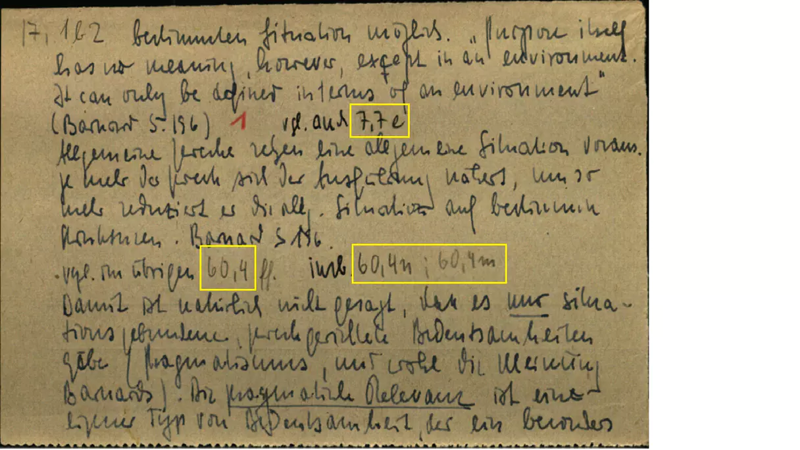
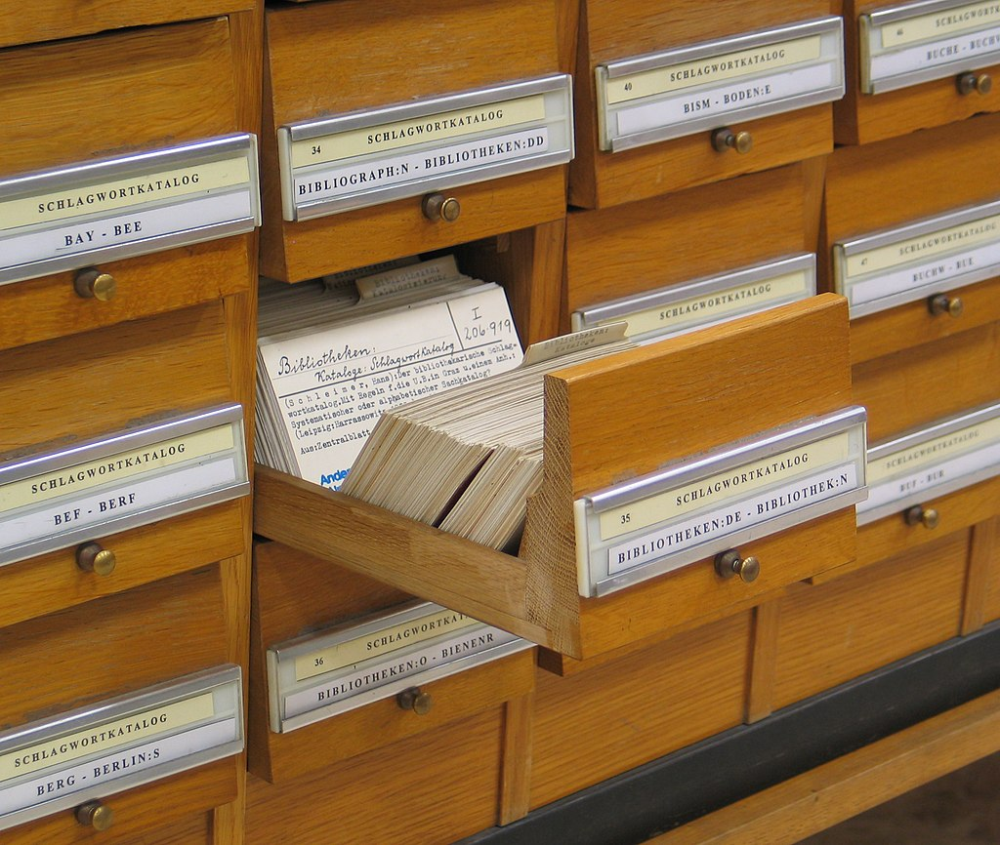
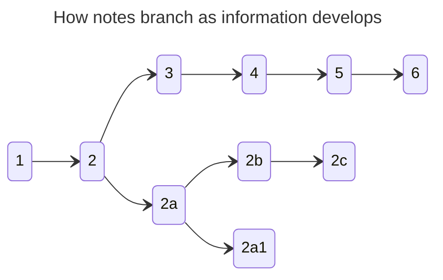
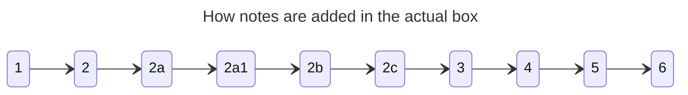
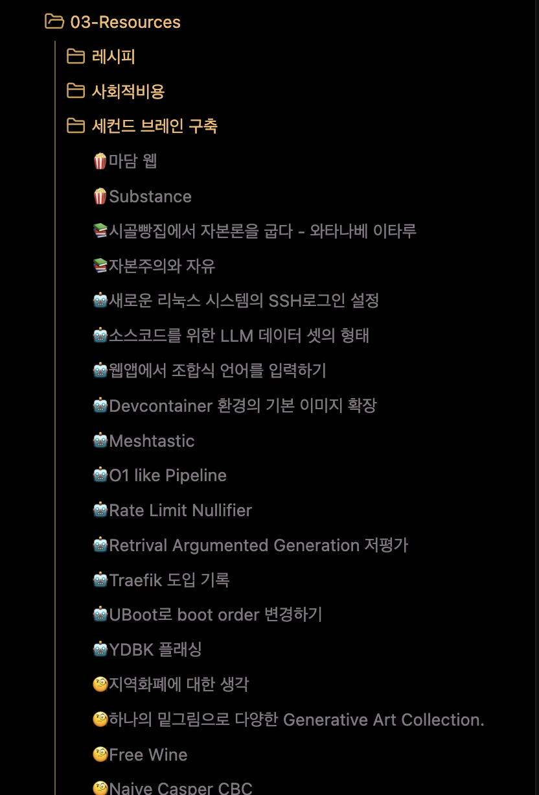
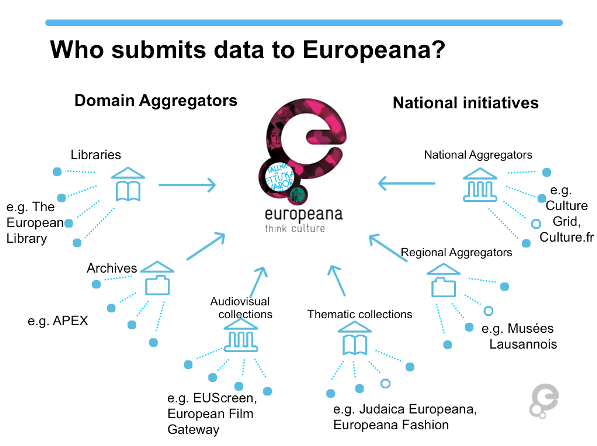
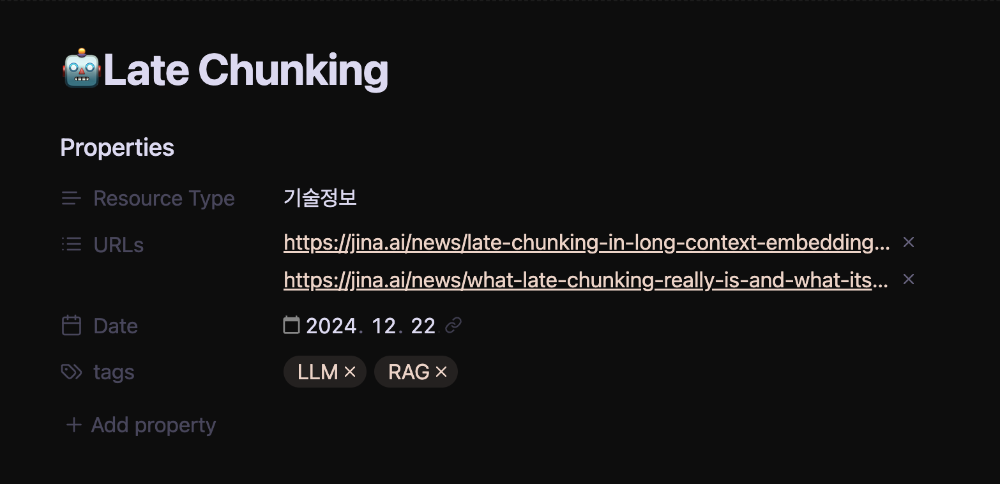
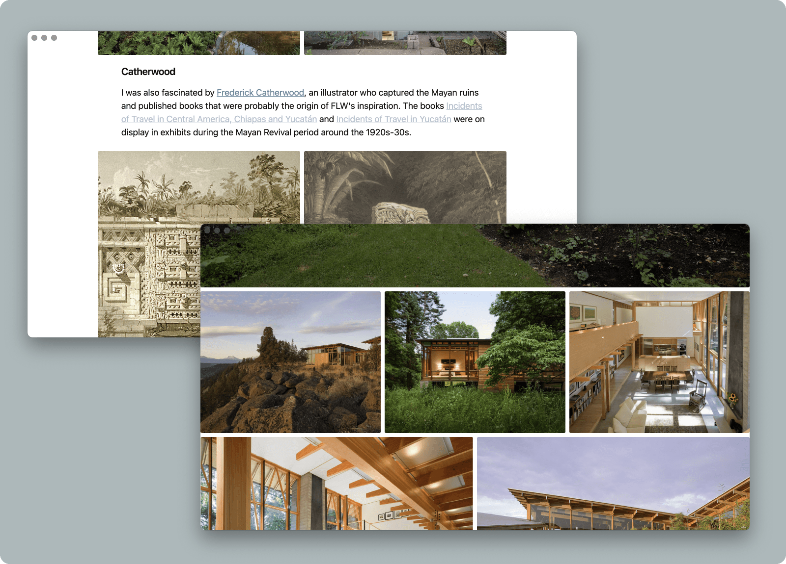
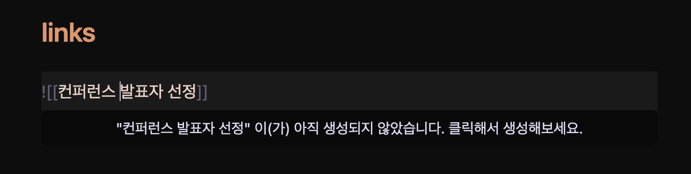
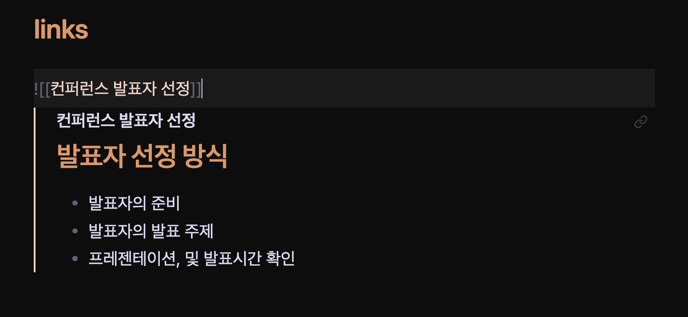

## Contents

This blog was created to serve as a `Second Brain`[^1]. Before I had this concept, I would hold a few topics I liked in my head and evolve those thoughts over several years. At times, when I paused and looked back, I could recall clear reasons for how those thoughts had developed. But when I tried to retrace certain past choices, I often lost context.

When I revisited things that had originally triggered my thinking, they often helped me reconnect with what I had in mind at the time. Because of that, I reached the conclusion that organising thoughts in a visible form is better for developing ideas in the long run.

At first, I only had an abstract goal, but no clear answer for what exactly to do or how to do it. Thinking about execution without clarity was no different from running blindly without a destination.

At the same time, dozens of browser tabs kept piling up. Even reading a single book felt heavy, and I realised I needed to shift my mind as quickly as possible from being used to store things into being used to think. I assumed my lack of focus while building this blog was part of the issue, so I paused information collection and told myself: "I need to prioritise this mental transition plan above everything else."

I was not sure whether a `Personal Knowledge Management (PKM)` system, which I had briefly explored while building the blog, would actually help me. Still, I want to give endless credit to my past self for stopping everything and spending time to understand it. What I learned from these systems has now become something like a superpower for me.

In this article, I closely examine the Second Brain, Zettelkasten, PARA, and Ontology methodologies, and summarise what I personally learned from them.

## System or Methodology?
To assess anything properly, sufficient understanding must come first. I needed to fully grasp what characteristics make these approaches worthy of being called personal knowledge management, and what advantages and drawbacks they provide.

What I was most curious about was this: how does simply storing information become something called a "second brain"? I wanted to understand what sits behind the system and, ultimately, how such a system could change me.

What follows is my personal summary of each system, and I believe it provides enough context to reach a conclusion.

### 0. Second Brain? Digital Garden?
To start with the conclusion: it means recording what you have learned outside your head so your mind can focus on thinking and you can refer back to records when needed. It sounds appealing, but not remembering everything introduces many issues. Re-exploring knowledge you have completely forgotten takes a long time. If you only jot things down in a memo app, there is often little cognitive structure to motivate sustained recording. Various personal frictions surface.

Around the late 2000s to early 2010s, `knowledge-based management` once became viral among companies. Many companies introduced internal wiki systems, but I have rarely heard of places that truly ran them well. As far as I remember, one key issue was that employees had little incentive to write wiki pages, and another was that they could not make sense of documents written by others. Even when someone tried to connect or reorganise existing pages, that work could become larger than their actual job. On top of that, members of the organisation often faced those documents as if they were unfamiliar every single time. Group-level knowledge management seems to require a fundamentally different perspective.

By contrast, personal knowledge management has a very long history. There are many examples, but to me, Marcus Aurelius' `Meditations` may be one of the closest forms. If the thoughts he recorded as an emperor continuously influenced him later, that could be called a second brain.

Regardless of older historical forms, modern personal knowledge management systems have changed significantly in shape. Many people now write notes on computers and smartphones and refer back to them, usually through a few advanced patterns.

There are many terms for knowledge management systems, such as "Second Brain," "Digital Garden," and "Zettelkasten." But rather than being just a storage space where knowledge is saved and retrieved when needed, it may be better understood as externalising abstract brain activity into a cognitive workspace.

### 1. Niklas Luhmann's Zettelkasten
There was a huge amount of information about Zettelkasten online, but it was difficult to find the exact method used by German scholar Niklas Luhmann, whose practice showed extraordinary efficiency.

During his lifetime, he published 70 books and 400 papers. Six additional books were published after his death. As one of the thinkers of social systems theory, and as someone who mostly worked alone, his output was remarkably efficient. Because of this, some people even mistake him for the inventor of the system, but many people had already used similar systems long before him.[^2]

I was able to find an article in German[^3] describing the Zettelkasten system he used. In practice, the method itself did not seem drastically different from what is commonly found online.

<figure class="mx-auto">
  
  <figcaption><cite>Part of an actual note written by Professor Niklas Luhmann, marked to show which notes it leads to and which notes it references.</cite><br/></figcaption>
</figure>

At its core, he wrote down daily ideas or reflections from reading and stored them as notes. The distinctive part was not merely writing notes, but how he recorded and stored them under specific conventions.

<figure class="mx-auto">
  
  <figcaption><cite>Luhmann's note catalogue preserved by the University of Graz.</cite><br/></figcaption>
</figure>

It is said that Luhmann wrote around six notes a day. The key point is that after writing a note, he considered carefully which box it belonged in.

Each box was divided by major themes such as "Sociology," "Communication," and "Complexity Theory." The very first step was deciding which box best suited the new note.



After choosing the box, he considered how the new note related to existing notes. For example, if a new note belonged under index 2 as a sub-concept, it would be given index `2-a` and inserted into the existing note box.



Because notes could be added in sequence within the real box, new information could be inserted without breaking the context of existing information.

Once he added a note to a box, he also wrote indices of other referenced notes at the bottom so the note could link out to others. This made it possible for one note to connect to notes in any box.

The information written there usually included two or three key keywords from the note, along with indices linked to related notes.

```
Keyword: Social public-goods cost
Reference note: 8
Related notes: 3b2, 9, Box 4 - 6c
Related keywords: social cost, trust cost
```

In particular, because he had to find physical notes among large collections of non-digital notes, I think these reference links prevented notes from becoming rigidly hierarchical.

After successfully adding notes to boxes, one should occasionally pull out any note at hand and discover new connections. This can include removing duplicated keywords in the catalogue, defining clearer connections as concepts become more precise, or integrating notes together. If you need to produce an output from your notes, you can also build an outline through them.

### 2. Tiago Forte's PARA (Projects-Areas-Resources-Archives)
Tiago Forte is well known as the founder of Forte Labs, a consulting firm focused on spreading personal knowledge management systems. Before storing knowledge, he recommends starting with four folders or categories:

The most important point, he says, is that switching between online and offline contexts should be very easy. No matter what system you use for notes, you should preserve this structure so you can capture ideas in any form.

 - **Projects**: activities with a clear end point that must be completed in the short term
 - **Areas**: ongoing responsibilities that continue indefinitely
 - **Resources**: information you remain continuously interested in
 - **Archives**: completed projects/activities and information you no longer actively use

He especially recommends that if you already have previously collected materials, you should confidently place them in `Archives`. The data is not disappearing, so you can retrieve it whenever needed, and it does not obstruct adoption of the new system.

From there, you simply store data. These are notes, and they can include many types of material: audio files, video, photos, and so on. The key point is that data does not need to be in a perfect folder from the start. Data rarely starts in its final place. If you leave it for now and keep refining it over time, it can eventually find the right location.

One thing to avoid is pre-building empty places where future data is supposed to go. If you learn something and need to remember it, write it and store it according to the current situation. Because this is a lifelong system, you will often find folders that are temporarily empty.

<figure class="mx-auto">
  
  <figcaption><cite>Part of the Resources section in the author's actual Obsidian workspace.</cite><br/></figcaption>
</figure>

Each folder should have clear policy rules.

For **Projects**, items should have a clear completion point, and if one project contains too many tasks, it should be split into smaller parts. It also helps to define a clear objective for what the project should produce. Examples include researching hospitals for a health check-up, making a purchasing shortlist, researching how to evaluate employees, or building a list of international film festivals.

For **Areas**, it should include lifelong responsibilities such as relationships, investment and assets, running a company, and tracking recent industry trends.

For **Resources**, data should be refined into information that can be shown to others and receive feedback. Through this process, data becomes personalised while also becoming easier to reference later. Examples may include keynote files prepared for presentations, recipes you use regularly, reading notes, or film reviews.

For **Archives**, information that is no longer relevant or actively used from all earlier directories should be placed there. Data from before adopting PARA will likely go there first, and over time many stored items will move in and out of this directory.

By regularly evaluating data inside the PARA system, you make it explicit that your collected data can move from `Resources` to `Projects`, or from `Areas` to `Projects`. In other words, stored information should not remain untouched forever. You should keep evaluating all data so that only essential parts remain from what you have stored and refined.

In short, the system aims to prepare data in advance for the future and keep it ready for reference when needed.

### 3. Data Ontology
Data Ontology has recently become better known through IT companies like Databricks and Palantir, so it may look like just another marketing term. In reality, however, it is one of the systems that has been used for a very long time since the emergence of computers and the internet.

One of the internet's early visions was the Semantic Web: information or resources connected across a distributed network in forms readable not only by humans but also by computers. When data is linked this way, it can be said to be connected through ontology.

Ontology itself is essentially a rich semantic layer for connecting data, so it has no obvious tangible form, which makes it difficult to grasp. Because of that, it may not even be clear whether this concept will help me, and motivation to apply it can be weak.

Still, since I could not evaluate it without understanding it first, I thought reviewing public examples would help me make a clearer judgement. So I summarised one representative ontology case.

#### Europeana, the European Union's digital library project
<figure class="mx-auto">
  
  <figcaption><cite>Diagram showing who records data in Europeana.</cite><br/></figcaption>
</figure>

Europeana[^4], the EU's digital library project, aims to integrate digitised cultural heritage held by more than 3,000 institutions across Europe and become a source of new knowledge.

Each participating institution registers various data such as photos, videos, booklets, and artefacts according to an ontology language called the Europeana Data Model (EDM).

As a digital library, Europeana supports not only searching registered data but also diverse activities. Since the library itself is a collection of ontology data about Europe, it can be seen as a source of information, knowledge, and wisdom.
- Education: It can help establish educational resources and activities, such as standardised teacher training guides built on diverse heritage assets. In particular, it provides learning scenarios using cultural heritage data held by Europeana.
- Technology: It also advances multilingual support for accessibility of digitised heritage and technical efforts such as 3D data restoration based on diverse archived materials.
- Climate crisis: It considers the impact of digital transformation of cultural heritage on climate and supports learning about those impacts.
- Research: It enables discovery of new information and exploration of past knowledge through digital heritage.

<figure class="mx-auto">
  
  <figcaption><cite>Diverse records of World War I discovered through Europeana.</cite><br/></figcaption>
</figure>

There are many other ontologies as well.
- Friend of a Friend: a specification that represents relationships between people as ontology, with the possibility of building database-free social media systems.
- Simple Knowledge Organization System: an ontology used to structure data for specific classifications. It can classify books by subject and track semantic relationships between terms, since terms tend to be used differently across domains and languages (thesaurus).

No matter what form the data takes, it is important to build connections and relationships so people or machines can read and interpret it. Europeana is a representative case. Only after everything is connected do certain methods and insights become visible.

When I think about how long it took to use non-ontologised data during the old "big data" boom, considering connectivity in the data we already hold is far from a luxury.

## Systems Require Sustained Attention
The systems described above share two clear common patterns.
1. Record new information as notes.
2. Continuously re-evaluate previously recorded notes.

These two are common behavioural patterns for building a Second Brain. Methods for linking notes, assigning indices, or deciding where notes are stored can be viewed as secondary elements that are open to personalisation.

In discussions around Zettelkasten, I also encountered extreme claims saying that because Luhmann's method does not fit digital tools, one must use physical notes to do it properly. But as also seen in PARA, data rarely finds its exact place all at once.

Have you ever tried to apply someone else's Obsidian setup to yourself? Have you used a Notion template shared by someone else? Have you bought numerous handwriting apps for iPad? Have you tried Scrivener just to build a "proper" writing setup? In my case, most did not fit.

In the end, what looked good was built on someone else's standards, not mine. So these systems are *less about storing knowledge under rigid rules* and more about moving thought outputs out of your head into a separate physical space, so your cognition has more room to think.

In `Editorial Thinking` by Hyejin Choi, the author writes that after 20 years in the media industry, editing has emerged as an essential skill needed across nearly all roles. The book captures her end-to-end editing process: collecting diverse data such as publication layouts, illustrations, books, and sentences; continuously evaluating that data; evaluating current projects; re-evaluating projects using collected data; and near project completion, checking whether only the core message remains. This method fully satisfies the same core conditions above, so the editor's approach is also a knowledge management system.

Therefore, what matters is the behaviour and process of re-evaluating the valuable data I have written, regardless of which tools I use.

## Building a Second Brain Digitally
I use Obsidian. I do not need the flashy plugins people talk about that require internet connectivity. I just choose an eye-friendly theme and add only template functionality needed for automation.

If you are comfortable with Markdown authoring syntax, it is easy to integrate features as needed. Most importantly, the data I write and store is clearly my own property, so with a single USB drive I could copy my whole system.

I tried Notion as well, but I wanted to reduce risks of being affected by Notion policies or updates, and reduce situations where my data becomes inaccessible due to network conditions or service scope because synchronisation depends on online connectivity. Fortunately, all my authoring tools are in the Apple ecosystem, so I can use iCloud Storage where changes sync immediately.

<figure class="mx-auto">
  
  <figcaption><cite>Frontmatter template used for saving notes in Obsidian. I am considering removing `Resource Type` because I do not need it.</cite><br/></figcaption>
</figure>

It is also useful that Markdown metadata allows attaching various logic layers. For example, URLs entered there can be automatically downloaded and archived whenever changes are detected on the source webpage. Since nothing in the world is truly permanent, this also helps me quickly recover old context when optimising notes incrementally.

For managing recorded audio, photos from exhibitions, music heard by chance, YouTube videos watched without prior context, well-organised blog articles, papers, and ebooks, digital handling is clearly the right approach.

<figure class="mx-auto">
  
  <figcaption><cite>The image grid provided by Obsidian's Minimal theme. Markdown documents improve convenience for image resource management.</cite><br/></figcaption>
</figure>

Basically, I use PARA but add an `Inbox`. Since my habit of collecting things indiscriminately is not going away, I added it on purpose. Sometimes right after recording something, I realise "this is not really data I care about," and move it directly to `Archives`. Later, I periodically evaluate notes and data in the Inbox and move most of them into the `Resources` directory.

If data can end as Markdown, I only add one text file. But often records such as audio or video are included, so in those cases I create a directory and store the text file together with related data.

<figure class="mx-auto">
  <div class="grid grid-cols-[repeat(auto-fit,minmax(0,1fr))] gap-4">
    
    
  </div>
  <figcaption><cite>A method that uses Obsidian's Internal Link feature to add notes immediately and view them within a single document.</cite><br/></figcaption>
</figure>

When I need to keep adding ideas, I register Internal Links through text files. In practice, this is no different from using Zettelkasten. Since each document also uses the same Frontmatter template mentioned earlier, each document can fulfil its role well. If one file lets me view ideas of the same category together, that is effectively enough.

<figure class="mx-auto">
  <video playsinline autoplay loop class="rounded-xl mx-auto">
	<source src="./9.mp4" type="video/mp4">Your browser does not support the video tag.</video>
  <figcaption><cite>Automation that lets me press a Note button to create a new document in Obsidian Inbox.</cite></figcaption>
</figure>

The device I hold the longest is my smartphone. If I cannot use the device I can always hold for recording, why carry it at all? Ideas and inspiration appear like a bright moon from any trigger. Whether I am reading or listening to music, a smartphone is in an ideal position to capture them. All written notes eventually sync to the always-open Obsidian on my Mac. Later, I can sit with a cup of coffee and re-evaluate what I captured.

Documents linked like Zettelkasten show strong connectivity, while individual documents keep loose connectivity through tags. Since knowledge is aimed at direct linkage to documents in `Projects` or `Areas`, I would say it is not important to spend too much time deciding exactly where each note should sit.

## Closing
Only after building a Second Brain did I realise this: "It is impossible for humans not to forget entirely by nature, and I myself only serve as a cache for my Second Brain." Because it keeps giving me ongoing stimulus, memories that might have faded do not fully disappear, I grasp only the core of information, and new ideas emerge from time to time. That feels like an excellent behavioural pattern for a human.

People also say, "With advanced LLMs, you can make the accumulated data of a Second Brain into a digital twin." I believe even that concept becomes understandable through a Second Brain. If I have accumulated my own outcomes to questions inside the Second Brain, perhaps those patterns of change can be integrated into an LLM.

I sometimes ask myself: what would I do if I could go back to the past? If I had no time to bring a sports almanac like in *Back to the Future*, I would still want to bring this one habit: building a Second Brain. I have no idea what would change, but at least I might wander less.

[^1]: There are many names, such as digital garden, personal brain, Memex, and Zettelkasten.
[^2]: https://en.wikipedia.org/wiki/Zettelkasten#History
[^3]: https://www.heise.de/news/Missing-Link-Luhmanns-Denkmaschine-endlich-im-Netz-4364512.html
[^4]: https://www.europeana.eu
