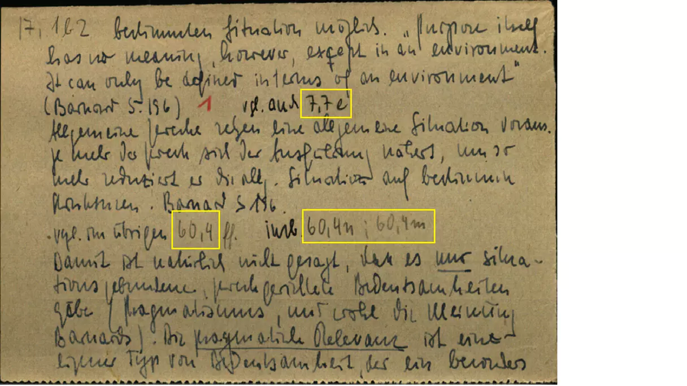
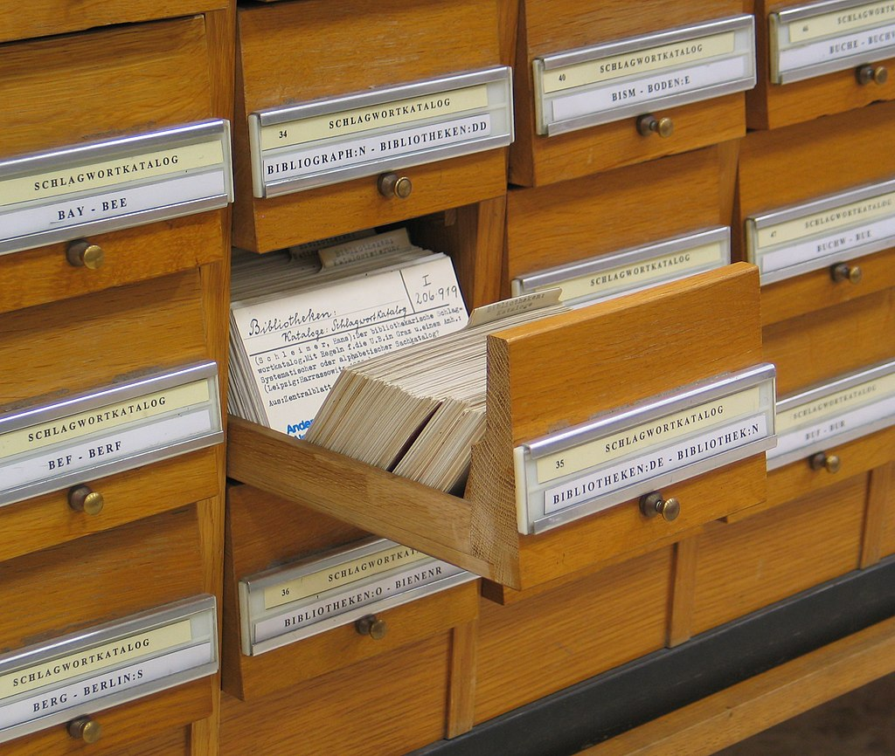
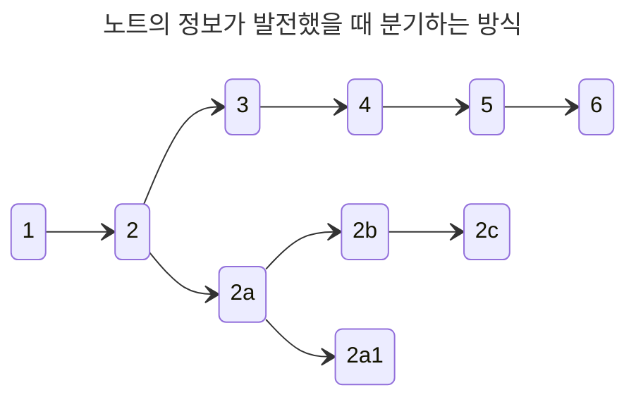
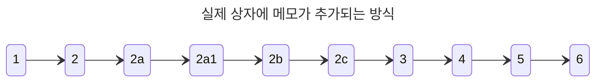
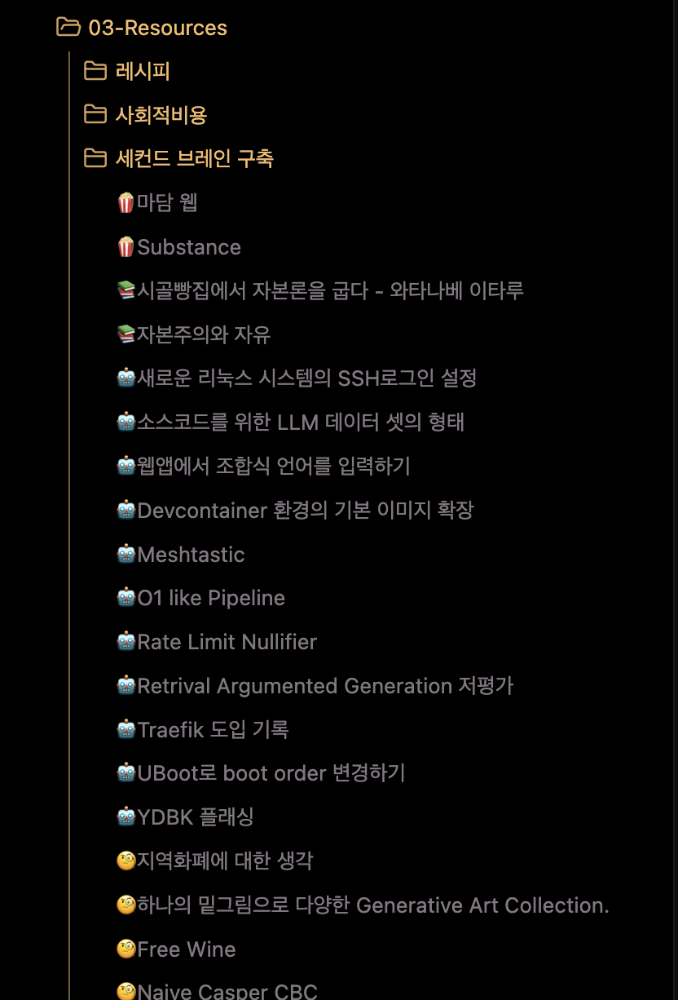
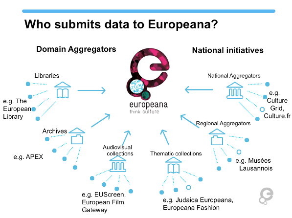
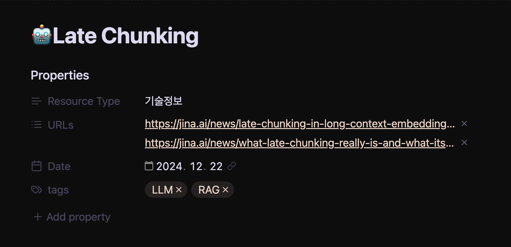
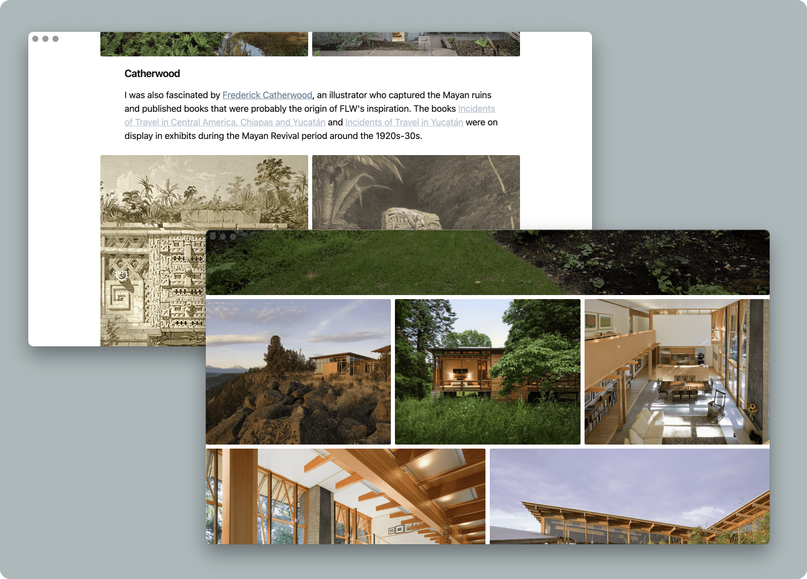
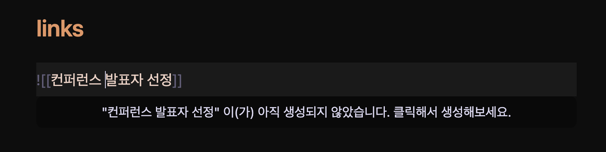
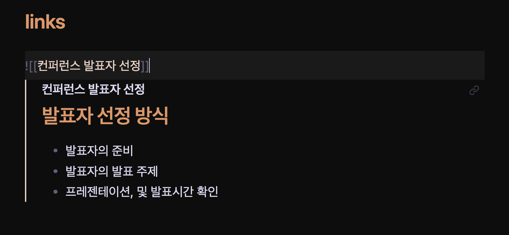

## 목차

이 블로그는 `세컨드 브레인`[^1]이라는 역할이 되기 위해 탄생되었다. 이러한 개념 이전에는 머릿속에 좋아하는 몇 가지 주제를 놓고 길게 몇 년씩 생각을 진화 시켜나가곤 했다. 어느 순간 멈춰 서서 생각해 보면, 생각을 어떻게 발전시켜 나가게 된 건지 명확한 이유들이 떠올랐지만, 몇 가지 과거의 선택을 되짚으려고 하면 종종 맥락을 잃는 일이 있었다.

종종 생각의 계기가 되는 것들을 다시금 확인했을 때 당시 생각을 짚을 수 있는 계기가 되곤 한다. 이런 문제들로 인해 생각들을 눈에 보이는 형태로 정리하는 것이 장기적으로 생각을 발전시키기 좋다는 결론에 도달하게 되었다.

당장 이를 가능하게 하기 위한 추상적인 목표만 있을 뿐 정확하게 무엇을 해야 하는지, 어떻게 수행해야 하는지 고민하는 것은 목표 없이 무작정 달리는 것과 다름이 없었다.

동시에, 브라우저에 쌓여가는 수 십 개의 탭. 책 한 권 읽는 데에 벅차다는 감각을 느끼고 있었으며, 하루라도 빨리 머리를 저장하는 용도가 아닌 생각하는 용도의 머리로 완전히 체질을 개선할 필요가 있었다. 이 블로그를 만들 때에 온전히 집중하지 못 한 탓이겠거니, 새로운 정보를 모으는 것을 잠시 덮어두고 '머리 전환 계획을 어떤 것보다 우선해야겠다.'다짐했다.

블로그를 제작할 때 훑어본 `개인 지식 관리(Personal Knowledge Management)` 시스템이 나를 구원할지는 명확하지 않았다. 그러나, 지금 모든 것을 멈추고 이것들을 알아내는 것에 시간을 쏟은 나에게 무한한 칭찬을 해주고 싶다. 지금에서는 이 시스템들을 통해 깨우친 점이 일종의 초능력이 되었음을 자랑스럽게 이야기한다.

이 글을 통해 세컨드 브레인, 제텔카스텐(Zettelkasten), PARA, Ontology 방법론들을 주의 깊게 살펴보고 개인적으로 깨닫게 된 것들을 정리하였다.

## 시스템인가 방법론인가
어떤 일이든 간에 대상을 판단하기 위해서는 충분한 이해가 수반되어야 한다. 무엇이 그것들을 개인 지식 관리라고 명칭 할 정도의 특징을 가졌고, 어떤 장점과 단점들을 제공했는지 온전히 파악할 필요가 있다.

더군다나 가장 궁금했던 것은, 정보들을 단순히 저장하는 것이 어떻게 제2의 두뇌라고 불리는지에 대해서였다. 그 뒤에 숨겨진 시스템의 이면과 궁극적으로 이런 시스템이 어떻게 나를 변화시킬지 궁금했다.

다음은 각 시스템들을 개인적인 시각으로 정리한 것이며, 결론에 도달하기에 충분한 설명이 될 것이라 생각한다.

### 0. 세컨드 브레인? 디지털 가든?
결론부터 말하면, 머리를 생각하는 용도로만 사용하기 위하여 깨우친 지식을 머리가 아닌 다른 곳에 기록하여 두고 필요에 따라 참고하는 것을 말한다. 듣기에는 좋아 보이지만, 기억하지 않는다는 것은 다양한 문제를 가져온다. 완전히 잊어버리게 된 지식을 다시 탐구하는 것은 오래 걸린다는 점. 메모를 한다고 하면 메모장에다가 하게 되니, 인지적인 장치가 부족하여 기록을 지속할 유인이 부족하다는 점 등. 온갖 개인적인 문제들이 튀어나오게 된다.

2000년대 후반 ~ 2010년대 초반 즈음 `지식 기반 경영`이 회사들 사이로 바이럴 된 적이 있었다. 많은 회사들이 내부에 위키 시스템을 도입했으나 실제로 잘 하고 있다는 곳은 정말 들어 본 적이 없다. 기억나는 대로 당시의 문제점을 짚어보자면 첫 번째로 직원들이 위키를 작성할 유인이 부족했고, 다른 사람이 작성한 문서를 알아볼 수 없다는 게 문제였다. 설령 다른 사람이 작성한 위키를 연결하거나 재정비하려고 하면 본업을 상회하는 일이 되어버리는 경우도 존재한다. 더군다나, 이 회사의 구성원들은 매번 문서를 대면할 때마다 익숙하지 않은 상태가 되어버린다는 점이다. 아무래도 집단의 지식 기반 경영은 보다 다른 관점이 필요하지 않나 싶다.

그에 반해 개인 지식 관리 시스템은 굉장히 역사가 깊다. 정말 많은 기록들이 존재하지만, 개인적으론 마르쿠스 아우렐리우스의 `명상록`이 이것에 가장 부합한 콘텐츠가 아닌가 한다. 황제로써 떠올리고 생각한 것들이 기록되어 지속적으로 자신에게 영향을 미쳤을 것이라 생각되면 세컨드 브레인이라 부를 수 있지 않나 싶다.

깊은 역사 속 지식 관리 시스템은 그렇다 치더라도, 현대의 개인 지식 관리 시스템은 모습이 많이 바뀌었다. 많은 사람들은 컴퓨터와 스마트폰을 통해서 메모를 작성하고 이를 참고하도록 하는데, 몇 가지 발전된 방식을 따른다.

'세컨드 브레인', '디지털 가든', '제텔카스텐' 등등 지식 관리 시스템을 지칭하는 단어는 많다. 그러나 단순히 지식을 저장하고 필요할 때마다 찾는 저장소의 공간이라기보다는 추상화된 뇌의 활동을 인지적인 영역으로 꺼낸 것이라 할 수 있지 않을까 싶다.

### 1. 니클라스 루만의 제텔카스텐(Zettelkasten)
제텔카스텐은 정말 인터넷에 많은 정보들이 있었으나, 실제로 가장 높은 효율을 보였던 독일의 니클라스 루만(Niklas Luhmann) 교수가 사용했던 방법 그대로를 찾는 것은 어려웠다. 

그는 생전 70권의 저서와 400건의 논문을 발표하고도 사후에 6권의 책이 더 나왔으며, 사회 체계 이론의 사상가 중 한 명 이자 그가 거의 혼자 일했다는 점에서 엄청난 효율을 보였던 것이다. 이러한 점으로, 이 시스템을 만든 사람으로 오해받기도 했는데 그 이전부터 이런 시스템을 이용한 사람은 무척이나 많았다.[^2]

그래서 그가 온전히 사용했던 제텔카스텐 시스템은 독일어로 된 아티클[^3]로 찾아볼 수 있었는데, 방법 자체는 인터넷에 있는 것들과 커다란 차이점은 없다고 보았다.

<figure class="mx-auto">
  
  <figcaption><cite>실제 니클라스 루만 교수가 작성했던 메모의 일부, 어떤 메모로 이어지는지, 어떤 메모에서 참조하는지에 대한 표식이 되어 있음.</cite><br/></figcaption>
</figure>

기본적으론, 매일 떠오르는 아이디어나 책을 읽다가 떠오른 감상을 메모에 적고 그것을 보관하는 방법이었다. 특이한 점은 메모들을 기록하되 메모들을 어떤 규약을 통해 기록하고 저장했는지가 중요했다.

<figure class="mx-auto">
  
  <figcaption><cite>그라츠 대학이 보관중인 루만 교수의 노트 카탈로그</cite><br/></figcaption>
</figure>

루만 교수는 매일 6개 정도의 메모를 작성했다고 알려져 있는데 중요한 점은 메모를 작성하고 어떤 상자에 어울릴지 고민했다.

각 상자는 "사회학", "커뮤니케이션", "복잡성 이론" 과 같은 큰 주제에 따라 나뉘었고, 작성한 메모가 어떤 상자에 어울릴지 우선적으로 고민하는 것이 가장 첫 번째였다.



메모를 저장해 둘 상자를 골랐다면, 기존에 적어둔 메모와 어떻게 연관될지 고민했다. 예시로, 새롭게 작성한 메모가 색인 2번의 하위 개념으로 들어가야 한다면, 2-a라는 색인을 지정하여 기존 메모 상자에 추가하는 것이다.



실제 메모 상자에는 메모를 일렬로 추가할 수 있게 되므로 새로운 정보가 기존 정보의 맥락을 해치지 않고 추가되는 모습을 볼 수 있다.

메모를 상자에 추가했다면, 메모 하단에 다른 메모와 연결될 수 있도록 참조 되는 다른 메모의 색인을 적어 두었다. 하나의 메모를 통해 어떤 상자에 있는 메모로도 연결될 수 있도록 한 것이다.

여기에 적힐 정보는 작성한 메모에서 2~3개 정도의 중요 키워드를 선정 후 해당 메모와 관련되는 색인도 같이 적어 두었다.

```
키워드: 사회 공공재 비용
참조 메모: 8
관련 메모: 3b2, 9, 상자 4 - 6c
관련 키워드: 사회적 비용, 신뢰비용
```

특히나, 디지털이 아닌 수많은 메모들 사이에서 물리적 메모를 찾아야 했으므로, 이러한 참조 링크를 작성하는 것이 메모 그 자체가 계층화되지 않도록 하는 장치였을 것이라 생각한다.

메모를 성공적으로 상자에 더했다면, 종종 손에 잡히는 아무 메모를 꺼내 새로운 연결성을 찾아야 한다. 카탈로그에 사용된 중복 키워드를 지우거나, 점차 명확해지는 개념에 따른 새로운 연결 정립, 메모의 통합과 같은 일들을 할 수 있겠다. 메모들을 통해서 결과물을 만들어야 한다면, 메모들을 통해서 아웃라인을 구성할 수도 있게 되는 것이다.

### 2. 티아고 포르테의 PARA(Projects-Areas-Resources-Archives)
티아고 포르테(Tiago Forte)는 개인 지식 관리 시스템을 보급하기 위한 컨설팅 폼인 Forte Labs의 창립자로 잘 알려져 있다. 그는 지식을 저장하기 전에 다음과 같이 4개의 폴더 또는 카테고리로 시작하라고 한다.

가장 중요한 점은, 온라인과 오프라인의 전환이 매우 쉬워야 한다고 말하며 메모를 위해 어떤 시스템을 사용하더라도 이런 구조를 유지하는 것으로 어떤 형태로든 아이디어를 포착할 수 있어야 한다고 말한다.

 - **Projects**: 종료 시점이 명확한 단기간 수행해야 하는 활동이 위치할 곳
 - **Areas**: 영원히 진행되는 활동이 위치할 곳
 - **Resources**: 지속적으로 관심을 가지는 정보들이 위치할 곳
 - **Archives**: 앞에서 완료한 프로젝트나 활동, 관심이 떨어진 정보들을 보관할 곳 

특히나 이전에 모아둔 자료들이 있다면 과감하게 `Archives`에 저장하라고 말한다. 자료가 사라지는 것이 아니기 때문에 필요할 때 언제든 찾을 수 있으며, 새로운 시스템을 도입하기에 방해가 되지 않기 때문이다.

이후부터는 데이터를 저장하면 된다. 이는 메모에 지나지 않고 다양한 자료들을 포함할 수 있게 된다, 음성 파일, 영상, 사진 등등 다양하게 말이다. 다만 여기에서 저자는 데이터가 꼭 정확한 폴더에 위치하지 않아도 된다고 말한다. 처음부터 데이터가 완벽하게 자기 자리에 위치하는 경우는 거의 없으므로, 우선은 두고 지속적으로 데이터를 정제해보면, 데이터가 올바른 위치를 찾을 수 있을 것이라 말한다.

경계해야 할 점은, 데이터가 미리 위치해야 할 곳을 만들지 않아야 한다는 것이다. 어떤 지식을 습득하고 그것을 기억해야 할 필요가 있다면, 작성하고 그때 상황에 맞게 저장하라고 말한다. 이러한 시스템은 평생 사용되는 시스템이므로, 종종 폴더를 찾아 들어가면 자료가 없는 경우가 있다고 이야기한다.

<figure class="mx-auto">
  
  <figcaption><cite>실제 사용하는 Obsidian속 Resources의 일부</cite><br/></figcaption>
</figure>

각 폴더마다 명확하게 정책을 가져가야 할 점들이 존재한다. **Projects**의 경우 종료 시점이 명확한 것들이 들어가야 하고, 프로젝트가 너무 많은 작업들을 포함하고 있다면 이를 잘게 쪼개라고 한다. 특히 해당 프로젝트를 통해 얻을 수 있는 목표가 명확하게 설정하는 것이 도움 된다고 말한다. 예를 들면 건강검진을 위한 병원 탐색, 제품 구매를 위한 리스트업, 직원을 평가하는 방법 조사, 국제 영화제 목록 조사 같은 일들이 될 수 있다.

**Areas**의 경우 인간관계, 투자 및 자산, 운영 중인 회사, 업계 최근 동향 등등 살면서 평생 수행해야 하는 작업들이 포함되어야 한다.

**Resources**의 경우 누구에게나 보여주고 피드백 받을 수 있는 정보로 정제되어야 한다. 이 과정을 통해서 데이터를 개인화하는 동시에 추후에 데이터를 참조하기 더 쉬운 형태로 만들어져야 한다고 말이다. 예를 들면, 발표하려고 만든 키노트 파일, 내가 주로 사용하는 음식 레시피, 독후감, 영화에 대한 감상평 같은 것도 포함될 수 있겠다.

**Archives**의 경우 모든 앞선 디렉토리에서 관심이 멀어졌거나 사용되지 않는 정보들이 위치하게 된다. PARA를 만나기 이전의 데이터들이 우선적으로 위치되고, 앞으로 보관한 많은 정보들이 이곳을 왔다 갔다 하게 될 것이다.

주기적으로 PARA 시스템에 포함된 데이터를 평가하는 것으로, 내가 모아둔 데이터들이  `Resources`에서 `Projects`로, `Areas`에서 `Projects`로 옮겨갈 수 있다는 점을 명확하게 해야 한다. 즉, 매번 저장한 정보를 그대로 두는 것이 아니라, 내가 저장하고 정제한 정보에서 필수적인 부분만 남기듯이 모든 데이터를 지속적으로 평가해야 한다는 것이다.

즉, 시스템은 평소에 미래를 위해 데이터를 잘 준비하고, 필요할 때 참고할 수 있도록 준비하는 것에 목표를 두는 것이라 할 수 있다.

### 3. 데이터 온톨로지(Data Ontology)
데이터 온톨로지는 최근 IT 기업인 Databrick과 Palantir를 통해 보다 많이 알려진 단어로 마케팅 용어 중 하나라고 생각될 수 있지만, 실제로는 컴퓨터와 인터넷이 생긴 이후 굉장히 오랫동안 사용되고 있는 시스템 중 하나이다.

인터넷의 초기 비전 중 하나는 Semantic Web으로써, 인터넷이라는 분산 네트워크 환경에서 정보 또는 자원 사이의 연결을 인간뿐만 아니라, 컴퓨터가 읽고 해석할 수 있는 형태로 연결된 것을 말하는데, 이 자체를 온톨로지로 데이터가 연결되었다고 말할 수 있는 것이다.

온톨로지 자체는 데이터를 연결하는 의미론적 계층(Rich Semantic Layer)에 지나지 않으므로 손에 잡히는 뚜렷한 모습이 없어 이해하는 것이 어렵다. 이러한 개념이 나에게 도움이 될지 되지 않을지조차 확실하지 않으므로, 이를 적용하려는 동기도 부족하다.

그러나 이를 판단할 만큼 온톨로지를 이해할 수 없으므로, 공개된 사례를 통해 온톨로지를 이해하는 것이 명확한 판단에 도움 될 것이라 생각되어 대표적인 온톨로지 사례 하나를 정리했다.

#### ​유럽 연합의 전자 도서관 프로젝트(Europeana)
<figure class="mx-auto">
  
  <figcaption><cite>누가 유로피아나에 데이터를 기록하는지 나타내는 도표</cite><br/></figcaption>
</figure>

유럽 연합의 전자 도서관 프로젝트인 Europeana[^4]은 유럽 내의 3000개 이상 기관들이 가지고 있는 디지털화된 문화유산을 통합하여 새로운 지식의 원천이 되는 것을 목표로 한다.

유로피아나에 등록된 각 기관들은, 사진, 영상, 책자, 유물, 등등 다양한 데이터를 Europeana Data Model(EDM)이라는 온톨로지 언어에 맞게 등록한다.

Europeana는 전자 도서관인 만큼 등록된 데이터 조회는 물론이고 다양한 활동을 지원한다. 전자 도서관 자체가 유럽이라는 온톨로지 데이터의 집합이므로 정보, 지식, 지혜를 얻을 수 있는 원천이라 할 수 있다.
- 교육: 다양한 유산들을 기반으로 표준화된 선생님 훈련 가이드 같은 교육 자원 및 도구, 교육 활동 확립하는 데 도움을 줄 수 있다. 특히, 유로피아나가 가지고 있는 문화유산 데이터를 이용한 다양한 학습 시나리오를 제공한다는 점이다.
- 기술: 문화유산을 디지털화하는 방법과 디지털 유산의 접근성을 위한 다국어 지원, 다양한 기록물들을 기반으로 3D 데이터 복원과 같은 TF도 진행한다. 
- 기후 위기: 문화유산의 디지털 전환이 기후에 미칠 영향을 고려하고, 이러한 영향에 대해 학습할 수 있다.
- 연구: 디지털 유산을 통해 새롭게 알게 되는 정보의 발견, 과거의 지식을 탐구할 수 있게 된다.

<figure class="mx-auto">
  
  <figcaption><cite>유로피아나로 찾은 세계 1차 대전의 다양한 기록물</cite><br/></figcaption>
</figure>

이 외에도 다양한 온톨로지들이 존재한다.
- Friend of a Friend: 사람들 간의 관계를 온톨로지로 표현하는 명세로써, 이를 이용하면 데이터베이스가 없는 Social Media를 구축할 수 있는 가능성도 가지고 있다.
- Simple Knowledge Organization System: 어떤 분류에 대한 데이터를 구성하는 데에 사용되는 온톨로지 이다. 책을 주제별로 분류하거나, 용어가 각 분야 및 언어마다 다르게 쓰이는 경향이 있으므로 용어의 의미적 관계를 추적하는 데에도 사용된다.(thesaurus)

데이터가 어떤 형태이든 연결을 구성하여 관계성을 구축하여 사람이든 기계이든 이를 읽고 해석할 수 있게 준비하는 것은 중요하다. 유로피아나의 경우가 대표적일 수밖에 없다. 모든 데이터를 연결하고서야 보이는 방법들과 해안이 보이는 것이다.

오래전 "빅데이터" 신드롬이 불었을 때, 온톨로지화 되지 않은 데이터들이 활용되는데 얼마나 오랜 시간이 소요되었는지 생각한다면 지금 가지고 있는 데이터의 연결성을 고민하는 것은 사치가 아닐 것이다.

## 시스템에는 지속적인 관심이 필요하다
앞서 언급된 시스템들에는 공통적인 부분이 명확하게 존재한다.
1. 새로운 정보를 메모로 기록할 것.
2. 기존에 기록된 메모를 끊임없이 재평가할 것.

이 두 가지가 세컨드 브레인을 만드는 공통된 행동 양식이며, 메모를 연결하는 방법이나, 메모에 색인을 지정하는 방법, 메모를 저장하는 장소와 같은 것들은 개인화가 가능한 부차적인 요소로 볼 수 있었다.

제텔카스텐을 언급한 내용 중에는, 루만 교수의 방법이 디지털 도구에 맞지 않으므로 제대로 사용하려면 물리적인 메모를 저장하는 것이 좋겠다는 극단적인 정보도 접할 수 있었다. 그러나 PARA에서도 읽을 수 있었던 내용이지만, 모든 데이터가 한 번에 제 자리를 찾는 경우는 드물다.

타인이 설정해둔 Obsidian 설정을 나에게 적용하려고 한 적이 있는가? 누군가 공유한 노션 템플릿을 써 본 적이 있는가? iPad에서 사용할 수많은 필기 앱들을 구매해 본 적이 있는가? 제대로 된 글쓰기 환경을 갖추기 위해 Scrivener를 사용하려고 해 보았는가? 나의 경우 대부분은 맞지 않았다.

결국 좋아 보이는 것들은, 타인의 기준에서 만들어진 것이므로 기준점이 나에게 있지 않은 것이었다. 그러므로, 이러한 시스템들이 *지식을 엄격한 규칙에 맞게 잘 저장할 목적 보다* 생각의 결과물을 머릿속에 두지 않고 물리적으로 다른 공간에 두게 함으로써 인지적으로 생각에 여유를 줄 수 있도록 하는 방법인 것이다.

최혜진 님의 저서 `Editorial Thinking`을 살펴보면, 저자가 20년간 미디어 업계에서 활동하며 에디팅은 거의 모든 직군에서 필요로 하는 필수적인 능력으로 부상했다고 하며, 책에는 본인이 에디팅을 수행하는 전체 과정을 담아 두었다. 여기에는 출판물의 레이아웃, 그림, 책, 문장과 같은 다양한 데이터를 수집하고, 데이터를 끊임없이 평가하는 과정, 내가 진행할 프로젝트 평가, 수집한 데이터로부터 프로젝트 재평가, 그리고 프로젝트 완성 즈음에는 내가 프로젝트를 통해서 전달하고자 하는 핵심만 담고 있는지 평가한다. 이러한 방법 또한 앞선 핵심 조건을 완벽하게 만족하고 있으므로, 에디터님이 구성하신 시스템도 지식 관리 시스템인 것이다.

그러므로, 내가 작성한 소중한 데이터들을 재평가하는 행동과 과정이 필요하지 어떤 도구를 쓰든지 상관이 없는 것이다.

## 디지털로 구현하는 세컨드 브레인
나는 Obsidian을 쓴다. 사람들이 말하는 예쁘고, 기능 좋고, 인터넷에 연결되어야 하는 플러그인은 필요하지도 않다. 눈이 편한 테마를 찾고, 자동화에 필요한 템플릿 기능 정도만 딱 더해두었다.

Markdown 저작 문법만 익숙하다면 필요할 때마다 이런저런 기능을 통합하기도 쉽고, 가장 중요한 점은 내가 작성하고 저장한 데이터들이 온전히 내 소유임이 명확해서, USB 하나만 있으면 내 전체 시스템을 복사할 수도 있다.

Notion을 써보기도 했지만 근본적으로는 Notion의 정책이나 업데이트에 따라 영향을 받을 수 있는 가능성, 그리고 온라인을 통해서 다른 기기와 동기화되므로 네트워크 환경이나 서비스 범위에 따라 내 데이터에 접근이 불가능한 일을 줄이고자 했다. 다행스럽게도 나의 모든 저작 도구가 Apple의 생태계에 있으므로, 변경점이 바로 동기화되는 iCloud Storage를 이용할 수 있어 다행이라 생각한다.

<figure class="mx-auto">
  
  <figcaption><cite>Obsidian을 통해 메모를 저장하는 Frontmatter 템플릿, `Resource Type` 속성은 필요 없어서 지우는 것을 고려 중.</cite><br/></figcaption>
</figure>

Markdown의 메타데이터를 통해 다양한 로직들을 붙일 수 있는 것도 좋다. 여기 입력된 URL은 변경점이 발견되면 자동으로 해당 웹페이지의 데이터를 자동으로 다운로드하여 저장해둔다. 의외로 세상에 영원한 것은 없으므로, 점진적으로 메모를 최적화하는 경우 기존 맥락을 빠르게 찾아볼 수 있다는 점도 좋다.

녹음된 기록, 전시 공간을 찍은 사진, 우연히 들은 음악, 내용도 모르고 보게 된 유튜브 영상, 잘 정리된 블로그 아티클, 논문, 전자책 등등 이를 관리하는 방법은 디지털이 명확하다.

<figure class="mx-auto">
  
  <figcaption><cite>Obsidian의 Minimal 테마가 제공하는 image grid. Markdown 문서를 통해 이미지 리소스 관리 편의성을 얻을 수 있다.</cite><br/></figcaption>
</figure>

기본적으로는, PARA의 시스템을 사용하되 `Inbox`를 추가해 두었다. 무작정 수집하는 것을 좋아하는 습관이 어디 가겠나 싶어 추가해 두었는데, 어떤 데이터는 기록한 직후, '내가 별로 좋아하는 데이터는 아니구나'싶어 바로 `Archives`로 보내는 경우도 있었다. 이후 정기적으로 Inbox에 있는 노트들과 데이터들을 평가하여 대부분 `Resources` 디렉토리로 보내게 된다.

데이터는 Markdown으로 끝날 수 있다면 텍스트 파일 하나만 추가하지만 대체로 음성, 영상과 같은 기록들이 추가되는 경우가 있다 보니 이런 경우 디렉토리를 만들어 텍스트 파일과 연관 데이터를 같이 저장해둔다.

<figure class="mx-auto">
  <div class="grid grid-cols-[repeat(auto-fit,minmax(0,1fr))] gap-4">
    
    
  </div>
  <figcaption><cite>Obsidian의 Internal Link 기능을 이용하여 메모를 바로 더하고, 하나의 문서에서 볼 수 있도록 하는 방법.</cite><br/></figcaption>
</figure>

여기에 지속적으로 아이디어를 더해야 한다면, 텍스트 파일을 통해서 Internal Link를 등록하는 방법을 쓴다. 이런 방식을 취한다면 사실상 제텔카스텐을 이용하는 것과는 다름이 없다. 각 문서도 앞선 Frontmatter 템플릿이 적용되어 있으므로, 각 문서의 역할을 톡톡히 할 수 있다. 하나의 파일을 통해서 같은 부류의 아이디어를 볼 수 있다면 다를 것이 없는 것이다.

<figure class="mx-auto">
  <video playsinline autoplay loop class="rounded-xl mx-auto">
	<source src="./9.mp4" type="video/mp4">Your browser does not support the video tag.</video>
  <figcaption><cite>Note 버튼을 눌러, Obsidian의 Inbox의 새로운 문서를 작성할 수 있도록 하는 자동화</cite></figcaption>
</figure>

내 손에 가장 오래 쥐어진 기기라면 스마트폰이다. 언제나 쥘 수 있는 기기를 기록의 용도로 사용할 수 없다면, 왜 들고 다녀야 할까? 아이디어와 영감은 어떤 계기에서든 밝은 달이 떠오르듯 생겨난다. 책을 읽다가도, 음악을 듣더라도, 그것을 포착할 수 있는 기기로 스마트폰은 정말 최적화된 위치를 점하고 있다. 작성된 모든 메모들은 결국 Mac에 항상 떠있는 Obsidian으로 동기화된다. 이후에 커피 한 잔을 들고 기록한 메모들을 재평가하면 되는 것이다.

제텔카스텐 처럼 연결되는 문서에는 강력한 연결성을 보이지만, 각 문서는 태그를 통해 느슨한 연결성을 가지도록 했다. 지식은 `프로젝트` 또는 `영역`에 있는 문서에 직접적으로 연결되는 것을 목표로 하고 있으므로, 메모가 위치할 곳을 찾는 데에 시간을 많이 쏟는 것은 중요치 않다고 말하고 싶다.

## 마치며
세컨드 브레인을 구축하고서야 '인간 본연의 습성으로 완전히 잊어버리는 것은 불가능하고, 나 자체는 세컨드 브레인의 캐시 역할을 할 뿐'이라는 점을 깨우쳤다. 지속적으로 나에게 자극을 준다는 점에서, 잊힐 기억도 잊히지 않고, 정보를 핵심만 파악하게 되며, 종종 새로운 아이디어가 떠오른다는 점에서 인간으로서 훌륭한 행동 양식을 가진 게 아닌가 한다.

"발전된 LLM을 이용해 세컨드 브레인이라는 데이터의 집합을 디지털 트윈으로 만들기도 한다."는데, 이런 개념도 세컨드 브레인을 통해서 이해하게 될 것이다. 어떤 질문에 대한 나름의 결과를 세컨드 브레인에 축적했다면 그 변화의 방식을 LLM에 접목할 수 있지 않을까 하긴 한다.

종종 과거로 돌아가게 된다면?이라는 명제로 내가 할 수 있는 일이 무엇인지 생각해 보고는 한다. '백 투 더 퓨처'처럼 스포츠 연감도를 챙길 시간도 없다면, 세컨드 브레인을 구축하는 이 습관 하나만큼은 가져가고 싶다는 생각을 한다. 무엇이 바뀔지는 아무것도 모르지만, 적어도 방황은 줄이지 않을까 싶다.

[^1]: 디지털 가든, 개인 두뇌, 메멕스, 제텔카스텐 등등 많은 이름들이 있다.
[^2]: https://en.wikipedia.org/wiki/Zettelkasten#History
[^3]: https://www.heise.de/news/Missing-Link-Luhmanns-Denkmaschine-endlich-im-Netz-4364512.html
[^4]: https://www.europeana.eu
