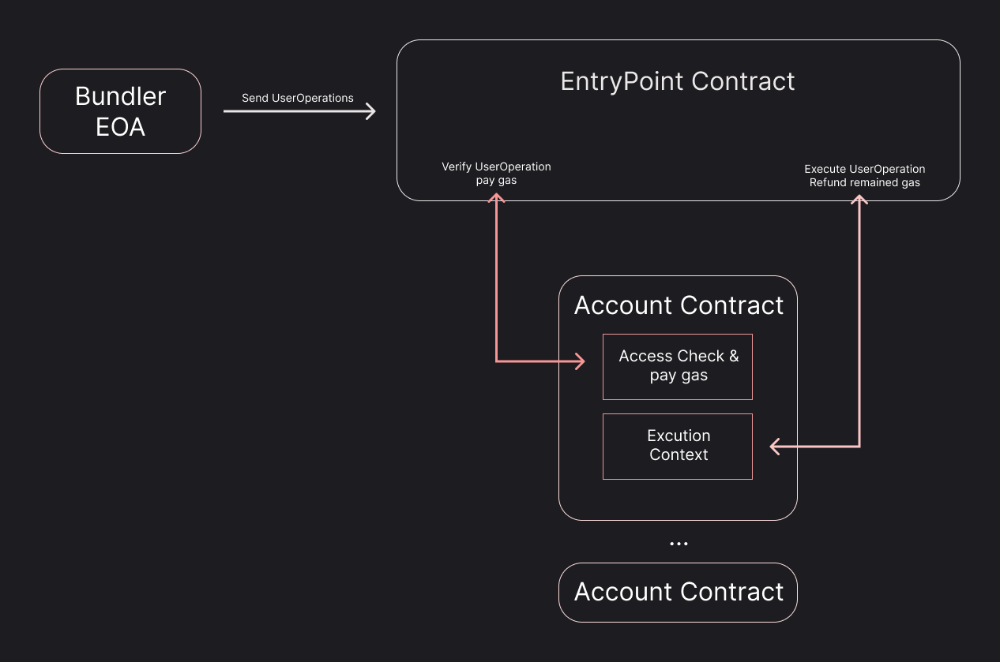

Ethereum has two types of accounts. There are contract accounts that we will implement, and accounts based on public-private key pairs. Public-private key accounts can trigger transactions and directly pay network fees.

Contract accounts cannot trigger transactions, so are not entities that directly pay fees. However, the permissions of these accounts are determined by the source code defined when creating the contract.

Account abstraction was a proposal that existed since the inception of Ethereum, to eliminate all public-private key accounts and unify them into code-driven accounts. At the time, public-private keys had low quantum resistance, so this was devised to improve it.

However, recent account abstraction focuses more on user experience. Ethereum block production has changed from `Proof of Work` to `Proof of Stake`, and the `Block Producer` and `Block Validator` will separate. As the producer separates from the validator, decentralisation will accelerate since the producer can gather transactions through various networks. But this is different from the original plan where AAs could autonomously trigger transactions.

Changing all Ethereum accounts to AAs now requires very important decisions. Bug-free code must be provided to all accounts, and usability must be simple. Also, contracts becoming able to trigger transactions requires changing the Ethereum protocol, with impacts to existing systems that are unimaginably shocking. So a feature of EIP 4337 is that it is implemented without changing the existing protocol.

In summary, public-private key accounts bundle the various calls AAs will use (called `UserOperation`s to avoid confusion with existing public-private transactions) into a single transaction for processing. Compared to using small numbers of calls individually, bundling them saves gas fees, and fees can also be paid in means other than ETH (ERC20, credit card payments, etc).

In addition to these features, from repeated experiences testing Web3 projects, one of the biggest issues was user inconvenience for real testing. To test actual Web3 products, users need a wallet supporting MetaMask or WalletConnect, and testing often happens on public networks, so testnet ETH was required to pay transaction fees. For years, testnet coins have commonly been airdropped to verified developers due to DDoS attacks poured onto testnets. It was difficult for non-developer real users to obtain these for testing, so I thought AA could help general users overcome barriers to testing. This motivated me to start this series.

For these reasons, when preparing for recent testing, I thought I should implement ERC-4337 as a trial. Recording is also very important, so I want to publicly document the process of implementing and integrating AA through my blog. All implementations will follow [ERC-4337](https://eips.ethereum.org/EIPS/eip-4337), and the contracts are on [own4337 on Github](https://github.com/Nipol/own4337). I think going through this public process will provide great motivation to continuously write these articles. Please let me know if there are any incorrect implementations, and I will continuously improve as I implement and integrate. I will be back tomorrow for the second day!

## Implementation Start 

In general, everything starts from the `UserOperation` struct. Because it defines the work a user wants to do, we first define it according to the document.

```solidity
// file Constants.sol

// SPDX-License-Identifier: UNLICENSED  
pragma solidity ^0.8.13;

struct UserOperation {
	address sender;
	uint256 nonce;
	bytes initCode;
	bytes callData;
	uint256 callGasLimit;
	uint256 verificationGasLimit;
	uint256 preVerificationGas;
	uint256 maxFeePerGas;
	uint256 maxPriorityFeePerGas;
	bytes paymasterAndData;
	bytes signature; // r, s, v order
}
```

And because the `UserOperationID` is created through this struct, we also create a library to handle operations related to the struct. First, it generates the hash information to create a unique ID for the Operation. This is generated based on information like chainid, nonce, EntryPoint, etc excluding the signature, to prevent hash reuse and replay attacks.

```solidity
// file UserOpLib.sol  

// SPDX-License-Identifier: UNLICENSED
pragma solidity ^0.8.13;

import "./Constants.sol";

library UserOpLib {
	/**
	* @notice Generate a unique hash for an Operation based on a given `UserOperation` structure,
	* *`Entrypoint` address, and `chainid`.
	* @param op UserOperation struct  
	* @param EntryPointAddr Entrypoint Contract Address
	* @return h Unique UserOperation hash.
	*/
	function opHash(UserOperation calldata op, address EntryPointAddr) internal view returns (bytes32 h) {
		// stored chainid
		uint256 chainId;

		// load chainid
		assembly {
			chainId := chainid()
		}

		// hashing
		h = keccak256(
			// concat data without signature(Too deep. use viaIr)
			abi.encodePacked(
				chainId,
				EntryPointAddr,
				op.sender,
				op.nonce,
				op.initCode,
				op.callData,
				op.callGasLimit,
				op.verificationGasLimit,
				op.preVerificationGas,
				op.maxFeePerGas,
				op.maxPriorityFeePerGas,
				op.paymasterAndData
			)
		);
	}
}
```

We also write test code to confirm it works well:

```solidity
// test/UserOpLib.t.sol

pragma solidity ^0.8.13;

import {Test, console2} from "forge-std/Test.sol";
import "../src/UserOpLib.sol";

// Make a Mock contract to extract library functionality.
contract HelperMock {
	// Connect struct to library  
	using UserOpLib for UserOperation;

	// Generate hash for given UserOperation
	function getHash(UserOperation calldata op, address entryAddr) external view returns (bytes32 h) {
		h = op.opHash(entryAddr);
	}
}

contract UserOperationHelperTest is Test {
	UserOperation op1;
	HelperMock ohm;

	function setUp() public {
		// Create sample UserOperation
		op1 = UserOperation({
			sender: Address("Sender"),
			nonce: 0,
			initCode: abi.encode(0),
			callData: abi.encode(0),
			callGasLimit: 0,
			verificationGasLimit: 0,
			preVerificationGas: 0,
			maxFeePerGas: 0,
			maxPriorityFeePerGas: 0,
			paymasterAndData: abi.encode(0),
			signature: abi.encode(0)
		});
		ohm = new HelperMock();
	}

	// for Debug
	function Address(string memory name) internal returns (address ret) {
		ret = address(uint160(uint256(keccak256(abi.encode(name)))));
		vm.label(ret, name);
	}

	// Main test target
	function testHash() public {
		UserOperation memory op = op1;
		// base
		emit log_uint(block.chainid);
		bytes32 h = ohm.getHash(op, Address("EntryPoint"));
		assertEq(h, 0x703b673b8562624140ecc3e1d3a7fe0a0ce9e511dfebb90e27a37140a08b394a);

		// chanage chainid		
		vm.chainId(999);
		emit log_uint(block.chainid);
		h = ohm.getHash(op, Address("EntryPoint"));
		assertEq(h, 0x512faaea96afd35c2a0f8f2a3fa3963a06769da4a64069efcc330df8c7f175ec);
		
		// chanage Entrypoint addr
		h = ohm.getHash(op, Address("Another EntryPoint"));
		assertEq(h, 0xe9ba5bc83fc204a07cf299be67a5c912c761a8c88ae534fb148c900a4194745c);
	}
}
```

Seeing the completely different hashes shows the variables influencing hash changes are well applied.

The `UserOperation` struct describing the transaction a user sends goes through various networks to the `Bundler`, and the Bundler uses the Entrypoint contract to call each `Account`. Because it is the entity recognized by all other contracts, the smallest thing we can start with is the Account contract, so we will implement it.

We implement the most important `validateUserOp`. For the versatility of the EntryPoint, it checks if the caller implements the EntryPoint interfaces. [EIP-165](https://eips.ethereum.org/EIPS/eip-165) is used for this, and if a contract trying to verify does not implement it, it is handled as a failure. This is the minimum criteria for a contract to work properly, and can be seen as the lightest way to verify a contract.

`Signature Aggregation` refers to BLS-based signatures. With existing ECDSA, the signature made by the AA owner would exist individually, increasing transaction size. But with BLS-based signatures, these signatures are compressed into one while still proving the authenticity of all users, reducing transaction size. For now we won't implement a BLS-based signing method, and will use an ECDSA verification method because the purpose is verifying 4337.

```solidity
// file Account.sol

// SPDX-License-Identifier: UNLICENSED
pragma solidity ^0.8.13;  

import "./Constants.sol";
import "./UserOpLib.sol";
import "./IERC165.sol";
import "./IEntryPoint.sol";
import "./IAccount.sol";

contract Account is IAccount {
	function validateUserOp(UserOperation calldata userOp, bytes32 userOpHash, uint256 missingAccountFunds)
	external
	returns (uint256 validationData)
	{
		// is caller EntryPoint?	
		if (IERC165(msg.sender).supportsInterface(type(IEntryPoint).interfaceId) != true) revert();

		if (missingAccountFunds != 0) {
			payable(msg.sender).transfer(missingAccountFunds);
		}

		// is this Account support `Signature Aggregation`? for Now. No.		
		uint8 v;
		bytes32 r;
		bytes32 s;

		// length check
		if (userOp.signature.length != 65) revert();
		
		// for easy accesible.
		bytes calldata signature = userOp.signature;

		assembly {
			calldatacopy(mload(0x40), signature.offset, 0x20)
			calldatacopy(add(mload(0x40), 0x20), add(signature.offset, 0x20), 0x20)
			calldatacopy(add(mload(0x40), 0x5f), add(signature.offset, 0x40), 0x2)

			// check signature malleability
			if gt(mload(add(mload(0x40), 0x20)), 0x7FFFFFFFFFFFFFFFFFFFFFFFFFFFFFFF5D576E7357A4501DDFE92F46681B20A0) {
				revert(0x0, 0x4)
			}

			r := mload(mload(0x40))
			s := mload(add(mload(0x40), 0x20))
			v := mload(add(mload(0x40), 0x40))
		}

		// Compare with ?
		address recovered = ecrecover(userOpHash, v, r, s);

		// packing authorizer(0 for valid signature, 1 to mark signature failure.
		// Otherwise, an address of an authorizer contract. This ERC defines “signature aggregator” as authorizer.),
		// validUntil(6 bytes) and validAfter(6 bytes)
		return 0;
	}
} 
```

Next are interfaces for Signature Aggregation, but because we won't implement them now, we will implement the `getNonce` of the `EntryPoint`. The document says the key is generally not used, so it is mostly 0. Here, the logic calculating the `sequence` slot is inefficient, so there is room for improvement later.


```solidity
// file Entrypoint.sol

// SPDX-License-Identifier: UNLICENSED
pragma solidity ^0.8.13;

import "./Constants.sol";
import "./IEntryPoint.sol";

contract EntryPoint is IEntryPoint {
	mapping (address => mapping(uint192 => uint64)) sequences;

	...

	function getNonce(address sender, uint192 key) external view returns (uint256 nonce) {
		uint64 sequence = sequences[sender][key];
		nonce = uint256(bytes32(abi.encodePacked(key, sequence)));
	}
}
```

Next we have to implement the `handleOps` function that sends the UserOperations gathered by the Bundler to the EntryPoint to generate actual transactions, but as written before, the current `Account` contract has too many deficiencies. In particular, the recovered address must be the Account owner. There are parts not in the spec, so we will implement them first:

```solidity
// file Account.sol

...
contract Account is IAccount {
	mapping(address => bool) public owners;

	constructor(address anOwner) {
		owners[anOwner] = true;
	}

	...

	function validateUserOp(UserOperation calldata userOp, bytes32 userOpHash, uint256 missingAccountFunds)
		...
	
		if (userOp.signature.length != 65) return 1;

		...

		if(!owners[ecrecover(userOpHash, v, r, s)]) return 1;

		// packing authorizer(0 for valid signature, 1 to mark signature failure.
		// Otherwise, an address of an authorizer contract. This ERC defines “signature aggregator” as authorizer.),
		// validUntil(6 bytes) and validAfter(6 bytes)

		return 0;
	}
```

Registering public-private key accounts like this in `owners` allows multiple accounts to control a single `Account`.

Causing a revert in the `validateUserOp` function means errors must be handled separately depending on implementation, so it seems all failure cases are designed to have an appropriate return form. Here, 6 bytes of `validUntil` and `validAfter` must also be packed into the 32 byte return, leaving 12 bytes and allocating 20 bytes for 0 and 1, but the order of this packing is also an issue.

<figure>
      
    <figcaption>Diagram of Bundler collecting UserOperations and passing to EntryPoint for Account operation</figcaption>
</figure>

Also here, we have to send the prepaid gas to the `EntryPoint` contract in advance, and send back any unused gas, but minimizing contract-calling-contract is best, so more thought seems needed.

```solidity  
// file EntryPoint.sol

	...
		function handleOps(UserOperation[] calldata ops, address payable beneficiary) external {		
			for(uint256 i; i < ops.length; ++i) {
				// TODO: sender is already deployed or sender is zero and valued initcode.
				// we need factory.
				IAccount(ops[i].sender).validateUserOp(ops[i], ops[i].opHash(address(this)), 0);
			}
		}
	...
```

Going further in the document, there was content about initCode and sender when implementing `handleOps`. Sender refers to the already deployed `Account` contract address, and if this value is empty or initCode exists, this code must be used to deploy the `Account` contract. So logic is needed to deploy the `Account` contract, and I will go this far today.   

Normally when writing, I take a day to proofread and rewrite parts that need it, which is very close to recording, so I will reiterate that and come back tomorrow for the second day!

Please let me know if you would like me to continue translating the rest of the message.