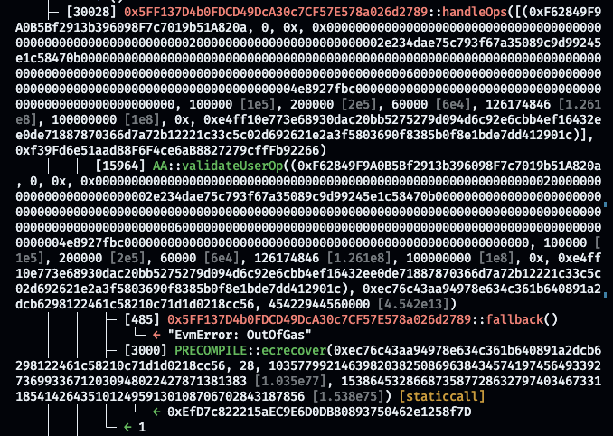
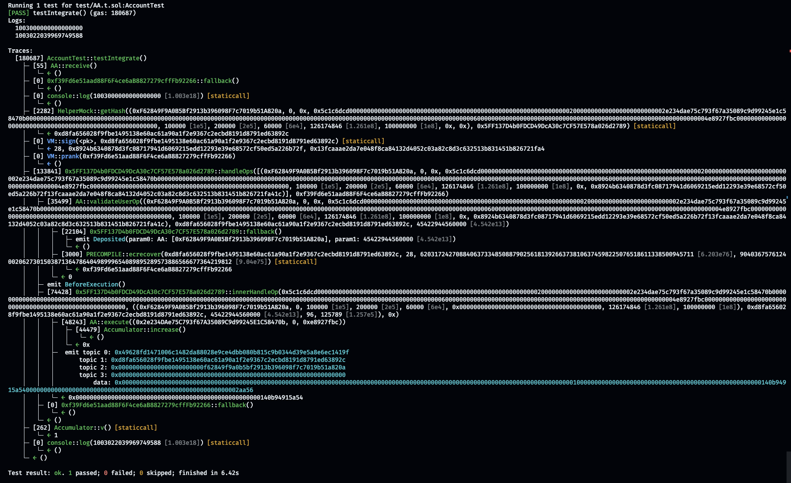

앞서, [이전 글](../Day-one-own-4337/)에 이은 두 번째 기록입니다. 전날 느꼈던 점이라면 명세만으로는 구현할 수 있는 것이 제한적이며 명확하지 않은 부분들이 존재했습니다.

* `ECDSA Signature`의 순서가 명확하게 확정되어 있지 않습니다.
* `Account`의 `validateUserOp`함수가 반환하는 데이터의 형태 중, `validUntil`과 `validAfter`가 있는 이유들 찾을 수 없었습니다. 이 값이 `UserOperation` 에 있지 않고 컨트랙트로 실행된 결과물로써 이러한 값들이 존재한다는 것이 이해되지 않았습니다. 
* 계정 추상화의 핵심은 `Account`가 다른 컨트랙트와 상호작용 하기 위해 독립적으로 동작하는 것이 주된 목적입니다. 그러나, `EntryPoint`를 통해서 `nonce`가 관리되는 것은 이상하게 보일 뿐만 아니라, `Account`는 다양한 주체가 운영하는 `EntryPoint`를 선택할 수 없는 것 처럼 느껴졌습니다. 
* 그러나 추후에 알게된 사실로써 각 체인마다 단 하나의 `EntryPoint`를 공통적으로 사용하므로 `nonce`가 `EntryPoint`에서 관리되는 것은 그다지 이상하지 않습니다.

명세에 나타나지 않은 부분들이 존재하기에, `Account` 컨트랙트를 배포하는 기능을 구현하기 전에 `Account`를 완전하게 구현하고 배포되어 있는 `EntryPoint` 컨트랙트와 통합하는 것을 목표로 방향을 전환하였습니다. `0x5FF137D4b0FDCD49DcA30c7CF57E578a026d2789`

`Account` 컨트랙트는 `EntryPoint` 컨트랙트로 부터 호출되어 `validateUserOp`함수를 확인하고 `calldata`를 호출하는 것이 일반적이므로, `calldata`를 처리하는 것을 우선합니다. 아래 레퍼런스 구현체에서는 별도의 `UserOperation`을 복사하여 내부 함수에서 호출을 처리하고 있습니다.

```solidity
// https://github.com/eth-infinitism/account-abstraction/blob/develop/contracts/core/EntryPoint.sol#L274-L276

...
if (callData.length > 0) {
    bool success = Exec.call(mUserOp.sender, 0, callData, callGasLimit);
    if (!success) {
...
```

`Exec`라이브러리의 `call`함수로 데이터를 호출하는 것 보다, 이미 준비되어 있는 `UserOperation` 라이브러리에 호출하는 기능을 넣는 것이 보다 직관적으로 보입니다.


```solidity
// file UserOpLib.sol

...
    /**
     * @notice  Executes the given `UserOperation` as a `call`.
     * @dev     Later, we'll need to get the value from calldata and use it directly.
     * @param   op              UserOperation struct
     * @return  success         Success or failure
     */
    function call(UserOperation calldata op) internal returns(bool success) {
        address sender = op.sender;
        bytes memory data = op.callData;
        uint256 callGasLimit = op.callGasLimit;

        assembly {
            success := call(callGasLimit, sender, 0, add(data, 0x20), mload(data), 0, 0)
        }
    }
...
```

구현한 코드에 대해 사용방법과 테스트를 위해서 다음 테스트 코드를 작성합니다. "HelperMock" 컨트랙트의 `if(!op.call()) revert();` 부분을 보실 필요가 있습니다. 해당 부분은 `require` 구문을 사용하여 오류를 검사할 수 있으나 대체로 `if` 구문을 이용 `revert`를 호출 하여 트랜잭션을 실패시키는 방법을 선호합니다.

`require` 구문은 오류 메시지를 문자열로 작성하므로 문자열이 길어지는 만큼 컨트랙트의 배포 크기도 늘어나게 됩니다. 이후에 Custom Error라는 기능이 솔리디티에 추가되었고 `if (!condition) revert CustomError();` 방식으로 사용할 수 있습니다. Custom Error의 장점으로 오류 문자열이 코드에 포함되지 않고 오류를 나타내는 4bytes 데이터로 저장되는만큼 컨트랙트의 배포 크기가 상대적으로 작게 유지 될 수 있게 도움을 줍니다. 현재 코드는 일반적인 `revert`로 트랜잭션이 취소 되도록 하였습니다.

```solidity
// test/UserOpLib.t.sol

// 실제로 call이 잘 이뤄지는지 확인하기 위해 샘플 컨트랙트를 만들어줍니다
contract Accumulator {
    uint256 public v;
    address public caller;

    // 호출 될 때 마다 v의 값을 1씩 증가시키며, 마지막 호출자의 정보를 `caller`에 저장합니다.
    function increase() external {
        v += 1;
        caller = msg.sender;
    }
}

...

// 기존 lib 도우미 컨트랙트에,
contract HelperMock {
    using UserOpLib for UserOperation;

    // 실행 기능을 연결해줍니다.
    function execute(UserOperation calldata op) external {
        if(!op.call()) revert();
    }

...

contract UserOperationHelperTest is Test {
    UserOperation op1;
    UserOperation op2;
    HelperMock ohm;
    Accumulator a;

    function setUp() public {
        ...

        a = new Accumulator();
        op2 = UserOperation({
            sender: address(a), // 앞선 Accumulator를 대상 주소로 지정합니다.
            nonce: 0,
            initCode: abi.encode(0),
            // Accumulator의 `increase`함수를 실행하도록 calldata를 만듦.
            callData: abi.encodeWithSelector(Accumulator.increase.selector), 
            callGasLimit: 200000,
            verificationGasLimit: 0,
            preVerificationGas: 0,
            maxFeePerGas: 0,
            maxPriorityFeePerGas: 0,
            paymasterAndData: abi.encode(0),
            signature: abi.encode(0)
        });
    }

    ...

    function testCall() public {
        UserOperation memory op = op2;

        // 헬퍼 컨트랙트를 통해 오브젝트를 바로 실행하도록 합니다.
        ohm.execute(op);

        // 최종적으로 대상 컨트랙트가 잘 호출 된 것을 확인할 수 있습니다.
        assertEq(a.v(), 1);
        assertEq(a.caller(), address(ohm));
    }
```

해당 코드에서 유의깊게 보셔야 할 부분은, `callData`를 생성하는 방식입니다. 해당 데이터 타입은 bytes인데, 함수와 인자들을 직렬화 한 데이터를 사용하는 방식입니다. 이것은 일반적인 트랜잭션에서도 해당 데이터를 body에 담아서 보내면 `increase()` 함수가 작동되는 것과 같습니다. 대상 컨트랙트에 `callData`를 전송했기 때문에 v의 값이 1 증가한 것을 확인할 수 있었습니다.

`Account`의 실행 로직이 잘 작동하는 것을 확인했기 때문에 `Account`가 다른 컨트랙트와 상호작용하는 인터페이스는 아무 것이나 사용해도 되는 것으로 보입니다. 그래서 이를 설계하고, `Account`가 ETH를 수취할 수 있는 상태가 아니므로, 이를 받을 수 있도록 함수를 추가해야 합니다. 또한 다양한 NFT 같은 다양한 토큰들을 받을 수 있어야 하기 때문에, 이를 위한 함수들도 추가합니다.

```solidity
// file AA.sol

contract AA is IAA {
    ...

    // 이더리움을 받기 위해서 추가한 함수
    receive() external payable {}

    ...

    // ERC721 기반 NFT를 받기 위한 함수
    function onERC721Received(address,address,uint256,bytes) external pure returns(bytes4) {
        return 0x150b7a02;
    }

    // ERC1155 기반 NFT를 받기 위한 함수
    function onERC1155Received(address,address,uint256,uint256,bytes) external pure returns(bytes4) {
        return 0xf23a6e61;
    }

    // ERC1155 Batch 기반 NFT를 받기 위한 함수
    function onERC1155BatchReceived(address,address,uint256[],uint256[],bytes) external pure returns(bytes4) {
        return 0xbc197c81;
    }
```

우선 ETH와 NFT를 받을 수 있는 작업을 수행합니다. `receive()` 함수가 없다면 수취에 실패하도록 컨트랙트가 만들어집니다. ERC721, ERC1155의 경우 `safe`접두어가 붙어있는 토큰 전송 함수가 있습니다. 토큰을 수취받는 대상이 컨트랙트인 경우에 토큰들이 영원히 컨트랙트에 남는 경우들을 방지하기 위해 각각의 NFT들을 받고 전송할 수 있는 기능이 있다는 것을 알려주는 역할입니다.

```solidity
// file IAA.sol

interface IAA {
    struct Call {
        address target;
        uint256 value;
        bytes data;
    }
    ...
```

```solidity
// file AA.sol

contract AA is IAA {
    ...

    function execute(Call calldata call) public returns (bytes memory returnData) {
        if (msg.sender != 0x5FF137D4b0FDCD49DcA30c7CF57E578a026d2789) revert();

        (bool success, bytes memory result) = call.target.call{value: call.value}(call.data);
        if (!success) {
            assembly {
                revert(add(32, result), mload(result))
            }
        }

        returnData = result;
    }

    function execute(Call[] calldata calls) public returns (bytes[] memory returnData) {
        if (msg.sender != 0x5FF137D4b0FDCD49DcA30c7CF57E578a026d2789) revert();

        uint256 length = calls.length;
        returnData = new bytes[](length);
        Call calldata calli;
        for (uint256 i; i != length; ) {
            calli = calls[i];
            (bool success, bytes memory result) = calli.target.call{value: calli.value}(calli.data);
            if (!success) {
                assembly {
                    revert(add(32, result), mload(result))
                }
            }

            returnData[i] = result;

            unchecked {
                ++i;
            }
        }
    }
    
    ...
```

`Account`가 다른 컨트랙트와 상호작용할 수 있도록 기능을 추가하는 과정입니다. 하나의 트랜잭션에 하나의 컨트랙트 또는 여러개의 컨트랙트 실행한다면 `execute`함수를 실행할 수 있습니다. `UserOperation`을 검증하고 실행하는 역할이 `EntryPoint`에 있기 때문에 각 함수의 첫 번째 줄은 이러한 실행 함수를 호출하는 대상이 `EntryPoint` 컨트랙트인지 확인해야만 합니다. 이러한 요소들을 고려하여 `execute` 함수에 대한 테스트 코드를 작성합니다.

```solidity
// file test/AA.t.sol

// SPDX-License-Identifier: UNLICENSED
pragma solidity ^0.8.13;

import {Test, console2} from "forge-std/Test.sol";
import {AA, IAA} from "../src/AA.sol";

contract Accumulator {
    uint256 public v;
    address public caller;

    function increase() external {
        v += 1;
        caller = msg.sender;
    }
}

contract AccountTest is Test {
    Accumulator acu;
    AA aa;

    function setUp() public {
        acu = new Accumulator();
        aa = new AA(Address("Owner"));
    }

    function testExecute() public {
        IAA.Call memory c =
            IAA.Call({target: address(acu), value: 0, data: abi.encodeWithSelector(Accumulator.increase.selector)});

        // Call from EntryPoint.
        vm.prank(0x5FF137D4b0FDCD49DcA30c7CF57E578a026d2789);
        aa.execute(c);

        assertEq(acu.v(), 1);
    }

    function testExecuteMulti() public {
        IAA.Call memory c =
            IAA.Call({target: address(acu), value: 0, data: abi.encodeWithSelector(Accumulator.increase.selector)});
        IAA.Call[] memory cs = new IAA.Call[](5);
        (cs[0], cs[1], cs[2], cs[3], cs[4]) = (c, c, c, c, c);

        // Call from EntryPoint.
        vm.prank(0x5FF137D4b0FDCD49DcA30c7CF57E578a026d2789);
        aa.execute(cs);

        assertEq(acu.v(), 5);
    }

    function testExecuteRaw() public {
        IAA.Call memory c =
            IAA.Call({target: address(acu), value: 0, data: abi.encodeWithSelector(Accumulator.increase.selector)});

        // Call from EntryPoint.
        vm.prank(0x5FF137D4b0FDCD49DcA30c7CF57E578a026d2789);
        // This is actually how EntryPoint calls Account.
        address(aa).call(abi.encodeWithSignature("execute((address,uint256,bytes))", c));

        assertEq(acu.v(), 1);
    }

    function testExecuteMultiRaw() public {
        IAA.Call memory c =
            IAA.Call({target: address(acu), value: 0, data: abi.encodeWithSelector(Accumulator.increase.selector)});
        IAA.Call[] memory cs = new IAA.Call[](5);
        (cs[0], cs[1], cs[2], cs[3], cs[4]) = (c, c, c, c, c);

        // Call from EntryPoint.
        vm.prank(0x5FF137D4b0FDCD49DcA30c7CF57E578a026d2789);
        // This is actually how EntryPoint calls Account.
        address(aa).call(abi.encodeWithSignature("execute((address,uint256,bytes)[])", cs));

        assertEq(acu.v(), 5);
    }

    function Address(string memory name) internal returns (address ret) {
        ret = address(uint160(uint256(keccak256(abi.encode(name)))));
        vm.label(ret, name);
    }
}
```

`AA` 컨트랙트의 소유권을 확인하기 위한 `validateUserOp`함수를 테스트 해야 합니다. 레퍼런스 구현체를 확인했을 때 해시를 계산하는 방법이 달랐기 때문에 이를 먼저 고쳐야 합니다.

```solidity
// file src/UserOpLib.sol

    // 기존 구현
    function opHash(UserOperation calldata op, address EntryPointAddr) internal view returns (bytes32 h) {
        // stored chainid
        uint256 chainId;

        // load chainid
        assembly {
            chainId := chainid()
        }

        // hashing
        h = keccak256(
            // concat data without signature(Too deep. use viaIr)
            abi.encodePacked(
                chainId,
                EntryPointAddr,
                op.sender,
                op.nonce,
                op.initCode,
                op.callData,
                op.callGasLimit,
                op.verificationGasLimit,
                op.preVerificationGas,
                op.maxFeePerGas,
                op.maxPriorityFeePerGas,
                op.paymasterAndData
            )
        );
    }

    ...

    // 새로운 구현
    function hash(UserOperation calldata op, address EntryPointAddr) internal view returns (bytes32 h) {
        // stored chainid
        uint256 chainId;

        // load chainid
        assembly {
            chainId := chainid()
        }

        h = keccak256(
            abi.encode(
                keccak256(
                    abi.encode(
                        op.sender,
                        op.nonce,
                        keccak256(op.initCode),
                        keccak256(op.callData),
                        op.callGasLimit,
                        op.verificationGasLimit,
                        op.preVerificationGas,
                        op.maxFeePerGas,
                        op.maxPriorityFeePerGas,
                        keccak256(op.paymasterAndData)
                    )
                ),
                EntryPointAddr,
                chainId
            )
        );
        // 이미 EntryPoint와 chainid를 통해 `UserOperation`가 만들어낼 해시값의 고유성이 확인되었음에도 해당 메시지를 서명의 일부로 사용함으로써,
        // 사용자의 서명이 이더리움외의 다른 네트워크에서 사용되는 것을 방지합니다.
        assembly {
            mstore(0x0, "\x19Ethereum Signed Message:\n32")
            mstore(0x1c, h)
            h := keccak256(0x0, 0x3c)
        }
    }
```

모든 요소들이 하나의 레벨에 존재하지 않고 `Signature`를 제외한 `UserOperation`를 우선적으로 해싱한 다음, 만들어진 해시값, `EntryPoint` 컨트랙트의 주소, 체인아이디를 묶어 해싱을 수행 한 값을 사용합니다. 이미 배포되어 있는 `EntryPoint` 컨트랙트와 호환되는 해싱 함수가 구현되었습니다. 이제 이것이 포함된 `validateUserOp` 함수를 테스트할 수 있습니다. 부수적으로 `opHash`인 함수 이름을 `hash`라는 보편적인 이름으로 변경하였습니다.

```solidity
// test/AA.t.sol
...

// 라이브러리를 사용하기 위해 라이브러리를 위한 Helper를 추가합니다.
contract HelperMock {
    using UserOpLib for UserOperation;

    function getHash(UserOperation calldata op, address entryAddr) external view returns (bytes32 h) {
        h = op.hash(entryAddr);
    }
}

...

contract AccountTest is Test {

    HelperMock ohm;

    ...

    function setUp() public {
        ohm = new HelperMock();
        acu = new Accumulator();
        // AA의 소유권자 EOA를 등록합니다.
        aa = new AA(0xf39Fd6e51aad88F6F4ce6aB8827279cffFb92266);
    }

    ...

    // 등록된 AA 소유권자로 테스트
    function testValidateUserOp() public {
        UserOperation memory op = UserOperation({
            sender: Address("Sender"),
            nonce: 0,
            initCode: abi.encode(0),
            callData: abi.encode(0),
            callGasLimit: 0,
            verificationGasLimit: 0,
            preVerificationGas: 0,
            maxFeePerGas: 0,
            maxPriorityFeePerGas: 0,
            paymasterAndData: abi.encode(0),
            signature: abi.encode(0)
        });

        // UserOperation과 EntryPoint 컨트랙트 주소로 해시를 생성합니다.
        bytes32 opHash = ohm.getHash(op, address(0x5FF137D4b0FDCD49DcA30c7CF57E578a026d2789));
        // AA의 소유자인 0xf39Fd6e51aad88F6F4ce6aB8827279cffFb92266 주소가 생성되는 비밀키로 해시에 서명합니다.
        (uint8 v, bytes32 r, bytes32 s) =
            vm.sign(0xac0974bec39a17e36ba4a6b4d238ff944bacb478cbed5efcae784d7bf4f2ff80, opHash);

        // 생성된 서명 값을 이어 붙여서 UserOperation의 서명 필드를 채워줍니다.
        op.signature = abi.encodePacked(r, s, v);

        // Call from EntryPoint.
        vm.prank(0x5FF137D4b0FDCD49DcA30c7CF57E578a026d2789);
        // 소유권자의 서명이 되었으므로, 성공해야 합니다.
        assertEq(aa.validateUserOp(op, opHash, 0), 0);
    }

    // AA의 소유자가 아닌 서명으로 테스트
    function testValidateUserOpNotFromOwner() public {
        UserOperation memory op = UserOperation({
            sender: Address("Sender"),
            nonce: 0,
            initCode: abi.encode(0),
            callData: abi.encode(0),
            callGasLimit: 0,
            verificationGasLimit: 0,
            preVerificationGas: 0,
            maxFeePerGas: 0,
            maxPriorityFeePerGas: 0,
            paymasterAndData: abi.encode(0),
            signature: abi.encode(0)
        });

        bytes32 opHash = ohm.getHash(op, address(0x5FF137D4b0FDCD49DcA30c7CF57E578a026d2789));
        // 0x70997970C51812dc3A010C7d01b50e0d17dc79C8
        (uint8 v, bytes32 r, bytes32 s) =
            vm.sign(0x59c6995e998f97a5a0044966f0945389dc9e86dae88c7a8412f4603b6b78690d, opHash);

        op.signature = abi.encodePacked(r, s, v);

        // Call from EntryPoint.
        vm.prank(0x5FF137D4b0FDCD49DcA30c7CF57E578a026d2789);
        // 소유권자의 서명이 아니므로 실패해야 합니다.
        assertEq(aa.validateUserOp(op, opHash, 0), 1);
    }
```

가장 간단한 '성공하는 경우' 및, '실패하는 경우'에 대해 테스트 코드를 작성해 보았습니다. 이 외에도 '취약한 서명 값', '서명 값의 길이', '복구 실패' 같은 테스트도 수행해야 하지만, 가장 우선되는 사항은 배포되어 있는 `EntryPoint` 컨트랙트와의 통합테스트 이기 때문에 나머지 테스트 코드는 나중에 추가할 예정입니다. `AA` 컨트랙트에 대한 소유자 EOA는 여럿 있을 수 있습니다. 그렇기에 이를 추가하고 제거하는 함수도 필요합니다.

```solidity
// file AA.sol

    ...

    function addOwner(address anOwner) external {
        if(msg.sender != address(this)) revert();

        owners[anOwner] = true;
    }

    function removeOwner(address anOwner) external {
        if(msg.sender != address(this)) revert();

        delete owners[anOwner];
    }
```

여기서 중요한 부분은, `addOwner`와 `removeOwner`를 호출하는 대상은, `AA` 컨트랙트 자신이여야 함수가 동작한다는 점입니다. 따라서, `addOwner`와 `removeOwner`를 호출하는 정보는 사용자의 `UserOperation`에 담겨 있어야 합니다. 이를 확인해보겠습니다.

```solidity
// file IAA.sol

    ...

    function addOwner(address anOwner) external;

    function removeOwner(address anOwner) external;

    ...
```

```solidity
// file test/AA.t.sol

    ...

    function testAddOwnerThroughExecute() public {
        address addTarget = 0xa0Ee7A142d267C1f36714E4a8F75612F20a79720;

        IAA.Call memory c = IAA.Call({
            target: address(aa),
            value: 0,
            data: abi.encodeWithSelector(IAA.addOwner.selector, addTarget)
        });

        assertEq(aa.owners(addTarget), false);

        // Call from EntryPoint.
        vm.prank(0x5FF137D4b0FDCD49DcA30c7CF57E578a026d2789);
        address(aa).call(abi.encodeWithSignature("execute((address,uint256,bytes))", c));

        assertEq(aa.owners(addTarget), true);
    }

    function testRemoveOwnerThroughExecute() public {
        address removeTarget = 0xf39Fd6e51aad88F6F4ce6aB8827279cffFb92266;

        IAA.Call memory c = IAA.Call({
            target: address(aa),
            value: 0,
            data: abi.encodeWithSelector(IAA.removeOwner.selector, removeTarget)
        });

        assertEq(aa.owners(removeTarget), true);

        // Call from EntryPoint.
        vm.prank(0x5FF137D4b0FDCD49DcA30c7CF57E578a026d2789);
        address(aa).call(abi.encodeWithSignature("execute((address,uint256,bytes))", c));

        assertEq(aa.owners(removeTarget), false);
    }

    function testAddOwnerCallFromNotSelf() public {
        address addTarget = 0xa0Ee7A142d267C1f36714E4a8F75612F20a79720;

        vm.expectRevert();
        aa.addOwner(addTarget);
    }

    function testRemoveOwnerCallFromNotSelf() public {
        address removeTarget = 0xf39Fd6e51aad88F6F4ce6aB8827279cffFb92266;

        vm.expectRevert();
        aa.removeOwner(removeTarget);
    }
```

4개의 테스트 함수로 `EntryPoint`를 통해 호출되는 `AA`가 자기 자신의 함수인, `addOwner`, `removeOwner`를 호출하여 소유자를 더하고 빼는 기능이 잘 작동하는 것을 확인할 수 있었습니다.

컨트랙트 주소가 사용자의 주 계정이 되는 것이기 때문에 EOA와 같은 사용성을 가질 필요가 있습니다. EOA는 서명만 제출하는 것으로 트랜잭션이나 특정 데이터가 EOA를 통해서 확인되었다.라는 것을 앞선 코드에서 동일한 방법으로 서명을 복구하면 서명한 계정 주소가 복구되기 때문에 이러한 것을 쉽게 확인할 수 있습니다.

하지만, `AA`같은 컨트랙트 계정의 경우 '비밀 키'를 이용하여 동작하는 것이 아니라 코드에 의해서 동작하기 때문에 서명을 통한 확인 기능을 제공할 수 없습니다. 서명을 제공하였더래도, `AA`컨트랙트에 등록된 많은 계정 주소중 하나이기 때문에 `AA` 컨트랙트가 서명한 것으로 나타나지 않습니다. 이러한 사용성이 떨어지는 경우를 방지하기 위해 컨트랙트가 서명한 것 처럼 수행할 수 있는 [ERC-1271](https://eips.ethereum.org/EIPS/eip-1271) 제안이 존재합니다. 이 제안은, `AA` 컨트랙트 주소 정보가 포함된 해시와 `AA`에 소유자로 등록된 계정 주소의 서명을 컨트랙트로 전달하면 컨트랙트가 해당 서명이 내 소유자의 서명이 맞다는 확인을 해주는 제안입니다.

```solidity
// file IERC1271.sol

// SPDX-License-Identifier: UNLICENSED
pragma solidity ^0.8.13;

interface IERC1271 {
    // bytes4(keccak256("isValidSignature(bytes32,bytes)")
    // bytes4 internal constant MAGICVALUE = 0x1626ba7e;

    /**
     * @dev     Should return whether the signature provided is valid for the provided hash
     * @param   _hash      Hash of the data to be signed
     * @param   _signature Signature byte array associated with _hash
     *
     * MUST return the bytes4 magic value 0x1626ba7e when function passes.
     * MUST NOT modify state (using STATICCALL for solc < 0.5, view modifier for solc > 0.5)
     * MUST allow external calls
     */
    function isValidSignature(bytes32 _hash, bytes calldata _signature) external view returns (bytes4 magicValue);
}
```

```solidity
// file AA.sol

...

import "./IERC1271.sol";

contract AA is IAA, IERC1271 {

    ...

    function isValidSignature(bytes32 _hash, bytes calldata _signature) external view returns (bytes4 magicValue) {
        if (_signature.length != 65) return 0xffffffff;

        uint8 v;
        bytes32 r;
        bytes32 s;

        assembly {
            calldatacopy(mload(0x40), _signature.offset, 0x20)
            calldatacopy(add(mload(0x40), 0x20), add(_signature.offset, 0x20), 0x20)
            calldatacopy(add(mload(0x40), 0x5f), add(_signature.offset, 0x40), 0x2)

            // check signature malleability
            if gt(mload(add(mload(0x40), 0x20)), 0x7FFFFFFFFFFFFFFFFFFFFFFFFFFFFFFF5D576E7357A4501DDFE92F46681B20A0) {
                mstore(0x0, 0x01)
                return(0x0, 0x20)
            }

            r := mload(mload(0x40))
            s := mload(add(mload(0x40), 0x20))
            v := mload(add(mload(0x40), 0x40))
        }

        if (!owners[ecrecover(_hash, v, r, s)]) return 0xffffffff;

        return 0x1626ba7e;
    }

    ...

```

그러나 이는 단순히 인터페이스 일 뿐입니다. 함수 자체는 '해당 컨트랙트에 해당 서명의 사용자가 존재한다.'라는 증명만 해 줄 뿐입니다. `UserOperation`에 데이터를 채우고 서명 값을 채우게 되는것 처럼 어떤 데이터에 서명하는가, 그리고 그리고 `AA` 컨트랙트의 `isValidSignature`함수를 호출하는 컨트랙트가 이것을 어떻게 자신의 컨트랙트에 반영시킬 것인지가 중요합니다. 이러한 함수 형태가 일종의 표준 성격을 띄고 있으므로 이를 추가하는 것이 나쁜 것이 아닐 것입니다.

```solidity
// file test/AA.t.sol

    function testIsValidSignature() public {
        bytes32 opHash = keccak256("hello");
        // 0xf39Fd6e51aad88F6F4ce6aB8827279cffFb92266
        (uint8 v, bytes32 r, bytes32 s) =
            vm.sign(0xac0974bec39a17e36ba4a6b4d238ff944bacb478cbed5efcae784d7bf4f2ff80, opHash);

        bytes memory signature = abi.encodePacked(r, s, v);

        bytes memory target = abi.encode(0x1626ba7e00000000000000000000000000000000000000000000000000000000);
        bytes memory result = abi.encode(aa.isValidSignature(opHash, signature));

        assertEq(result, target);
    }

```

이렇게 테스트 코드도 작성되었으므로 이더리움 테스트넷인 Sepolia에 배포되어 동작하고 있는 `EntryPoint` 컨트랙트와 통합 테스트를 해보겠습니다.

```toml
...
[rpc_endpoints]
SEPOLIA_RPC_URL = "${SEPOLIA_RPC_URL}"
```

```solidity
// file test/AA.t.sol

    ...

    function setUp() public {
        vm.createSelectFork(vm.rpcUrl("SEPOLIA_RPC_URL"));

    ...

    function testIntegrate() public {
        // AA에 이더를 담아둡니다.
        payable(aa).call{value: 1 ether}("");
        // EntryPoint를 실행할 EOA(Bundler)에 가스비로 사용할 이더를 넣어둡니다.
        payable(0xf39Fd6e51aad88F6F4ce6aB8827279cffFb92266).call{value: 1 ether}("");

        // Bundler의 현재 밸런스를 확인합니다. 1.000000000000000000 ether
        console2.log(address(0xf39Fd6e51aad88F6F4ce6aB8827279cffFb92266).balance);

        // AA의 execute 함수의 인자로 사용될 calldata를 정의합니다.
        IAA.Call memory c =
            IAA.Call({target: address(acu), value: 0, data: abi.encodeWithSelector(Accumulator.increase.selector)});

        UserOperation memory op = UserOperation({
            sender: address(aa),
            nonce: 0,
            initCode: "",
            // 앞서 준비한 calldata를 execute 함수 시그니쳐와 결합해줍니다
            callData: abi.encodeWithSignature("execute((address,uint256,bytes))", c),
            callGasLimit: 100_000,
            verificationGasLimit: 200_000,
            preVerificationGas: 60_000,
            maxFeePerGas: 126_174_846,
            maxPriorityFeePerGas: 100_000_000,
            paymasterAndData: "",
            signature: ""
        });

        // EntryPoint에 UserOperation을 배열로 주입하여야 하므로, 배열로 만들어줍니다.
        UserOperation[] memory ops = new UserOperation[](1);
        ops[0] = op;

        // 만들어둔 UserOperation에 대해 해시하고 서명을 만들어줍니다.
        bytes32 opHash = ohm.getHash(op, address(0x5FF137D4b0FDCD49DcA30c7CF57E578a026d2789));
        // 0xf39Fd6e51aad88F6F4ce6aB8827279cffFb92266
        (uint8 v, bytes32 r, bytes32 s) =
            vm.sign(0xac0974bec39a17e36ba4a6b4d238ff944bacb478cbed5efcae784d7bf4f2ff80, opHash);
        op.signature = abi.encodePacked(r, s, v);

        // Bundler의 EOA로, UserOperation을 EntryPoint로 전송해줍니다.
        vm.prank(0xf39Fd6e51aad88F6F4ce6aB8827279cffFb92266);
        IEntryPoint(0x5FF137D4b0FDCD49DcA30c7CF57E578a026d2789).handleOps(ops, payable(0xf39Fd6e51aad88F6F4ce6aB8827279cffFb92266));

        // 가산기의 숫자가 1증가했는지 확인합니다.
        assertEq(acu.v(), 1);

        // Bundler의 최종 밸런스를 확인합니다. 1.000022039969749588 ether
        console2.log(address(0xf39Fd6e51aad88F6F4ce6aB8827279cffFb92266).balance);
    }
```

가장 처음 실행때에는 전혀 다른 주소가 복원 된 것을 확인할 수 있었습니다.

<figure>
    
    <figcaption>AA에 등록되지 않은 주소가 복원되어 1이 반환된 것을 확인</figcaption>
</figure>

그래서 `src/UserOpLib.sol` 파일의 "Ethereum Signed Message" 접두어를 붙여 계산하는 부분을 삭제하고 다시 통합 테스트를 실행시켜 보았습니다. 

<figure>
    
    <figcaption>AA가 작동하여, 가산기의 올바른 작동과 Bundler의 밸런스가 늘어난 모습</figcaption>
</figure>

결과, 서명값이 "Ethereum Signed Message"를 사용하지 않는 것으로 보입니다. 이것이 빠지더라도 `UserOperation`의 고유성은 확인되었으므로 [EIP-721](https://eips.ethereum.org/EIPS/eip-712) 방식의 서명 또한 가능하리라 생각됩니다.

이제 더 해볼 것은 Paymaster가 대신 가스비를 지불하는 것과 가스비를 ERC20으로 지불하는 것을 통합 테스트로 해볼 필요가 있습니다. 또한 시장에는 `AA`에 다양한 기능들을 추가하는 방법들을 논의하고 있습니다. 내가 키를 모두 잃어버렸더래도 지갑의 복구가 가능한 `Social Recovery`. 자산이 이동한 다음에 바로 실행될 함수, `AA`를 다양한 사람들이 서명해야 사용할 수 있는 멀티시그 월렛으로 변화시킬 필요 또한 종종 요구됩니다. 이를 가능하게 하는, [EIP-6900](https://eips.ethereum.org/EIPS/eip-6900)도 살펴볼 필요가 있습니다.

여전히 이 과정을 통해서 작성된 코드는 [own4337 on Github](https://github.com/Nipol/own4337)에서 확인하실 수 있습니다. 

긴 글 끝까지 읽어주셔셔 감사합니다. :)
