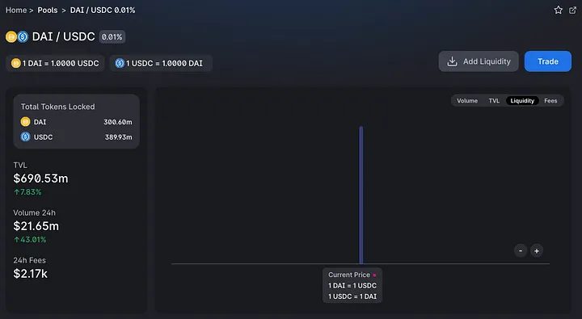

## 솔리디티로 유니스왑이 제공하는 기능 A to Z 알아보기

유니스왑은 2020년 부터 2021년 초까지, DeFi Summer 동안 유동성을 끌어올린 중추적인 역할을 담당했습니다. Automative Market Maker(이하 AMM)라는 독보적인 도구로써, 잦은 아비트라지 기회를 제공하는 동시에, DeFi 프로토콜에 쉽게 통합되어 더 많은 거래 볼륨과 유동성을 창출하였습니다.

이후에 유니스왑을 포크한 프로토콜과 자신만의 독특한 수식을 가진 Balancer와 Curve, 그리고 이 프로토콜들의 포크까지 많은 AMM들이 등장하게 되었고, 각자 거버넌스 토큰을 뿌리면서 유례없는 유동성 잔치가 펼쳐졌다고 하여도 과언이 아닐 겁니다.

이후에, 다음과 같은 독특한 기능들을 가진 새로운 세대의 유니스왑 V3가 발표되었습니다.

* 지정된 가격대에만 유동성을 공급하는, 집중화된 유동성
* 유동성 증표를 ERC721 기반 NFT로 제공하는 기능
* Pool이 가질 수 있는 다양한 수수료 체계
* 별도의 컨트랙트 없이 조회할 수 있는 TWAP(Time-weighted Average Price).

이 유동성을 지정한 가격대에 집중시킬 수 있는 이 기능이 대표적인데, 같은 가치를 가진 토큰들 사이의 교환으로 유명한 Stable Swap의 Curve와 유니스왑을 비교한다면 다음과 같다고 볼 수 있습니다.

<figure>
    
    <figcaption>Dai를 USDC로 유니스왑 V3을 이용해서 교환하는 모습</figcaption>
</figure>

<figure>
    
    <figcaption>Dai를 USDC로 Curve finance를 이용해서 교환하는 모습</figcaption>
</figure>

단순 수수료의 차이이기 이전에 결과로 보이듯, 같은 가치에 대한 교환에 있어서 극단적인 차이가 발생하기에, 같은 가치의 자산을 교환하는 데 있어 최적의 결과를 보여준다는 점입니다. 특히나, 이러한 유동성들이 유니스왑을 통해 모이게 된다는 점에 주목할 만합니다.

이렇게 자본 효율성(Capital Efficiency)이 극대화되는 프로토콜을 통합하는 것은 많은 잠재성을 가지게 합니다. 이미 유니스왑을 통합하여 다양한 기회들을 접목하는 것을 보면, 아직 숨겨진 잠재성이 많지 않은가 하는 생각이 들게끔 합니다. 유니스왑을 통합한 예시는 어떤 것이 있을까요?

## Active LP
유니스왑이 유동성을 특정 가격대에 집중할 수 있게 되면서, 거래가 자주 일어나는 가격대에 맞춰 유동성을 지속적으로 옮겨주는 프로토콜들이 나오게 되었습니다. 이 프로토콜들은 교환으로 발생되는 수수료를 주된 목표로 하여 가격대가 변할 때마다, 기존 유동성이 위치한 가격대를 대신하여 옮겨줍니니다.

예를 들어 ETH:USDC 유동성 풀에 100명이 각각 유동성 공급을 하고 있다고 할 때, 거래되는 가격대가 변경되면 이를 100명 모두 각각 유동성이 위치한 가격대를 옮겨야 하지만, 이러한 프로토콜을 이용하고 있다면 몇 명분의 유동성이든, 한 번에 대신 옮겨주기 때문에 가스비를 소모하는 부분에 있어서도 더 적게 사용하게 됩니다. 이러한 것을 활성화된 유동성 공급(Active LP)이라고 부릅니다.
또한 이런 자동화된 프로토콜은 쌓인 수수료를 청구하여 다시 유동성으로 더해주는 기능도 가지고 있기 때문에, 복리의 효과 또한 누릴 수 있다는 점이 있습니다.

일반 이용자가 유니스왑에 유동성 공급하면, 공급의 증표로 NFT를 받게 됩니다. 이러한 증표가 NFT로 제공되었을 때 단점은 기존 프로토콜과의 통합에 어려움을 겪는다는 점입니다. 일반적인 토큰을 담보로 대출을 하는 프로토콜은 NFT를 예치받기 위해서 인터페이스를 추가 개발해야하고, NFT가 가지고 있는 정보를 검증할 수 있어야 하기에 프로토콜의 확장은 필수적입니다.

이러한 점을 개선시킨 것이 Gelato Network라는 자동화 프로토콜이 제공하는 G-UNI 토큰이 있습니다. Gelato를 통해 유니스왑에 유동성을 공급하게 되면 가격대를 자동으로 옮겨줄 뿐만 아니라, 정기적으로 쌓인 수수료 또한 다시 유동성으로 공급하여 줍니다. 또한 유동성에 대한 증표가 일반적인 ERC20으로 제공되기 때문에 MakerDAO와 같은 기존 프로토콜에 통합되어 있습니다.

## bean the DAO 의회
제 개인적인 Social DAO를 시작하면서 몇몇 장치들을 도입할 필요가 있었습니다. 현실 세계의 주식은 오더북을 이용한 교환이 자주 일어나는데 반해, 블록체인에서는 많은 토큰들이 AMM을 이용하여 교환된다는 점을 주목하였습니다. 특히나 유동성이 적은 토큰을 위해서 유동성을 한 곳에 모을 필요가 있었고, 바이백이나 토큰 발행을 통한 희석을 하는 데 있어서도 좋은 방법이 필요했습니다.

이러한 방법을 고민하던 끝에, DAO의 투표권이 유니스왑 bean:ETH에 대한 유동성이 되도록 구성했습니다. 이를 통해서 DAO의 가치를 지속적으로 추적할 수 있게 되었고, 사용자는 거버넌스 토큰을 스테이킹 하였을 때 최대 가치를 느낄 수 있도록 하여, 거버넌스 참여를 더욱 독려할 수 있게 되었습니다.

유동성이 한곳에 모이게 되었으므로, TWAP을 통해 DAO의 가치 산정이 더욱 쉽게 이뤄질 수 있다고 보여집니다. 거버넌스가 가진 토큰과 유동성은 쉽게 계산되어 자동화된 공시를 가능하게 한다는 점, 또한 투표권이 유동성으로 이뤄지기 때문에 두 개의 토큰이 아니라, 하나의 토큰. 예를 들어 순수하게 ETH만 스테이킹하는 것으로도 거버넌스 참여가 가능하게 되므로 DAO에 있어서 지속적인 도전이 되리라 생각합니다. 해당 코드는 [UniswapModule](https://github.com/Nipol/Governance/blob/feat/council/contracts/Council.sol) 에서 확인할 수 있습니다.

‘bean the DAO 의회’를 개발하는 도중 유니스왑을 통합할 때 굉장히 많은 문제에 봉착했습니다. 유니스왑 V3부터 인터페이스들이 기능에 따라 분할되어 다양해졌고, 백서에 기록된 내용이 실제 구현된 코드를 완전히 설명하지 못하는 경우가 많아 개발자 문서를 확인하고, 때로는 문서로도 해결되지 않아 실제로 사용되는 예시를 찾기 위해 인터페이스가 어떻게 컨트랙트를 호출하는지 확인할 필요가 있었습니다.

그래서, 이 글을 통해 유니스왑을 통합할 때 동일한 문제를 겪지 않도록, 유니스왑을 코드 레벨에서 이해할 수 있도록 안내하고, 유니스왑 컨트랙트가 제공하는 인터페이스를 사용 예시로 알려드리려고 합니다.

## 유니스왑V3을 호출하여, 유동성 풀 만들기

가장 먼저, 원하는 토큰 쌍으로 유동성 풀을 만들 수 있어야 합니다. 유동성 풀은 유니스왑 팩토리 컨트랙트를 통해서 생성되며, 유니스왑의 모든 배포된 컨트랙트 주소는 Uniswap Contract Deployments에서 확인할 수 있습니다. 아주 다행인 점은, 대부분의 컨트랙트가 체인에 관계없이 동일한 주소를 가지고 있다는 점입니다.

```solidity
// SPDX-License-Identifier: MIT
pragma solidity ^0.8.0;

import "@uniswap/v3-core/contracts/interfaces/IUniswapV3Factory.sol";
import "@uniswap/v3-core/contracts/interfaces/IUniswapV3Pool.sol";

import "./StandardToken.sol";

contract UniswapV3Integration {
    address public constant UNIV3_FACTORY = 0x1F98431c8aD98523631AE4a59f267346ea31F984;
    IUniswapV3Factory v3Factory = IUniswapV3Factory(UNIV3_FACTORY);
    IUniswapV3Pool pool;
    StandardToken token0;
    StandardToken token1;

    uint24 constant fee = 3000;

    constructor() {
        token0 = new StandardToken("bean the token", "bean", 18, 100000e18);
        token1 = new StandardToken("Wrapped Ether", "WETH", 18, 0);
        pool = IUniswapV3Pool(v3Factory.createPool(address(token0), address(token1), fee));
    }
}
```

이 코드는 유니스왑을 직접적으로 통합하는 컨트랙트이며, 유니스왑의 인터페이스는 npm 을 통해서 쉽게 추가해서 불러올 수 있습니다.

컨트랙트가 배포될 때, 두 개의 표준 ERC20을 생성하도록 했습니다. 이는 각각 bean과 WETH라는 토큰으로 배포되며, 유동성 풀을 만들 때 필요한 두 개의 토큰으로 사용됩니다. 이 두 토큰을 이용하여 유니스왑 팩토리 컨트랙트를 호출하여 유동성 풀을 생성하도록 합니다.

팩토리 컨트랙트의 `createPool` 함수 내부를 보면 두 토큰의 주소와 수수료 값을 입력받게 되는데, 이 정보들은 충돌하지 않는 컨트랙트 주소를 구성하는 데 사용됩니다.

```solidity
...
    new UniswapV3Pool{salt: keccak256(abi.encode(token0, token1, fee))}();
...
```

솔리디티에서는 컨트랙트를 배포할 때 `salt`를 지정하면 `create2`를 이용하여 배포되며, salt 값에 따라 컨트랙트 주소를 확정할 수 있습니다. 유동성 풀이 `create2`를 이용하여 배포되는 것을 알 수 있습니다. 여기에서 사용되는 `salt`는 ‘token0의 주소, token1의 주소, 그리고 수수료 값’을 순서대로 배치하여 keccak256로 해싱 한 값을 사용하고 있습니다. 그러면, token0과 token1의 순서를 바꾸면 전혀 다른 해시값이 salt로 사용되는데, 같은 토큰 구성과 수수료 체계를 가지고 있지만 새로운 유동성 풀을 만들게 되지 않을까요?

```solidity
// 결과: 0xd240917b4f29206a2f1fa9ca8c04135d5fb29b9de9297735e850d15b6343ea43
function sampleHashOne() external pure returns(bytes32) {
    return keccak256(abi.encode(address(1), address(2), 3000));
}

// 결과: 0x55b5bb173ff5ab0df513148295f13e7d273d1e487d43c8e8221c3cf0816df006
function sampleHashTwo() external pure returns(bytes32) {
    return keccak256(abi.encode(address(2), address(1), 3000));
}
```

여기에서 유니스왑의 특징 중 하나가 나오는데, *‘유니스왑은 토큰의 순서를 굉장히 중요하게 생각하고 있다.’* 는 점입니다. 유니스왑 전반적으로 두 개의 토큰 주소가 들어왔을 때, token0에는 상대적으로 작은 주소를 가진 토큰이, token0에는 상대적으로 큰 주소를 가진 토큰이 오도록 조정됩니다.

이것이 가능한 이유는, 컨트랙트 주소 또한 16진수로 구성된 숫자이기 때문에 비교가 가능하고, 주소 자체가 해시를 통해 결정된 것이기 때문에 충돌이 있을 수 없기 때문입니다. 이러한 특성으로 크고 작음에 대한 비교가 가능합니다. 토큰 순서의 중요성은 유동성 풀이 생성될 때뿐만 아니라, 앞으로 나올 다른 기능들에도 영향을 미칩니다.

## 집중화된 유동성 공급 수행하기

새로운 유니스왑을 이용하여 원하는 가격대에 유동성을 집중시킬 수 있게 되면서 유니스왑에서의 교환비율이 좋은 경우가 종종 발견되곤 합니다. 특히나, 가치가 같은 토큰들 사이의 유동성 풀에서 이점이 극대화되었는데 DAI/USDC의 경우를 예시로 볼 수 있겠습니다.

<figure>
    
    <figcaption>Dai와 USDC 유니스왑 풀의 유동성 범위</figcaption>
</figure>

두 토큰의 가치가 거의 동일하게 평가되다 보니, 0.9998~1.0001 가격 사이에 유동성이 공급된 것을 확인할 수 있습니다. 또한 유동성이 넓은 범위를 커버하지 않아 토큰을 교환할 때 가격 변동성 또한 극도로 낮다는 특징이 있습니다. 유동성 공급자들도, 두 개의 토큰이 동일한 가치에 수렴한다는 컨센서스가 있기 때문에 유니스왑의 발표대로 자본 효율성(Capital Efficiency)이 엄청나다는 것을 확인할 수 있습니다.

이처럼 저희의 예제에서도 유동성을 특정 가격 범위에 등록하는 것을 목표로 합니다. 앞서 만든 유동성 풀에 토큰을 공급하기 위해서는 초기 가격을 지정한 다음, 등록할 가격 범위를 지정해야 합니다.

유니스왑 V2에서는 유동성 풀이 생성되면 각각의 토큰 수량을 예치하는 것으로 초기 가격과 교환 비율을 설정하였다면, V3에서는 가격 범위를 지정하여 유동성을 등록할 수밖에 없기 때문에 단순히 토큰의 비율로 초기 가격과 교환비율을 알 수 없다는 점입니다. 그렇기에, ‘초기 가격’과 ‘토큰을 등록할 가격 범위’를 유동성 풀에 기록하여야 합니다.

<figure>
    
    <figcaption>유니스왑의 유동성 분포 예시</figcaption>
</figure>

유니스왑에서 사용되는 가격은 제곱근(Squared Root)을 이용합니다. ‘초기 가격’과 ‘토큰을 등록할 가격 범위’을 제곱근 형태로 계산하여 유동성 풀에 등록하게 됩니다. 백서에 적힌 수식은 다음과 같습니다.

$$
\sqrt{P} = \sqrt{\frac{y}{x}}
$$

이것은 유니스왑이 따르고 있는 기본 수식인 $x*y=K$에 해당하는 것이라 볼 수 있고, 이 수식을 통해서 1 ETH가 1,800 DAI라는 가격을 계산하면 다음과 같습니다.

$$
\sqrt{P} = \sqrt{\frac{1}{1800}}
$$

그러나 앞서서도 말했듯, 유니스왑에서는 토큰의 순서가 무척 중요합니다. 어떤 토큰이 분자와 분모에 위치해야 하는지 알아야 하기 때문입니다. WETH의 토큰 주소는 `0xC02aaA39b223FE8D0A0e5C4F27eAD9083C756Cc2`이고, DAI의 토큰 주소는 `0x6b175474e89094c44da98b954eedeac495271d0f`입니다. 컨트랙트 주소의 크기 비교를 하면, 유동성 풀의 token0은 DAI이며, token1은 WETH가 될 것입니다. 이를 이용하여 sqrtPrice를 계산하는 솔리디티 코드를 보겠습니다.

```solidity
uint160 sqrtPriceX96;
uint256 PRECISION = 2**96;
// 1 weth가 1800 DAI인 경우. weth는 소수점 18자리 지원, DAI 또한 소수점 18자리 지원.
sqrtPriceX96 = uint160(sqrt((1e18 * PRECISION * PRECISION) / 1800e18));
// 결과: 1867425699159537997291064607

sqrtPriceX96 = uint160(sqrt((1800e18 * PRECISION * PRECISION) / 1e18));
// 결과: 3361366258487168395123916293647
```

아래의 결과가 토큰의 순서를 반대로 만든 결과인데, 전혀 다른 결과가 나오게 됩니다. 당연한 결과이겠죠! 이렇게 유니스왑에서 사용되는 sqrtPrice의 최대 최솟값은 각각 `1461446703485210103287273052203988822378723970342`과 `4295128739`로 정해져 있고, 가격 공간과 매칭을 하면 다음과 같습니다.

<figure>
    
    <figcaption>유니스왑의 가격 공간과 제곱근 된 가격 공간의 비교</figcaption>
</figure>

가격 공간과 제곱근 된 가격에 대해 어떻게 일치되는지 아시겠지요? 만약 토큰 순서를 반대로 구성하여 제곱근 된 가격을 입력하거나, 토큰 교환, 유동성 등록을 하면 트랜잭션이 대부분 실패하게 된다는 점을 유의할 필요가 있습니다.

하지만, 사용자의 관점에서는 “토큰 A는 토큰 B로 환산했을 때 얼마가 되어야 하나” 또는, “각각 얼마에서 토큰 공급을 할 것인지”를 고려하기 때문에, 토큰의 순서를 자동으로 처리할 수 있도록 다음의 함수를 작성하여 줍니다.

```solidity
/**
 * @notice 토큰 주소의 순서에 따라 제곱근된 가격을 자동으로 계산합니다.
 * @param addr0 토큰 주소0
 * @param addr1 토큰 주소1
 * @param reserve0 토큰 주소0에 해당하는 토큰 수량
 * @param reserve1 토큰 주소1에 해당하는 토큰 수량
 * @return sqrtPriceX96 각 리저브에 따른 현재 토큰의 가치
 */
function encodeSqrtPrice(
    address addr0,
    address addr1,
    uint256 reserve0,
    uint256 reserve1
) public pure returns (uint160 sqrtPriceX96) {
    if (addr0 > addr1) {
        sqrtPriceX96 = uint160(sqrt((reserve0 * PRECISION * PRECISION) / reserve1));
    } else {
        sqrtPriceX96 = uint160(sqrt((reserve1 * PRECISION * PRECISION) / reserve0));
    }
}
```

유니스왑은 제곱근 값으로 표시되는 가격을 사용하는 이유로, ‘기본 AMM 알고리즘인 $x*y=K$ 의 기하학적 특성으로 유니스왑에서 사용되는 수학에 잘 들어 맞습니다.’라고 이야기하고 있으며, 앞서서 계속 나왔던 sqrtPrice에 접미어로 붙는 X96은 무엇일까요?

EVM은 부동소수점의 영향을 받지 않기 위해 모든 정보를 256비트 단위로 저장하고 있습니다. 가장 쉬운 실전 예시로, ERC20 잔고는 정수로만 저장됩니다. 그렇지만, 소수점 정보에 따라 18자리 소수점 또는 6자리 소수점 등으로 표현될 수 있습니다. 잔고가 1로 저장되어 있다면, 18자리 소수점을 지원하는 토큰에서는 `0.000000000000000001`로 표현되고, 6자리 소수점을 지원하는 토큰에서는 `0.000001`로 표현됩니다.

유니스왑에서는 접미어 X뒤에 따라오는 숫자를 소수점을 표현하는데 예약된 비트(bit)라고 설명하고 있습니다. `sqrtPriceX96` 자체는 `uint160`에 저장하고 있으므로, 160 - 96 = 64비트는 정수를 표현하는 데 사용하고 있습니다.

종종 유니스왑 코드 또는 문서를 보면 `sqrtRatioX96` 이 나타나는데, `sqrtPriceX96`과 동일한 의미로 사용되는 것입니다.

다시 저희 코드로 돌아오면, 이제 `sqrtPriceX96`을 계산할 수 있게 되었기 때문에 유동성을 등록하기 위한 가격 범위를 계산할 것입니다. 유동성을 등록할 때 두 개의 토큰 모두를 준비하는 방법보다 두 개의 토큰 중 하나만 등록할 수 있도록 가격 범위를 설정할 것입니다.

<figure>
    
    <figcaption>가격 공간에서, 현재의 가격 지점과, 유동성을 등록하려는 가격의 범위</figcaption>
</figure>

우선 저희는 1 bean을 0.01 ~ 10 ETH의 가격 범위로 등록하려고 합니다. 그렇기에 유동성 풀이 가지고 있어야 하는 초기 가격은 0.01 bean/ETH 가 적합하고, 이것을 계산하여 가격 정보를 등록합니다.

```solidity
uint160 initialPriceX96 = encodeSqrtPrice(address(token0), address(token1), 1e18, 0.01 ether);

// 앞서 만든 Pool에 가격 정보를 초기화 합니다.
pool.initialize(initialPriceX96);
```

초기 가격 정보는 유동성이 등록되기 이전에는 몇 번이고 호출이 가능하기 때문에, 바로 이후에 유동성이 공급되는 것이 합당합니다. 다만 여기에서는 제곱근 된 가격이 직접적으로 사용되지 않고, 자료형이 int24인 `Tick`을 이용하게 됩니다.

`Tick`이란 유동성 풀의 현재 가격이 0.01% 변동될 때마다 한 칸씩 움직이는 눈금이라고 생각해야 합니다. 이 눈금의 단위는 유동성 풀이 가지는 수수료 체계와도 직접적인 상관관계가 있습니다.

```solidity
constructor() {
    ...
    feeAmountTickSpacing[500] = 10;
    emit FeeAmountEnabled(500, 10);
    feeAmountTickSpacing[3000] = 60;
    emit FeeAmountEnabled(3000, 60);
    feeAmountTickSpacing[10000] = 200;
    emit FeeAmountEnabled(10000, 200);
}
```

저희가 앞서 지정했던 0.3%에 해당하는 수수료의 1 Tick은 60이라는 단위를 가지고 있습니다. 1% 수수료에서는 200이고, 0.05% 수수료에서는 10입니다. 이후에 추가된 0.01% 수수료에서는 1입니다.

<figure>
    
    <figcaption>가격 공간과 Tick 공간이 일치하는 모습</figcaption>
</figure>

다행스럽게도 이러한 Tick을 변환하고 계산하기 위해 라이브러리가 제공되며, 제곱근 된 가격을 Tick으로 변환하거나 그 반대의 변환도 가능합니다. Tick 영역 또한 최대 최소 값이 결정되어 있는데, integer를 사용하고 있어 `887272` 에서 `-887272`를 사용하고 있습니다.

이렇게, 제곱근 된 가격과 Tick이 서로 바뀔 수 있다는 것을 알게 되었으니, 원하는 가격 범위를 먼저 계산한 다음에 그것을 Tick으로 변환하면 저희가 원하는 가격 범위를 얻을 수 있게 됩니다. 가격의 범위를 설정하는 것이기 때문에, 시작 가격과 끝 가격 이렇게 두 가지를 필요로 합니다.

끝 가격은 10 bean/ETH의 제곱근 된 가격을 구한 다음, Tick으로 변환 시키면 되지만, 0.01 bean/ETH 에 대한 초기 가격에서 1 Tick 증가시킨 값을 시작 가격으로 사용하고자 합니다. 이렇게 하는 이유는 유동성 범위에서 하나의 토큰만 등록할 수 있도록 하려는 목적인데, 좀 더 상세한 이유는 나중에 설명됩니다.

```solidity
import "@uniswap/v3-core/contracts/libraries/TickMath.sol";

int24 tickSpacing = 60; // 0.3% 수수료 풀의 TickSpacing

uint160 upperPriceX96 = encodeSqrtPrice(address(token0), address(token1), 1e18, 10 ether);

int24 lowerTick = TickMath.getTickAtSqrtRatio(initialPriceX96) + tickSpacing;
int24 upperTick = TickMath.getTickAtSqrtRatio(upperPriceX96);
```

TickMath의 getTickAtSqrtRatio 함수를 이용하여 제곱근 된 가격을 Tick으로 변환시켰습니다. 하지만! 단순히 이렇게만 사용하면 유동성은 등록될 수도 되지 않을 수도 있습니다. 앞서 Tick의 단위에 대해 알려드렸는데, 이를 다르게이야기 하자면 _모든 Tick 값은 Tick의 단위로 나누었을 때 나머지 값이 없어야 한다_ 는 점입니다.

<figure>
    
    <figcaption>Tick 공간에서, 하나의 가격 지점이 가지고 있는 Tick의 단위</figcaption>
</figure>

교환될 토큰의 0.3%가 수수료로 적립되기 때문에 유동성 범위 또한 수수료에 따른 단위, 1 Tick 단위로 움직여야 한다는 점입니다. 계산한 Tick 값을 Tick Spacing으로 나머지가 발생하지 않도록 계산하여, 나머지가 있다면 빼고 보정할 필요가 있습니다

```solidity
if ((lowerTick % tickSpacing) != 0)
    lowerTick = lowerTick - (lowerTick % tickSpacing) + (lowerTick < 0 ? -tickSpacing : tickSpacing);
if ((upperTick % tickSpacing) != 0)
    upperTick = upperTick - (upperTick % tickSpacing) + (upperTick < 0 ? -tickSpacing : tickSpacing);

require(upperTick > lowerTick);
```

앞서 본 Tick Space는 음수에서 양수로 이뤄져 있고, 가격 공간과 1:1 일치하기 때문에 이때에도 토큰의 순서가 그대로 적용되는 것을 알 수 있습니다. 낮은 Tick은 높은 Tick보다 무조건 작아야 합니다. 이제 유동성 범위를 위한 Tick을 구했으니 실질적으로 유동성을 등록할 차례입니다.

유동성이 등록되기 위해서는 현재 유동성 풀의 가격과, 가격 범위, 그리고 등록하고자 하는 토큰 수량을 기반하여 단일 숫자로 나타낸 liquidity를 계산해 내어야 합니다. 이는 `LiquidityAmounts` 라이브러리의 `getLiquidityForAmounts` 함수를 이용하여 계산할 수 있습니다. 이 함수에서는 현재 유동성 풀의 제곱근 가격과, 검증된 Tick 값을 다시 제곱근 된 가격으로 변경하여 주고, 각각의 유동성 공급할 토큰 수량을 적어줍니다.

```solidity
import "@uniswap/v3-periphery/contracts/libraries/LiquidityAmounts.sol";

(uint256 token0Amount, uint256 token1Amount) = (0, 100000e18);

uint128 liquidity = LiquidityAmounts.getLiquidityForAmounts(
    initialPriceX96,
    TickMath.getSqrtRatioAtTick(lowerTick),
    TickMath.getSqrtRatioAtTick(upperTick),
    token0Amount,
    token1Amount
);
```

저희가 만들어낸 토큰 bean과 WETH는 주소가 각각, `0x1866…` 과 `0x0c7b…`입니다. 이렇게 되면 유동성 풀의 token0은 WETH이고, token1은 bean이 됩니다. 저희는 bean 토큰 하나만 등록할 것이기 때문에, `token1Amount`에만 등록할 유동성 수량을 적어 주었습니다. 이제 정말 계산해낸 liquidity를 이용하여 유동성 풀에 유동성을 등록할 차례입니다.

```solidity
(uint256 amount0, uint256 amount1) = pool.mint(
    address(this),
    lowerTick,
    upperTick,
    liquidity,
    bytes("")
);
```

저희가 만들고 있는 컨트랙트가 유동성 풀의 `mint`함수를 호출합니다. 순서대로 유동성의 소유자로 기록될 주소, 등록할 가격 영역에 대한 `낮은 Tick`과 `높은 Tick` 그리고 앞서 계산해낸 liquidity 값을 넣고, 마지막으로는 호출자에게 콜백 할 데이터를 집어넣는 부분입니다.

마지막 인수를 이해하기 위해서는 유니스왑 V3가 가지고 있는 컨트랙트 구조를 이해할 필요가 있습니다. 유동성 풀은 컨트랙트가 아닌, 코드가 없는 지갑과 독단적으로 상호작용할 수 없도록 설계가 되었습니다.

```solidity
...
    uint256 balance0Before;
    uint256 balance1Before;
    if (amount0 > 0) balance0Before = balance0();
    if (amount1 > 0) balance1Before = balance1();
    IUniswapV3MintCallback(msg.sender).uniswapV3MintCallback(amount0, amount1, data);
    if (amount0 > 0) require(balance0Before.add(amount0) <= balance0(), 'M0');
    if (amount1 > 0) require(balance1Before.add(amount1) <= balance1(), 'M1');
...
```

위 코드는 유동성 풀의 `mint` 함수 내부입니다. 중간에 콜백을 호출하는 것을 알 수 있는데, 여기에서 `msg.sender`는 유동성 풀을 이용하는 주소가 잡히게 됩니다.

일반적인 EOA는 코드를 가지고 있지 않으니 저 부분에서 트랜잭션이 실패하게 됩니다. 유니스왑 이용자들이 유동성을 공급할 때에는 `uniswapV3MintCallback` 함수가 구현되어 있는 [NonfungiblePositionManager](https://github.com/Uniswap/v3-periphery/blob/main/contracts/NonfungiblePositionManager.sol)을 이용하고, NFT는 해당 컨트랙트에서 발행되게 됩니다. 이러한 콜백 함수들은, 유동성 풀을 호출한 컨트랙트에서 실행되며 대부분의 경우 토큰을 유동성 풀로 옮기는 역할을 합니다.

```solidity
import "@uniswap/v3-core/contracts/interfaces/callback/IUniswapV3MintCallback.sol";

// Pool에서 fallback으로 호출되는 함수
function uniswapV3MintCallback(
    uint256 amount0Owed,
    uint256 amount1Owed,
    bytes calldata
) external {
    if (amount0Owed != 0) token0.transfer(address(pool), amount0Owed);
    if (amount1Owed != 0) token1.transfer(address(pool), amount1Owed);
}
```

해당 함수가 실행되는 컨트랙트가 bean 토큰을 소유하고 있기 때문에, 일반적인 `transfer` 함수를 이용하여 토큰이 유동성 풀로 옮겨지도록 코드를 작성하였습니다. 토큰을 컨트랙트가 가지고 있지 않고, 사용자의 지갑에서 토큰을 유동성 풀로 옮겨야 한다면 `transferFrom` 함수를 이용하여 사용자의 지갑에서 유동성 풀로 토큰이 전송되도록 하여야 합니다.

콜백이 끝나야만 유동성이 등록되는데, 현재 유동성의 상태에 따라 나머지 토큰이 생겨 실제로 등록되는 토큰의 수량이 `100000` 개가 아닌, `99999.999999999999999994`인 것처럼 약간의 소액이 남는 경우가 생기기도 합니다. 대체로 이런 경우 유동성을 등록하기 위한 가격 범위가 토큰을 딱 떨어지게 담기에 충분하지 않거나, 계산상으로 나머지 숫자가 발생한 것이기 때문에, 이러한 점이 발생한다는 것을 알고 있어야 합니다. `uniswapV3MintCallback` 함수까지 잘 호출되었다면, 유동성은 잘 등록되었을 것입니다.

## 유니스왑을 오더북 스타일로 이용하기

유동성이 풍부한 AMM에서 특정 가격대에 구매가 가능한 주문을 넣기 위해서는 AMM 외부의 요소를 사용하여야 하는 경우가 많았습니다. 트랜잭션이 미래 시점에 실행되기 위해서 특정 채굴자를 믿어야 했으며, 이것을 실행하는 주체가 있다는 점이 분명한 단점으로 존재했습니다. V3부터는 집중화된 유동성을 공급할 수 있게 되면서, 완벽하지는 않지만 오더북처럼 이용할 수 있게 되었습니다.

<figure>
    
    <figcaption>1. 가격 공간에서, 현재 가격과 가격대에 등록된 유동성</figcaption>
</figure>

직접적인 예시로써, DAI/ETH 유동성 풀에서 1 ETH가 1,500 DAI인 경우에 다음과 같은 경우를 상정하여 주문을 등록할 수 있습니다. 첫 번째로 ETH의 가격 상승이 예상되어 ETH을 1,600Dai에 판매하는 주문을 등록할 수 있습니다. 두 번째는 ETH가 낮아질 때 구매하기 위해서 DAI를 이용하여 ETH를 구매하는 주문을 등록할 수 있습니다.

<figure>
    
    <figcaption>2. 현재 가격의 오른쪽에는 “1,600 DAI에 ETH를 판매하는 유동성 주문”과 왼쪽의 “900 DAI에 ETH를 구매하는 유동성 주문”</figcaption>
</figure>

<figure>
    
    <figcaption>3. 이후 ETH 가격이 상승하여, ETH를 1,600 DAI에 판매하는 유동성 전부가 DAI로 변환됨</figcaption>
</figure>

<figure>
    
    <figcaption>4. 또 다른 경우로, ETH의 가격이 하락하여 900 DAI에 ETH를 구매하는 유동성이 전부 ETH로 변환됨</figcaption>
</figure>

그러면, 이런 형태의 주문은 어떨까요? ETH의 가격이 1,750 DAI에 도달하는 경우 이후에 추가적인 상승을 예상한다고 가정하여, 1 ETH를 1,750 DAI에 구매하는 주문을 등록하거나, ETH의 가격에 추가적인 하락이 예상되는 경우 하락을 겪지 않기 위해 ETH를 1,400 DAI에 판매하는 주문을 등록하는 겁니다. 하지만 아쉽게도 이러한 Stop 계열의 주문은 유니스왑에 등록될 수 없습니다. 이러한 Stop 계열 주문들을 AMM의 유동성 그래프로 보자면 다음과 같습니다.

<figure>
    
    <figcaption>불가능한 주문 형태</figcaption>
</figure>

이런 예시들을 보아서 아시겠지만, 유동성 공급과 오더북 형태의 사용방법이 다르지 않다는 것과 근본적으로는 유니스왑의 AMM 시스템을 따른다는 점입니다. 현재 가격을 벗어난 가격 영역에 대해서는 하나의 토큰만 등록 가능하다는 점, 현재의 가격이 지정한 가격 영역을 지나가면 쌍에 해당하는 토큰만 유동성에 남는다는 점입니다.
그렇다면 가장 좋은 사용방법은 어떤 것일까요? 저희가 오더북에 주문을 등록할 때에는 딱 떨어지는 값을 입력하지만, 유니스왑에서는 가격 범위를 지정해서 넣어야 한다는 점입니다. 저희는 가격 범위를 설정하는 가장 최소 단위인 Tick을 알고 있습니다.

```solidity
// 수수료 0.3%에 대한 Tick 단위
int24 tickSpacing = 60;

// 1 ETH : 900 DAI에 대한 가격을 산출합니다.
uint160 lowerPriceX96 = encodeSqrtPrice(address(weth), address(dai), 1 ether, 900e18);

// 낮은 Tick과 높은 Tick을 준비할 때, 높은 Tick은 낮은 Tick에서 1Tick 만큼 움직인 영역으로 지정합니다.
int24 lowerTick = getTickAtSqrtRatio(lowerPriceX96);
int24 upperTick = getTickAtSqrtRatio(upperPriceX96) + tickSpacing;

// Tick 검증
if ((lowerTick % tickSpacing) != 0)
    lowerTick = lowerTick - (lowerTick % tickSpacing) + (lowerTick < 0 ? -tickSpacing : tickSpacing);
if ((upperTick % tickSpacing) != 0)
    upperTick = upperTick - (upperTick % tickSpacing) + (upperTick < 0 ? -tickSpacing : tickSpacing);

require(lowerTick < upperTick);

// token0 이 DAI이기 때문에, 9,000 Dai를 이용하여 10 ETH를 구매하도록 합니다.
(uint256 token0Amount, uint256 token1Amount) = (9000e18, 0);

// 등록될 주문에 대한 유동성을 계산합니다.
uint128 liquidity = LiquidityAmounts.getLiquidityForAmounts(
    sqrtPriceX96,
    TickMath.getSqrtRatioAtTick(lowerTick),
    TickMath.getSqrtRatioAtTick(upperTick),
    token0Amount,
    token1Amount
);

// 주문을 등록하고, 실제 등록된 유동성 수량이 반환됩니다.
(uint256 amount0, uint256 amount1) = pool.mint(
    address(this),
    lowerTick,
    upperTick,
    liquidity,
    bytes("")
);
```

DAI/ETH 유동성 풀이 현재 가격으로 1500 DAI/ETH에 있다고 가정하고, 900 DAI/ETH가 되면 자동으로 구매가 되도록 유동성을 공급합니다. 가격 범위는 900 DAI/ETH + 1 Tick 으로 설정합니다. 이후에 유동성 풀의 현재 가격이 900 DAI/ETH 이하라면, 해당 유동성은 ETH로만 남아있을 것입니다.

이 또한 집중화된 유동성 공급 기능을 이용하여 AMM에 유동성을 등록하는 것과 같기 때문에, Pool의 기준 가격이 900 DAI/ETH 가 넘기 전에 유동성이 제거되어야 원하는 토큰으로 유동성을 변경할 수 있습니다. 그려면 유동성 풀에 있는 토큰은 어떻게 교환할 수 있을까요?

## SwapRouter를 이용하여 토큰 교환하기

유동성 풀은 독자적으로 작동할 수 없다 보니, 유니스왑에서 제공하는 SwapRouter를 이용하여 토큰을 교환하는 것이 일반적입니다. 또한 사용자의 입장에서 토큰의 허용을 SwapRouter에만 하면 되니, 편리한 점이 있기도 합니다. 토큰을 교환하기 위한 SwapRouter의 두 가지 함수를 알아보도록 하겠습니다.

### exactInput

이 함수는 유동성 풀로 들어올 토큰의 정확한 수량을 가지고 유동성 풀에서 나갈 토큰의 임의 수량을 받도록 합니다. 여기에서 교환될 토큰에 대해 확정적인 수량을 받을 수 없는 이유가 있습니다. 토큰 교환 트랜잭션을 보내고 나서 해당 트랜잭션이 블록에 들어가기 전까지, 앞서 다른 트랜잭션들로 인해 토큰의 교환이 지속적으로 발생하게 된다는 점입니다. 이후에 나의 트랜잭션이 블록에 들어갈 때에는 유동성 풀 내부의 토큰 비율에 변동이 생기게 됩니다. 유동성 풀의 토큰 수량이 변경되는 것을 슬리피지(Slippage)라고 합니다. 이것이, 유동성 풀에서 나가는 토큰에 대해 임의 수량을 지정할 수밖에 없는 이유입니다.

```solidity
import "@uniswap/v3-periphery/contracts/interfaces/ISwapRouter.sol";

address UNIV3_ROUTER = 0xE592427A0AEce92De3Edee1F18E0157C05861564;

ISwapRouter v3router = ISwapRouter(UNIV3_ROUTER);

uint256 tokenOut = v3router.exactInput(
    ISwapRouter.ExactInputParams({
        path: abi.encodePacked(address(token0), fee, address(token1)),
        recipient: address(this),
        deadline: block.timestamp,
        amountIn: 1e18,
        amountOutMinimum: 0
    })
);
```

함수가 받는 인자부터 확인하면, `ExactInputParams` 라는 구조체를 이용하여 인자들을 구성하고 있습니다. 이렇게 했을 때의 이점은, 구조체이기 때문에 바이트 데이터가 최소한의 패딩으로 압축되며, 인자를 calldata로 받기 때문에 인자를 메모리로 복사하지 않아도 되어 할당 비용을 아낄 수 있다는 특징이 있습니다.

첫 번째 인자를 보면, `path`가 있는데 유동성 풀로 들어올 토큰의 주소, 수수료, 그리고 유동설 풀에서 나갈 토큰의 주소를 지정하여 `abi.encodePacked` 로 압축하고 있습니다.

두 번째로 recipient는 교환해 내는 토큰을 받을 주소를 지정하는 곳입니다. 해당 코드가 컨트랙트에서 실행되기 때문에 `address(this)`로 지정되었습니다.

세 번째로 deadline은 해당 트랜잭션이 블록에 들어갈 최대 시간을 지정하는 것입니다. deadline을 30분 뒤로 설정하고, 트랜잭션이 30분 뒤에 블록에 들어간다면 토큰 교환은 실패하게 됩니다. 이렇게 오랜 기간이 지났을 때 가격 변동을 예측하기 어렵기 때문에 실패를 하도록 최소한의 성공 시간을 입력하라고 둔 것입니다. 저희의 경우 별도로 설정하지 않고, 트랜잭션이 블록에 들어가는 시간이 deadline으로 구성되도록 했습니다.

네 번째 amountIn은, token0의 토큰이 유동성 풀로 들어올 수량입니다. 바로 다음 amountOutMinimum을 0으로 설정한 것을 볼 수 있는데, 이것은 슬리피지를 신경 쓰지 않겠다는 의미와 같습니다. 만약 1개의 토큰으로 최소 10개의 토큰을 받을 수 있는데, 슬리피지를 생각하여 9.998개 정도 받아도 상관이 없다면, 해당 영역에 9.998을 입력하면 됩니다.

이렇게 해서 토큰의 교환이 완료되면 실제로 교환된 토큰의 수량이 tokenOut이라는 숫자로 반환되기 때문에 쉽게 확인이 가능합니다.

### exactOutput

이 함수는 exactInput과 완전히 반대의 경우를 가지고 있습니다. 함수가 뜻하는 바 그대로 유동성 풀에서 나갈 토큰의 정확한 수량을 고정해두고 들어올 토큰에 대해 임의 수량을 받도록 합니다.

```solidity
import "@uniswap/v3-periphery/contracts/interfaces/ISwapRouter.sol";

address UNIV3_ROUTER = 0xE592427A0AEce92De3Edee1F18E0157C05861564;

ISwapRouter v3router = ISwapRouter(UNIV3_ROUTER);

uint256 tokenIn = v3router.exactOutput(
    ISwapRouter.ExactOutputParams({
        path: abi.encodePacked(address(token1), fee, address(token0)),
        recipient: address(this),
        deadline: block.timestamp,
        amountInMaximum: 2e18,
        amountOut: 1e18
    })
);
```

recipient와 deadline는 동일한 역할을 하고 있으며, path의 경우 다르게 동작합니다. 여기에서는 왼쪽부터 _유동성 풀에서 나갈 토큰 주소, 수수료, 유동성 풀로 들어올 토큰 주소_ 순서로 이뤄져 있습니다. 들어올 토큰은 오른쪽에 위치하여야 합니다.

아래 다른 영역 amountInMaximum은 아래 amountOut 수량만큼 교환될 때 최대로 사용할 수 있는 수량을 적어둔 것입니다. 이후에 스왑이 완료되면, 실제로 들어간 토큰 수량이 tokenIn 으로 반환되어 확인할 수 있습니다.

## Multihop Swap

토큰을 교환을 하는 데 있어서는 다양한 경우들을 상정할 수 있어야 합니다. 예를 들어, bean 토큰을 구하려는 사용자가 있는데, DAI만 가지고 있다고 가정합니다. 그러나 bean은 ETH와 쌍으로 구성된 유동성 풀밖에 없어서 이 사용자는 DAI를 ETH로 교환한 다음, 교환된 ETH를 다시 bean으로 교환하여야 합니다.

이를 각각 트랜잭션으로 구성하면, 가스비도 아깝고 토큰이 교환되는 동안 슬리피지가 발생할 수도 있기에 한 번에 처리되는 것이 좋을 것입니다. 이러한 유동성 풀들을 연결해 주는 기능이 V2에도 있었고, V3에도 있기에, path를 설정하는 것으로 아주 쉽게 적용할 수 있습니다.

`ExactInputParams` 를 기준으로 적용한다면, 입력 토큰인 DAI와 구성되어 있는 ETH 유동성풀, 그리고 ETH와 연결되어 있는 bean 유동성 풀을 찾도록 합니다.

<figure>
    
    <figcaption>두 가지 풀을 이용하여, DAI를 Bean으로, Bean을 Dai로 바꿀 수 있도록 유동성을 연결하는 예시</figcaption>
</figure>

```solidity
...
    path: abi.encodePacked(address(DAI), fee, address(WETH), fee, address(BEAN)),
...
```

이렇게 패스를 구성하면, DAI/ETH 유동성 풀에 DAI가 들어가고 ETH가 ETH/BEAN 유동성 풀로 들어가, 최종적으로 bean이 교환되어 나가게 됩니다.

## 유동성을 제거하고, 쌓인 수수료를 청구하기

유니스왑에 등록된 유동성은 등록한 recipient만 제거할 수 있습니다. 특히 동일한 가격 공간에 다양한 이용자들이 유동성을 공급하는 일이 늘 있기에, 각각의 유동성에 고유한 키를 붙여 관리하게 됩니다. 이를 포지션 키라고 하며, 이를 계산할 수 있는 도구를 제공하고 있습니다.

```solidity
import {PositionKey} from "@uniswap/v3-periphery/contracts/libraries/PositionKey.sol";

bytes32 positionKey = PositionKey.compute(address(this), lowerTick, upperTick);
```

포지션 키를 계산하는 인자로, 유동성 공급자의 주소, 낮은 Tick, 높은 Tick을 이용하여 계산하게 됩니다. 내부적으로 해시 함수를 이용하므로 계산되는 키는 유일한 값이라고 할 수 있습니다. 계산된 포지션 키를 이용하여 유동성 풀에 등록된 유동성에 접근할 수 있게 되며, 이를 직접적으로 해지할 수 있습니다.

```solidity
// 해당하는 포지션에 존재하는 유동성 수량 조회
(uint128 Liquidity, , , , ) = pool.positions(positionKey);

// 해당 포지션에서 유동성 만큼 토큰을 제외하며, 각 토큰 마다 유동성 제거되는 수량을 반환합니다.
(uint256 amount0, uint256 amount1) = pool.burn(lowerTick, upperTick, Liquidity);

// 제외된 토큰 수량 전부를 수집하여 전송합니다.
(amount0, amount1) = pool.collect(address(this), lowerTick, upperTick, uint128(amount0), uint128(amount1));
```

burn 을 하는 것으로 유동성이 되돌려지는 것이 아니라, 등록된 유동성이 제외된 상태로 남아있게 됩니다. 이후에 collect 함수를 호출하는 것으로 제외된 유동성을 호출 당사자에게 전송하도록 하였습니다.

<figure>
    
    <figcaption>유니스왑 인터페이스에서 쌓인 수수료</figcaption>
</figure>

유니스왑 V2와 V3의 엄청난 차이를 보이는 부분이 수수료의 처리 부분입니다. V2의 경우 수수료가 유동성에 자동으로 누적되는 반면, V3의 경우 수수료는 유동성에 더해지지 않고 제외된 상태로 남아있게 됩니다. 유동성이 제거되어 사용되지 않는 유동성으로 제외되는 것과 같습니다.

따라서 각각의 입력값을 최대로 입력하는 것으로, 제외된 유동성 전체를 가져올 수 있게 됩니다.

```solidity
(amount0, amount1) = pool.collect(address(this), lowerTick, upperTick, type(uint128).max, type(uint128).max);
```

## 유니스왑의 동작 구조와 최종 코드

저희가 작성한 컨트랙트는 유니스왑 컨트랙트와 직접적으로 상호작용하는 방식으로 작성되었습니다. 일반적인 사용자들은 🦊 Metamask와 같은 인터페이스를 통해 공개키-비밀키 기반의 지갑을 사용하며, 유동성 풀과 직접 소통하는 대신에 유니스왑 인터페이스에 연결된 토큰을 교환하기 위해 만들어진 `SwapRouter`, 유동성 풀에 유동성을 공급하는 데 사용되는 `NonFungiblePositionManager` 을 사용하게 되며, 이러한 것들을 Periphery 컨트랙트라고 부르고 있습니다.

Periphery 컨트랙트들은 유동성 풀과 같은 Core 컨트랙트에 반응하기 위해 callback 함수들을 구현하고 있습니다. 각각의 컨트랙트가 토큰이 교환될 때 호출되는 `uniswapV3SwapCallback` 그리고 유동성이 등록될 때 호출되는 `uniswapV3MintCallback` 이 구현되어 있습니다.

<figure>
    
    <figcaption>Periphery 컨트랙트가 중개하는 Core 컨트랙트 개요도</figcaption>
</figure>

Periphery 컨트랙트 또한 Core 컨트랙트의 측면에서 보자면 별도의 컨트랙트입니다. 따라서, 유니스왑을 통합한다는 것은 코어 컨트랙트가 필요로 하는 콜백을 구현하는 것이라고 볼 수 있습니다.

그렇다면, 콜백을 통해서 어떤 기능을 확장할 수 있을까요? 유니스왑은 콜백이 다양한 로직을 가질 수 있도록 인터페이스를 제공하고 있습니다. 앞서 저희는 callback의 세 번째 인자를 사용하지 않아 이름을 지정하지 않았었습니다.

```solidity
function uniswapV3MintCallback(
    uint256 amount0Owed,
    uint256 amount1Owed,
    bytes calldata // <<--- 이 부분
) external
```

언급하지 않았지만, 해당 부분은 `mint` 함수가 호출될 때 마지막 인자를 그대로 callback으로 넘겨주는 역할을 하게 됩니다. `bytes("")`로 빈 데이터를 전송했었지요, 해당 데이터를 채워 유동성 풀로 전송한 다음, 유동성 풀이 Periphery 컨트랙트의 callback 함수로 보내게 됩니다.

이러한 로직의 분리는 코어 컨트랙트의 의존성이 최소화된 상태에서 테스트 가능성, 그리고 사용자가 구성 가능한 개발 경험을 제공합니다.

앞서 작성한 컨트랙트 코드를 업그레이드하겠습니다. 컨트랙트가 가지고 있는 토큰을 유동성 공급에 사용하는 것이 아니라, 사용자의 지갑에 있는 토큰을 유동성 공급하는 데 사용할 수 있도록 해보겠습니다. 당연히 사용자의 토큰은 저희가 작성하는 컨트랙트 코드에 `approve`가 되어 있어야 합니다.

```solidity
    (uint256 amount0, uint256 amount1) = pool.mint(
        address(this),
        lowerTick,
        upperTick,
        liquidity,
        abi.encode(msg.sender) // 해당 코드의 컨트랙트를 이용하고 있는 지갑주소를 bytes로 인코딩하여 전달
    );
...

// Pool에서 컨트랙트로 호출되는 함수, 
// 해당 함수의 호출자는 Pool이며 데이터는 Pool에서 전송됩니다.
function uniswapV3MintCallback(
    uint256 amount0Owed,
    uint256 amount1Owed,
    bytes calldata data // mint를 통해 전달한 data가 이곳으로 넘어옵니다.
) external {
    address from = abi.decode(data, (address)); // 넘어온 데이터를 주소 타입으로 디코딩합니다.
    // 이후에 디코딩 된 데이터를 기반으로, 사용자의 지갑에서 유동성 풀로 토큰을 전송합니다.
    if (amount0Owed != 0) token0.transferFrom(from, address(pool), amount0Owed);
    if (amount1Owed != 0) token1.transferFrom(from, address(pool), amount1Owed);
}
```

여기에서 `data`는 `bytes` 타입으로만 전송되므로, 입력되는 데이터 타입과 콜백에서 해석되어야 하는 데이터 타입이 일치할 수 있어야 합니다. 현재의 코드에서는 느슨하게 타입을 공유하고 있지만, 구조체를 이용해서 타입에 대한 실마리를 공유하는 것이 더 나은 방법일 수 있습니다.

이렇게 유니스왑의 V3 컨트랙트들이 독단적으로 동작하는 방식보다, 다른 컨트랙트와 보다 명확하게 작동할 수 있도록 설계가 되었다는 점을 알고 있다면, 유니스왑을 보다 편하게 통합할 수 있을 겁니다. 지금까지 작성한 전체 코드를 확인해 봅시다.

```solidity
// SPDX-License-Identifier: MIT
pragma solidity ^0.8.0;

import "@uniswap/v3-core/contracts/interfaces/IUniswapV3Factory.sol";
import "@uniswap/v3-core/contracts/interfaces/IUniswapV3Pool.sol";
import "@uniswap/v3-core/contracts/libraries/TickMath.sol";
import "@uniswap/v3-core/contracts/interfaces/callback/IUniswapV3MintCallback.sol";
import "@uniswap/v3-periphery/contracts/libraries/LiquidityAmounts.sol";
import "@beandao/contracts/interfaces/IERC20.sol";

/**
 * @title UniswapV3Integration
 * @author yoonsung.eth
 * @notice 토큰을 두 개에 해당하는 유동성 풀을 생성하여 초기 가격을 결정하여 초기화합니다.
 * 사용자는 토큰을 해당 컨트랙트를 통하여 미리 지정된 가격 공간에 유동성을 공급하여
 * 사용자들이 NFT없이 유동성을 증명할 수 있게 도와주는 컨트랙트입니다.
 * @dev 토큰과 초기 가격 공간에 대한 정보 및 수수료 정보가 constructor와 컨트랙트에 정의되어 있으므로, 
 * 해당 정보들을 컨트랙트가 배포될 때 초기화 되도록 하면 좀 더 유연해집니다.
 */
contract UniswapV3Integration is IUniswapV3MintCallback {
    address public constant UNIV3_FACTORY = 0x1F98431c8aD98523631AE4a59f267346ea31F984;
    uint24 constant fee = 3000;
    int24 constant tickSpacing = 60;
    uint256 constant PRECISION = 2**96;

    IUniswapV3Factory v3Factory = IUniswapV3Factory(UNIV3_FACTORY);
    IUniswapV3Pool pool;
    IERC20 token0;
    IERC20 token1;
    int24 lowerTick;
    int24 upperTick;

    mapping(address => uint128) userLiquidity;

    constructor(address _token0, address _token1) {
        token0 = IERC20(_token0);
        token1 = IERC20(_token1);
        pool = IUniswapV3Pool(v3Factory.createPool(address(_token0), address(_token1), fee));

        uint160 initialPriceX96 = encodeSqrtPrice(address(_token0), address(_token1), 1e18, 0.01 ether);
        uint160 upperPriceX96 = encodeSqrtPrice(address(_token0), address(_token1), 1e18, 10 ether);

        pool.initialize(initialPriceX96);

        lowerTick = TickMath.getTickAtSqrtRatio(initialPriceX96) + tickSpacing;
        upperTick = TickMath.getTickAtSqrtRatio(upperPriceX96);

        if ((lowerTick % tickSpacing) != 0)
            lowerTick = lowerTick - (lowerTick % tickSpacing) + (lowerTick < 0 ? -tickSpacing : tickSpacing);
        if ((upperTick % tickSpacing) != 0)
            upperTick = upperTick - (upperTick % tickSpacing) + (upperTick < 0 ? -tickSpacing : tickSpacing);

        require(upperTick > lowerTick);
    }

    /**
     * @notice 유동성 풀에 대한 토큰 두 개를 예치하며, 사용자는 해당 컨트랙트에 대해 토큰 사용 권한을 허용해 주어야 합니다.
     * @param token0Amount token0 의 예치 수량
     * @param token1Amount token1 의 예치 수량
     */
    function deposit(uint256 token0Amount, uint256 token1Amount) external {
        (uint160 sqrtPriceX96, , , , , , ) = pool.slot0();

        uint128 liquidity = LiquidityAmounts.getLiquidityForAmounts(
            sqrtPriceX96,
            TickMath.getSqrtRatioAtTick(lowerTick),
            TickMath.getSqrtRatioAtTick(upperTick),
            token0Amount,
            token1Amount
        );

        (uint256 amount0, uint256 amount1) = pool.mint(
            address(this),
            lowerTick,
            upperTick,
            liquidity,
            abi.encode(msg.sender)
        );

        userLiquidity[msg.sender] += liquidity;
    }

    /**
     * @notice 이미 예치된 유동성을 제거합니다.
     * @param liquidity 제거할 유동성 수량
     */
    function withdraw(uint128 liquidity) external returns (uint256 amount0, uint256 amount1) {
        userLiquidity[msg.sender] -= liquidity;
        (amount0, amount1) = pool.burn(lowerTick, upperTick, liquidity);
        (amount0, amount1) = pool.collect(msg.sender, lowerTick, upperTick, uint128(amount0), uint128(amount1));
    }

    // 여기에 사용자마다 수수료를 청구하는 함수를 구현해보세요!

    /**
     * @notice 유니스왑 풀에 유동성 공급할 때 풀에서 예치되는 콜백 함수, IUniswapV3MintCallback에 의해 구현됩니다.
     */
    function uniswapV3MintCallback(
        uint256 amount0Owed,
        uint256 amount1Owed,
        bytes calldata data
    ) external {
        address from = abi.decode(data, (address));
        if (amount0Owed != 0) token0.transferFrom(from, address(pool), amount0Owed);
        if (amount1Owed != 0) token1.transferFrom(from, address(pool), amount1Owed);
    }

    function encodeSqrtPrice(
        address addr0,
        address addr1,
        uint256 reserve0,
        uint256 reserve1
    ) internal pure returns (uint160 sqrtPriceX96) {
        if (addr0 > addr1) {
            sqrtPriceX96 = uint160(sqrt((reserve0 * PRECISION * PRECISION) / reserve1));
        } else {
            sqrtPriceX96 = uint160(sqrt((reserve1 * PRECISION * PRECISION) / reserve0));
        }
    }

    function sqrt(uint256 x) internal pure returns (uint256 y) {
        uint256 z = (x + 1) / 2;
        y = x;
        while (z < y) {
            y = z;
            z = (x / z + z) / 2;
        }
    }
}
```

## 가장 커다란 문제! 유니스왑을 통합하기 위해서는…

위의 코드를 통합하여 개발하려고 보면 가장 커다란 문제에 봉착하게 됩니다. 바로 유니스왑을 통합한 코드를 작성하려면, 의존성 문제로 인해 솔리디티 버전을 0.7.6에 맞춰야 한다는 거죠.

<figure>
    
    <figcaption>실제 유니스왑 코드를 통합할 때 생기는 오류들</figcaption>
</figure>

유니스왑 자체는 이미 각 체인에 배포된 상태이기 때문에, 인터페이스를 통해서 콜백을 주고받을 수만 있다면 컨트랙트가 어떤 컴파일러로 컴파일 되든지 상관이 없어야 합니다.

특히나, 최신 버전의 솔리디티 컴파일러를 사용하는 것에는, 생성되는 크고 작은 바이트 코드의 버그가 적고, 쉽게 사용할 수 있는 문법들이 대거 추가되기도 하였으며, 새로운 Yul IR이 적용되어 실행되는 코드가 보다 최적화된다는 점이 특징입니다.

저희가 유니스왑을 새롭게 배포할 것도 아니고, 제공되는 인터페이스와 라이브러리를 이용하여 기배포된 유니스왑을 호출할 수 있으면 되기에, 이런 것들은 극히 사소한 부분이라는 점입니다. 그래서, 유니스왑 인터페이스를 0.8.11 버전 이상에서 사용할 수 있는 코드 패키지를 배포합니다. 버전을 올리고, 구 버전 컴파일러에서 사용되던 느슨한 타입 체크를 좀 더 확실하게 수정하였습니다.

[Uniswap V3 Pack on Github](https://github.com/Nipol/UniswapV3Pack)

해당 패키지를 더하고, import 구문을 다음과 같이 바꿔주면 됩니다.

```solidity
pragma solidity ^0.8.0;

import "UniswapV3Pack/v3-core/libraries/TickMath.sol";
import "UniswapV3Pack/v3-core/interfaces/IUniswapV3Factory.sol";
import "UniswapV3Pack/v3-core/interfaces/IUniswapV3Pool.sol";
import "UniswapV3Pack/v3-core/interfaces/callback/IUniswapV3MintCallback.sol";
import "UniswapV3Pack/v3-periphery/libraries/LiquidityAmounts.sol";
```

## 맺으며,

이 글은 정말 필요에 의해 쓰였습니다. 이 글 전체에 나타난 bean 토큰을 유동성 공급하는 과정은, 실제로 제가 필요로 하는 가격 범위에서 유동성을 공급하기 위한 과정과 동일합니다. 의회의 투표권을 유동화 시키면서 스테이킹 되지 않은 거버넌스 토큰의 가치를 억제할 도구로써 필수적이라 생각했습니다. 더불어 토큰의 유동성이 극도로 낮다 보니 거버넌스 토큰에 대한 가치 평가가 제대로 이뤄질 수 없는데, 유동성이 풍부한 프로토콜에 유동성을 집중시켜 가치 평가가 수월하게 이뤄질 수 있도록 구성할 수 있어야 했습니다.

이러한 도구로써 유니스왑 V3은 최고의 도구였으며, 이를 통합하는 과정은 너무 고통스러웠습니다. 유니스왑이 발전되면서, 이해할 수 없다면 사용할 수 없는 유형의 구조를 가지고 있고, 대부분의 연산을 off-chain 영역에서 처리하고 on-chain을 통해 검증하는 방식으로 작동하고 있기에, 코드와 사용자 경험을 연결시키는 부분에서도 어려움을 겪을 수밖에 없었습니다.

그러나 시간은 많은 것을 해결하는 데 도움을 줍니다. 약 두 달간 정신없이 파악하는 동시에 통합하는 과정을 겪었더니 꽤 유니스왑이 편하게 다가왔기에, 이후의 사람들은 제가 겪은 고통스러운 과정을 그대로 따르지 않고 유니스왑을 좀 더 잘 이해하는 마음으로 이 글을 적었습니다.

부디 이 글과 자료들이 도움이 많이 되길 바라면서, 유니스왑을 통합한 다양한 프로토콜들이 나오기를 기대해 봅니다.

## Disclaimer

이 글에서 나타나는 모든 내용은 언제든 변경될 수 있으며, 코드나 소프트웨어의 제시된 작동을 보장하지 않습니다. 모든 언급된 정보는 교육 목적일 뿐이며 투자 조언으로 받아들여서는 안됩니다.

## References

* [Uniswap V3 Core Github](https://github.com/Uniswap/v3-core)
* [Uniswap V3 Periphery Github](https://github.com/Uniswap/v3-periphery)
* [Uniswap Interface Github](https://github.com/Uniswap/interface)
* [Uniswap Docs Github](https://docs.uniswap.org/)