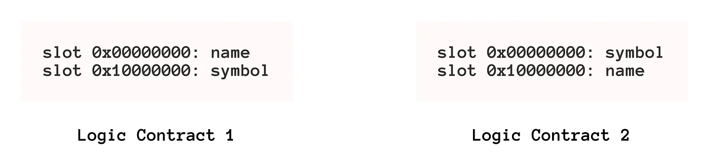
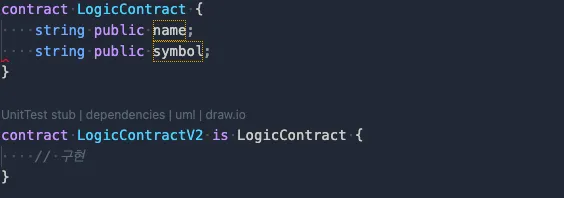
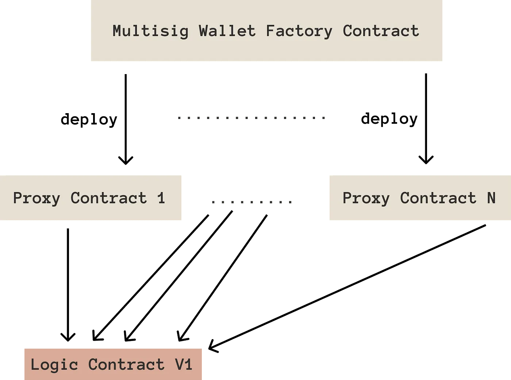
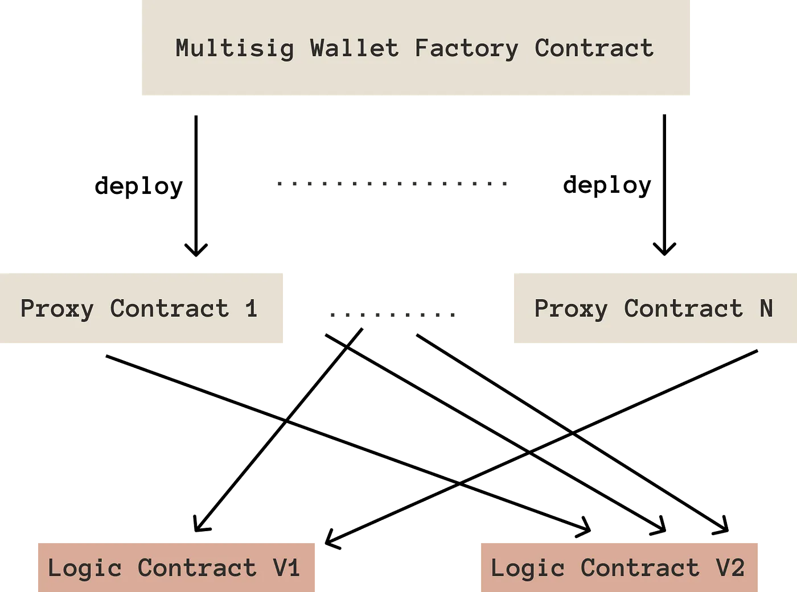
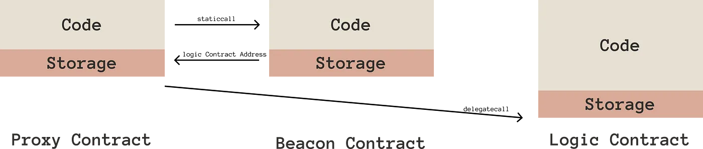
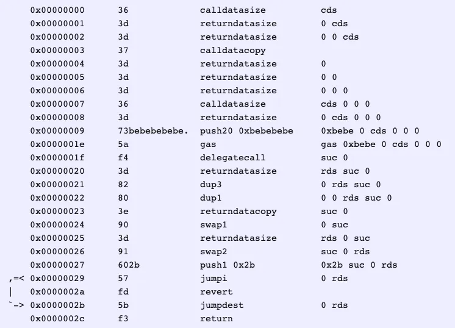
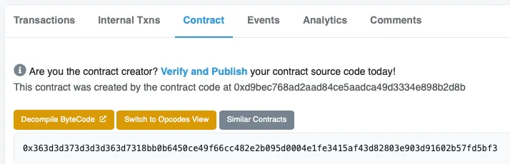
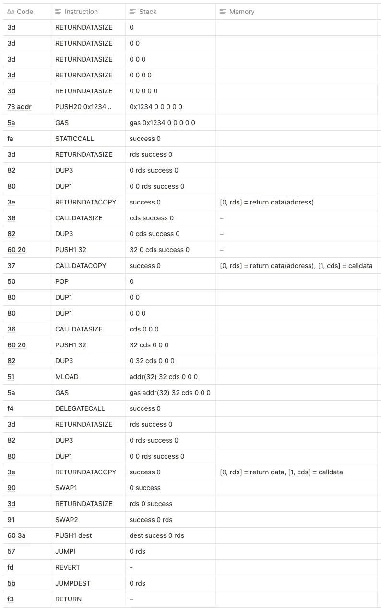
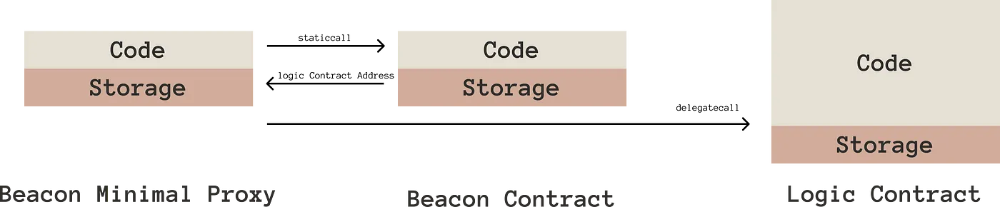

## 가장 작은 크기로, 업그레이드 가능한 스마트 컨트랙트와 🏭factori.eth

블록체인의 불변성으로 인하여, 스마트 컨트랙트는 블록체인에 배포된 이후에는 업그레이드가 되지 않는 것이 일반적입니다. 업그레이드가 되는 경우도 로직과 대상을 분리하는 방법으로 이뤄지거나, 아래의 방법들을 따르는 것이 일반적입니다.

이 글에서는, 이더리움에서 사용된 업그레이드 가능한 스마트 컨트랙트 패턴을 알아보고, 궁극적으로 업그레이드 가능한 Minimal Beacon Proxy와 Factori.eth를 소개합니다.

## 표준 프록시 컨트랙트(Standard Proxy Contract)

이미 사용이 검증된 경우로 업그레이드 가능한 스마트 컨트랙트는 프록시 컨트랙트에서 `delegatecall`을 이용하여 이미 배포된 컨트랙트를 호출하면, 배포된 컨트랙트의 로직을 프록시 컨트랙트에서 그대로 사용하면서도, 데이터의 저장 공간은 프록시 컨트랙트를 이용하게 됩니다.

아주 잘 만들어진 ERC20 토큰 컨트랙트가 이미 배포되어 있다면, 표준화된 작은 크기의 프록시 컨트랙트만 배포하여 잘 만들어진 토큰 컨트랙트를 이용할 수 있는 것입니다. 또 다른 말로 로직 컨트랙트에 버그가 있다면 프록시 컨트랙트도 동일한 버그를 가지게 됩니다.

이것이 자주 이용되는 형태인 [EIP-1822 Universal Upgradeable Proxy Standard](https://eips.ethereum.org/EIPS/eip-1822)으로 표준안을 따릅니다.

<figure>
    
    <figcaption>EIP-1822, UUPS가 동작하는 방식 개요</figcaption>
</figure>

UUPS의 경우 로직 컨트랙트를 그대로 이용하는 것이 아니라, 프록시 컨트랙트가 로직 컨트랙트를 호출하는 과정을 거치기 때문에, 매번 트랜잭션에서 사용되는 가스 비용이 로직 컨트랙트를 그대로 이용하는 것보다 훨씬 높다는 것이 단점으로 지적됩니다. 대략 1~30% 정도의 가스 비용이 증가하게 됩니다.

그렇다면, 프록시 컨트랙트를 한때는 다중 서명 컨트랙트로, 한때는 ERC20으로 바꿔가며 이용할 수 있지 않을까요? 아쉽게도 이는 불가능합니다. 이러한 이유로 다음과 같은 단점이 있는데, 프록시의 저장 영역 형태가 로직 컨트랙트의 저장 영역 형태를 그대로 따른다는 점입니다.

<figure>
    
    <figcaption>새로운 로직 컨트랙트가 다른 저장 영역 형태를 가진 경우</figcaption>
</figure>

`로직 컨트랙트 1`에 버그가 생겨 저장 영역의 형태가 다른 `로직 컨트랙트 2`로 프록시 컨트랙트를 업데이트한다면 기존 프록시 컨트랙트에 저장된 내용이 사라지거나, 다른 데이터로 덮어쓰이게 됩니다. 다중 서명 지갑 주소가, 토큰 밸런스로 변경되는 이상한 상황이 생길 수도 있다는 것입니다.

<figure>
    
    <figcaption>저장 영역 형태를 변경하지 않고 만드는 최선의 방법</figcaption>
</figure>

이러한 저장 영역의 덮어쓰기를 방지하기 위해서 개발이라는 영역에서 새롭게 업그레이드되는 로직 컨트랙트는 기존 로직 컨트랙트를 상속하는 방법으로 개발됩니다. 이 방법만이 저장 영역을 오염시키지 않는 최선의 방법이며, 이는 코드를 관리하는 영역에서 굉장히 많은 집중을 요합니다.

이러한 문제는 차치하더라도, 업그레이드 측면에서 프록시 컨트랙트는 비용을 많이 발생시킵니다.

<figure>
    
    <figcaption>프록시 컨트랙트를 배포할 때, 기본적인 로직 컨트랙트를 연결</figcaption>
</figure>

위와 같이 다중 서명 프록시 컨트랙트를 배포하면서, 로직 컨트랙트를 연결해 줍니다. 더 높은 보안성을 가진 로직 컨트랙트 V2로 바꾸려면 어떻게 해야 할까요? 프록시 컨트랙트에 예치되어 있는 자산이, 로직 컨트랙트 V1의 버그로 인해 탈취될 위험이 있다면 빠르게 버그가 해결된 로직 컨트랙트 V2로 바꾸어야 할 것입니다.

<figure>
    
    <figcaption>개별 프록시가 각각 다른 로직 컨트랙트를 바라보는 모습</figcaption>
</figure>

따라서 개별 프록시 컨트랙트의 소유자가, 각각 로직 컨트랙트를 업그레이드해야 하기 때문에, 한 번에 모든 업그레이드가 도달하기 어렵다는 문제가 있습니다.

## 비콘 프록시 컨트랙트(Beacon Proxy Contract)

모든 프록시 컨트랙트의 업그레이드를 한 번에 수행하기 위해서, 프록시 컨트랙트와 로직 컨트랙트 사이에 특별한 컨트랙트가 하나 추가되는데, 이것이 바로 비콘 컨트랙트입니다. 기존 프록시 컨트랙트가 로직 컨트랙트의 정보를 가지고 있었다면, 이제 프록시 컨트랙트는 비콘 컨트랙트에 대한 정보만 가지게 됩니다. 그리고 비콘 컨트랙트가 로직 컨트랙트의 정보를 가지게 되며, 프록시 컨트랙트가 사용될 때는 비콘 컨트랙트가 전달하는 로직 컨트랙트 정보로 작동됩니다.

이러한 방법 또한 앞서 소개했던 [EIP-1822](https://eips.ethereum.org/EIPS/eip-1822)에 포함되어 있으며, 누구나 쉽게 도입할 수 있습니다.

<figure>
    
    <figcaption>프록시 컨트랙트와 로직 컨트랙트 사이의 비콘 컨트랙트</figcaption>
</figure>

이전에 본 다중 서명 컨트랙트의 예시에서, 모든 프록시들이 하나의 비콘 컨트랙트를 바라보고 있었다면 비콘 컨트랙트가 가지고 있는 로직 컨트랙트를 변경하는 것으로, 모든 프록시 컨트랙트가 새로운 로직 컨트랙트로 업그레이드 한 것과 같은 효과를 낼 수 있습니다. 특이 케이스로, 아직 기능이 준비되지 않았더라도 비콘 프록시를 이용한다면 추후에 기능을 대규모 컨트랙트로 배포할 수 있다는 것이 장점입니다.

다만, 기존의 프록시 컨트랙트 보다는 트랜잭션에 필요한 가스비가 더 증가하게 됩니다. 작동하기 위해서 비콘 컨트랙트를 순회하는 과정이 그대로 가스비에 반영되게 되는 것입니다. 이는 명백한 단점입니다.

## 미니멀 프록시 컨트랙트(Minimal Proxy Contract)

프록시 컨트랙트의 가장 커다란 문제점은, 실수로 인해 저장 영역이 오염될 수 있다는 점입니다. 이러한 위험성은 배제하고, 단순히 이더리움 체인의 크기를 줄이기 위해 프록시 컨트랙트를 사용하는 방법이 바로, 미니멀 프록시 컨트랙트입니다.

가장 기초적으로 이용되는 프록시 컨트랙트라 하더라도, 스마트 컨트랙트 개발 언어인 솔리디티로 개발됩니다. 코드는 컴파일러를 통해, 이더리움에서 해석할 수 있는 바이트 코드로 변환되는데 이때 많은 코드가 생성됩니다. 실제로 작동에 필요로 하는 코드보다 더 많이 생성되게 됩니다. 실제로 프록시 컨트랙트는 로직 컨트랙트에 `delegatecall`을 호출 할 수 있으면 되기 때문에 컴파일을 거쳐 크기가 증가한 코드는 그다지 의미가 없습니다.

이더리움이 자체적인 Virtual Machine(EVM)을 가지고 있기에, EVM이 해석 가능한 바이트 코드만으로 프록시 컨트랙트를 만든 것이 바로 [EIP-1167 Minimal Proxy Contract](https://eips.ethereum.org/EIPS/eip-1167)입니다.

<figure>
    
    <figcaption>EIP-1167로 구현된 Proxy Contract, 총 45바이트</figcaption>
</figure>

<figure>
    
    <figcaption>EIP-1167로 배포된 토큰 컨트랙트 코드</figcaption>
</figure>

이렇듯, 원하는 컨트랙트를 배포할 때 드는 비용을 획기적으로 낮출 수 있습니다. 잘 최적화된 토큰 컨트랙트를 배포하는데 드는 가스는 대략 적으로 1,671,617gas이고, EIP-1167로 배포된 토큰 컨트랙트의 경우 151,839gas에 지나지 않습니다. 이를 통해 컨트랙트 배포 비용을 혁신적으로 아낄 수 있다는 장점이 있습니다.

코드 크기를 줄여 이더리움의 저장 공간을 줄이는 행위는 많은 사람들이 노력하는 부분이기도 합니다. 수십만 개의 ERC20 토큰의 경우, 표준안이 있지만 각각의 구현체가 이더리움에 배포되어 있기 때문에 이더리움이 처리해야 하는 저장 공간은 어마어마합니다. 이런 경우에 동일한 로직을 이용할 수 있도록 미니멀 프록시의 사용을 적극적으로 도입하는 것이 좋습니다.

다른 장점으로 기존 프록시 컨트랙트를 이용할 때 트랜잭션 가스 비용이 1~30% 정도 증가했다면, EIP-1167의 경우 트랜잭션에 필요한 가스 비용이 아주 소폭 증가한다는 점에서 최대의 이익을 가집니다.

기존 프록시 컨트랙트와 다른 점으로, 배포된 코드에 로직 컨트랙트의 주소가 기록된 방식으로 작동하기에 영원히 변경되지 않는다는 점은 아쉬운 점입니다. 업그레이드가 점진적으로 필요한 영역일 경우 매번 새로운 컨트랙트로 이주하는 과정이 필요할 것이며, 이러한 마이그레이션을 하기 위해 만든 기능들이 많은 DeFi 프로토콜에서 사고를 겪은 지점이기도 합니다.

이런 특성으로 컨트랙트의 업그레이드가 필요한 곳에서는 미니멀 프록시가 사용될 수 없었습니다. 그렇다면, 배포 비용은 줄이고 대규모 컨트랙트를 동시에 업그레이드하는 방법은 없을까요?

## 미니멀 비콘 프록시 컨트랙트(Minimal Beacon Proxy Contract)

대규모 업그레이드와 낮은 트랜잭션 가스비라는 두 가지 토끼를 잡기 위해서 어셈블리 레벨에서 컨트랙트 작업을 시작했습니다. 여기에는 미니멀 프록시와 같은 아주 작은 코드를 가지면서도, 비콘 컨트랙트와 통신하여 로직 컨트랙트의 정보를 받아온 다음에 작동할 수 있도록 작업했습니다.

작업 자체는 6개월 전에 시작했으나 실제 작업은 하루만에 끝낼 수 있었습니다. 😅 많은 커뮤니티 리소스 덕분에 수월하게 작업할 수 있었고, remix를 이용해서 최종 디버깅을 수행하여 결과물을 만들어 낼 수 있었습니다.

<figure>
    
    <figcaption>6개월만에 구현한 미니멀 비콘 프록시, 60바이트.</figcaption>
</figure>

실제로 이를 이용한 배포가 굉장히 저렴해졌습니다. 그러면서도 트랜잭션에 필요한 가스비가 미니멀 프록시 컨트랙트를 사용할 때와 비교했을 때 그다지 증가하지 않았다는 점입니다.

> 미니멀 비콘 프록시 컨트랙트 코드의 라이센스는 LGPLv3이며 직접적으로 코드를 추가하거나 복사해서 사용하는 경우 LGPLv3에 의해 연계되는 코드를 공개하여야 합니다.

<figure>
    
    <figcaption>미니멀 비콘 프록시 컨트랙트의 작동 개요</figcaption>
</figure>

미니멀 비콘 프록시가 완전히 바이트 코드로 이뤄져 있기 때문에, 쉽게 배포할 수 있도록 인터페이스를 만들 필요가 있습니다. 이는 bean the DAO에서 제공하는 컨트랙트 라이브러리를 통해 쉽게 사용할 수 있도록 하였습니다.

> npm install -d @beandao/contracts

이렇게, 이더리움에서 사용하는 프록시 컨트랙트에 대해 쭉 나열해 보았습니다. 이를 트랜잭션 가스비가 적게 드는 순서대로 나열하면, 다음과 같습니다.

1. 미니멀 프록시 컨트랙트
2. 미니멀 비콘 프록시 컨트랙트
3. (넘을 수 없는 통곡의 벽…🧗)
4. 프록시 컨트랙트
5. 비콘 프록시 컨트랙트

물론 이 ‘미니멀 비콘 프록시 컨트랙트’ 또한 저장 영역 오염에 대한 위험성을 줄여주지는 않으며, 좀 더 많은 사용자들의 리뷰를 통해 업그레이드가 관리될 필요성은 여전히 존재합니다. 더군다나 비콘 컨트랙트 또한 관리해야 하는 요소이기에 복잡성은 더욱 증가했다고 볼 수 있는데, 이것을 어떻게 잘 풀어낼 수 있을까요?

## 표준화된 컨트랙트 공장 — 🏭 Factori.eth

Factori.eth는 bean the DAO가 운영하는 두 번째 프로토콜로써, 누구나 다양한 컨트랙트를 미니멀 프록시와 미니멀 비콘 프록시 형태로 배포할 수 있도록 하여, 컨트랙트 배포 비용을 획기적으로 절감시켜주는 데 도움을 줍니다.

앞서 말씀드렸듯이, 비콘 컨트랙트 또한 관리의 대상이며 저장 영역에 대한 오염은 어떻게 해결할 수 있을까요?

Factori.eth를 bean the DAO가 관리하는 프로토콜로 두면서, DAO 구성원들을 다수의 감시자로 Factori.eth를 감찰하게끔 합니다. 등록될 로직 컨트랙트의 만듦세가 좋은지, 또는 업그레이드해야 할 로직 컨트랙트가 저장 영역을 오염시키지 않는지에 대해 자체적으로 판단하여 업그레이드를 진행합니다.

또한 bean the DAO를 통해 배포되는 모든 컨트랙트가 Factori.eth를 통해 배포되므로, bean the DAO 또한 Factori.eth의 열성적인 사용자이자 감시자로써 역할을 톡톡히 수행하게 됩니다.

현재 Factori.eth를 통해서 배포할 수 있는 컨트랙트는 ERC20이 준비되어 있으며, 해당 컨트랙트에는 여러 편의 기능을 가진 확장 기능들이 추가적으로 구현되어 있습니다. 토큰 개발에 대한 특별한 지식을 가지고 있지 않더라도 Factori.eth를 통해 배포된 토큰이라면, 미래의 기능들을 도입하는데 어려움이 없을 것입니다.

앞으로 Factori.eth에 추가될 로직 컨트랙트들은 다음이 준비되어 있습니다.

* NFT 토큰 표준, ERC721
* 더치 옥션
* 다중 서명 지갑
* 토큰 분배 도구
* 그리고 거버넌스까지…

위의 컨트랙트들을 순차적으로 등록할 것이며, 이 목록에 없는 컨트랙트가 있으시다면 [bean the DAO의 👾Discord](https://discord.gg/Gy2hnGWVhr)를 통해 요청하실 수 있습니다.

Factori.eth는 현재 이더리움 메인넷에만 배포되어 있으나, 요청에 따라 다른 네트워크로도 배포할 수 있고, 지속적인 관리를 수행할 수 있으니 언제든 저희에게 알려주세요!

사용중인 컨트랙트에 Factori.eth를 통합하려면, npm 패키지로 설치하여 간단하게 호환성 그리고 통합 테스트를 진행할 수 있으며, 다음의 명령어로 설치할 수 있습니다.

> npm install -d @beandao/factorieth

> FactoriV1: 0x7906743465F43fe72Ced0986D62037920929dDC7

> StandardERC20 Key: 0xd84f5b1df9c4fd84edcba18d9eec1e0598f898a9d84025ffcd437e0b828fbbe5

<figure>

```solidity
/**
 * SPDX-License-Identifier: LGPL-3.0-or-later
 */

pragma solidity ^0.8.0;

import "@beandao/contracts/interfaces/IMint.sol";
import "@beandao/contracts/interfaces/IERC173.sol";
import "@beandao/factorieth/IFactory.sol";

contract Integration {
    IFactory private Factory;
    bytes32 private TOKEN_KEY;

    event Sample(address deployed);

    constructor(address factoryAddr, bytes32 tokenKey) {
        Factory = IFactory(factoryAddr);
        TOKEN_KEY = tokenKey;
    }

    function deployToken(
        string calldata name,
        string calldata symbol,
        uint256 amount
    ) external payable returns (address deployed) {
        bytes[] memory callData = new bytes[](2);
        callData[0] = abi.encodeWithSelector(IMint.mintTo.selector, msg.sender, amount);
        callData[1] = abi.encodeWithSelector(IERC173.transferOwnership.selector, msg.sender);

        bytes memory init = abi.encodeWithSelector(
            bytes4(keccak256("initialize(string,string,string,uint8)")),
            "1",
            name,
            symbol,
            uint8(18)
        );
        deployed = Factory.deploy{value: msg.value}(TOKEN_KEY, init, callData);

        emit Sample(deployed);
    }

    function calculateAddress(string calldata name, string calldata symbol) external view returns (address calculated) {
        bytes memory init = abi.encodeWithSelector(
            bytes4(keccak256("initialize(string,string,string,uint8)")),
            "1",
            name,
            symbol,
            uint8(18)
        );
        calculated = Factory.calculateDeployableAddress(TOKEN_KEY, init);
    }
}
```

<figcaption>Factori.eth를 컨트랙트에 통합하여 배포하는 방법</figcaption>
</figure>

Factori.eth에 등록된 로직 컨트랙트는 각각 다른 식별자를 가지고 있으며, 같은 로직 컨트랙트라 하더라도 미니멀 프록시와, 미니멀 비콘 프록시가 각각 다른 식별자를 가지고 있습니다. 그리고 비콘 미니멀 프록시의 경우 로직 컨트랙트가 변경될 수 있습니다.

앞선 경우와 같이 스마트 컨트랙트에 통합하지 않더라도 팩토리에 직접적으로 트랜잭션을 전송하여 토큰을 생성하는 방법도 준비되어 있습니다.

<figure>

```javascript
const FactoryV1Json = require('@beandao/factorieth/build/contracts/FactoryV1.json');

async function main() {
  const FactoryTemplate = await ethers.getContractFactory(FactoryV1Json.abi, FactoryV1Json.bytecode);
  // 메인넷에 배포된 Factori.eth 주소
  const Factory = await FactoryTemplate.attach('0xD9BEc768Ad2aAd84cE5AAdcA49D3334e898B2D8b');

  // 토큰을 배포하고 초기화 하는데 사용될 Interface
  const ABI = [
    'function initialize(string memory contractVersion, string memory tokenName, string memory tokenSymbol, uint8 tokenDecimals)',
    'function mintTo(address to, uint256 value)',
    'function transferOwnership(address newOwner)',
  ];
  const interfaces = new ethers.utils.Interface(ABI);

  // 토큰 컨트랙트의 버전
  const contractVersion = '1';
  // 토큰 컨트랙트의 이름
  const tokenName = 'Sample Token';
  // 토큰 컨트랙트의 심볼
  const tokenSymbol = 'Sample';
  // 토큰의 소수점 자리
  const tokenDecimals = ethers.BigNumber.from('18');
  // 소수점 자리를 포함하여 토큰을 처음 배포할 숫자는 다음이 됩니다. 100000.000000000000000000
  const initialToken = ethers.BigNumber.from('100000000000000000000000');

  // 토큰을 배포하면서 초기화 할 때 필요한 데이터를 직렬화 합니다.
  const initdata = interfaces.encodeFunctionData('initialize', [
    contractVersion,
    tokenName,
    tokenSymbol,
    tokenDecimals,
  ]);
  
  // 토큰을 생성하는데 필요한 이더 수량을 받아옵니다.
  // 초기 값은 0.001 ETH 이며, 사용될 때 마다 0.3%씩 상승합니다.
  const price = await Factory.getPrice('0x93a29c9777094fdf34309d8a898fd8cdb2717ed3b8209e3fcd9ae5cc6d0c6568');

  // 토큰 컨트랙트를 배포할 때 토큰을 수령하도록 합니다.
  // 해당 작업으로, 토큰 수량이 결정되고 총 공급량이 업데이트 됩니다.
  const mintCallData = interfaces.encodeFunctionData('mintTo', [
    '토큰 수령인의 이더리움 주소',
    initialToken,
  ]);

  // 배포된 토큰 컨트랙트의 소유권 이전(이 작업이 없다면, 토큰 컨트랙트의 소유권은 factory가 가지게 됩니다.)
  // 토큰 컨트랙트의 소유권이 있다면 추후에 토큰을 생성하거나 소각할 수 있습니다.
  const ownerCallData = interfaces.encodeFunctionData('transferOwnership', [
    '토큰 컨트랙트의 소유권을 가질 이더리움 주소',
  ]);

  // factory에서 토큰 컨트랙트의 템플릿 키를 넣고, 초기화 데이터, 그리고 각각 필요한 호출을 배열형태로 넣어줍니다.
  await Factory['deploy(bytes32,bytes,bytes[])'](
    '0x93a29c9777094fdf34309d8a898fd8cdb2717ed3b8209e3fcd9ae5cc6d0c6568',
    initdata,
    [mintCallData, ownerCallData],
    { value: price },
  );
}

main()
  .then(() => process.exit(0))
  .catch(error => {
    console.error(error);
    process.exit(1);
  });
```

<figcaption>Factori.eth를 직접적으로 호출하여 토큰을 생성하는 방법</figcaption>
</figure>

위의 과정들에서 템플릿을 이용하기 위한 비용이 발생하는 것을 알 수 있습니다. 이 비용은 트랜잭션에 사용되는 총 가스비의 1/10 수준에 지나지 않으며, 이렇게 누적된 비용은 bean the DAO의 공금으로써 배포된 컨트랙트의 보안을 위해 사용된다는 점을 미리 알려드립니다.

매번 배포 마다 비용을 지불하는 것이 부담스럽다면, 단 한 번 사용료를 지불하는 것으로 Factori.eth의 모든 컨트랙트를 평생 무료로 사용할 수 있습니다. 또한 bean the DAO와 협의를 통해 필요로 하는 컨트랙트를 등록하여 저렴하게 배포하시기 바랍니다.

아 코드는 이쪽이에요!

[Factori.eth on Github](https://github.com/Nipol/Factori.eth)

### Disclaimer
이 글에서 나타나는 모든 내용은 언제든 바뀔 수 있으며, 코드나 소프트웨어의 제시된 작동을 보장하지 않습니다. 모든 정보는 교육 목적일 뿐이며 투자 조언으로 받아들여서는 안됩니다.
