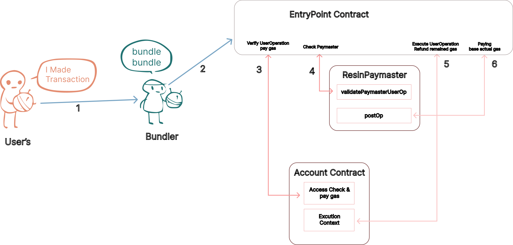
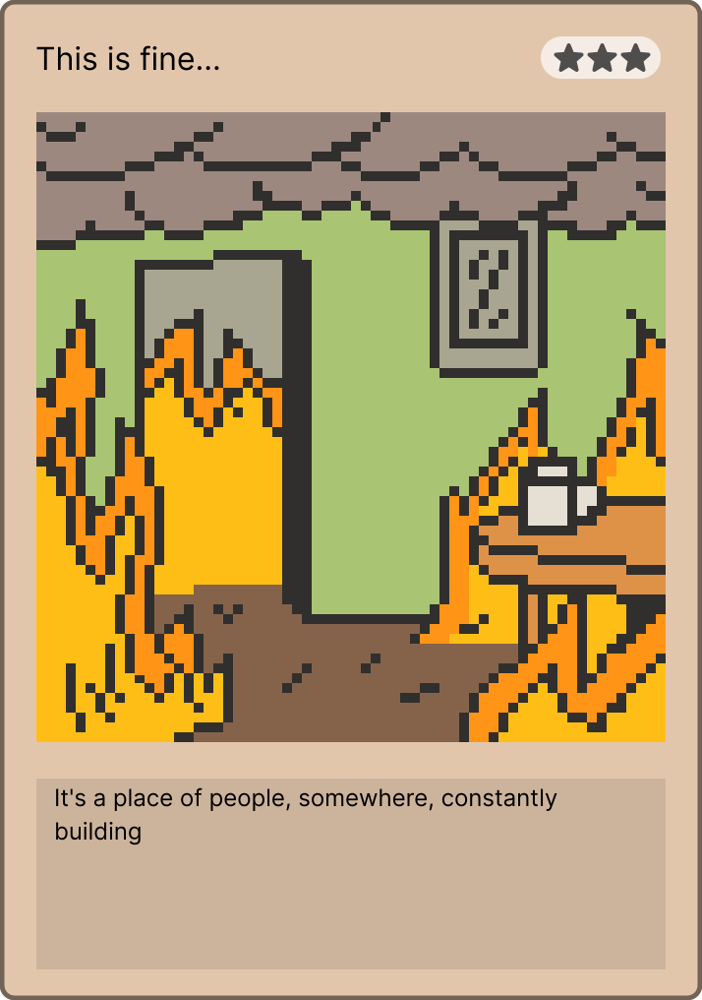
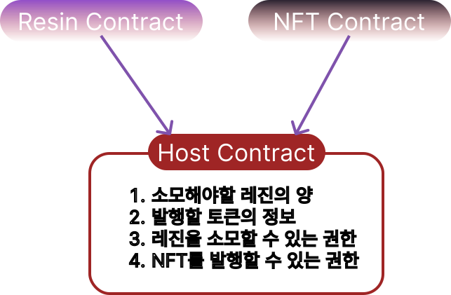
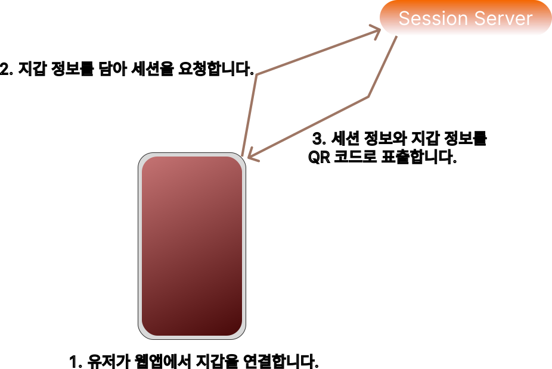
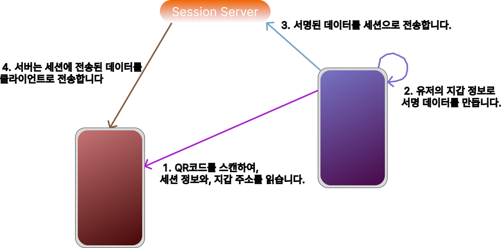
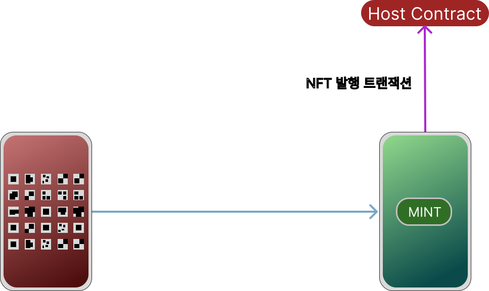

## Contents

## Systems Should Be Designed to Drive Behaviour

I do not even know why after all these years, but I still play Genshin Impact. I started because I was curious how a game with no pre-existing IP could become so beloved, and now it is a game I open every day. I learned a lot from it. I can confidently say it is very well designed in how it trains users and how it guides payment behaviour across the industry.

One of those well-designed systems is called Resin. Most players recognise it as a "fatigue" system, but it does not affect story progression or core gameplay. It is focused only on obtaining resources for character growth. If you take your time and progress steadily, it does not become a hard barrier. Even after spending all Resin, the game still provides materials that can refill it, which is also notable because it reduces player stress.

In general, fatigue systems let content providers both retain users steadily and reduce content consumption speed. The reason users spend fatigue differs by game type. In multiplayer games, players do not want to fall behind others. In single-player games, progress slows down, so users focus on spending all fatigue and become more immersed. In this article, I will record the journey of implementing this kind of system with smart contracts and introducing it into several projects. **However!** Even if you do not know code, I believe you can still take away plenty of practical ideas.

Through this article, we will build a contract that satisfies the following conditions, while keeping the code easy to modify for many different use cases. You can find the code including tests in [Resin on Github](https://github.com/Nipol/Resin).

 * Up to 220 points
 * Up to 1,400 reserve points
 * Recover 1 point every 8 minutes
 * When 220 points are fully recovered, recover reserve points every 15 minutes
 * Recover 60 points through external methods
 * Use reserve points to refill up to 220 points
 * Points cannot be transferred to others

A key characteristic of `blockchain` and `smart contracts` is that real-time update costs are expensive, and exact execution at a desired moment is not guaranteed. Every user will have a different recovery timing. We could implement logic that increments by 1 point each time, but if a central service provider runs that update, cost scales linearly with the number of participants. So instead of updating continuously, the contract should store the time when points were used and calculate points based on elapsed time.

```solidity
//SPDX-License-Identifier: UNLICENSED
pragma solidity ^0.8.0;

/**
 * @title   Resin
 * @author  yoonsung.eth
 * @notice  Users can have up to `220`, and if they have used this system at least once, they can also have up to `1,400` reserve points.
 */
contract Resin {
    // Struct for storing user point information
    // EVM stores in 256-bit units, so this is aligned to 160 bits for single save/load efficiency.
    struct Point {
        // Max 220 points
        uint16 balance;

        // Max 1400 reserve points
        uint16 rBalance;

        // Last access timestamp
        uint128 lastAccess;
    }

    // Max point amount
    uint16 constant MAX_POINT = 220;

    // Max reserve point amount
    uint16 constant MAX_RESERVE_POINT = 1_400;

    // Point recovery interval
    uint128 constant RECOVERY_TIME = 8 minutes;

    // Reserve point recovery interval
    uint128 constant RECOVERY_RESERVE_TIME = 15 minutes;

    // Point data mapped by user address
    mapping(address => Point) public users;

    // The deployer is the owner for now.
    address immutable owner;

    constructor() {
        owner = msg.sender;
    }

    /**
     * @notice  Contract owner can burn `amount` points from a user.
     * @param   user    Target user address
     * @param   amount  Amount of points to burn
     */
    function consumeFrom(address user, uint16 amount) external {
        if (msg.sender != owner) revert();

        // Copy point data from storage to memory.
        Point memory u = users[user];

        // Read current points.
        (uint16 balance, uint16 rBalance) = balanceOf(user);

        // Consume points
        balance -= amount;

        // Update last record.
        (u.balance, u.rBalance, u.lastAccess) = (balance, rBalance, uint128(block.timestamp));

        // Save updated data.
        users[user] = u;
    }

    /**
     * @notice  Refill points to the max 220 using reserve points.
     */
    function recharge() external {
        // Copy point data from storage to memory.
        Point memory u = users[msg.sender];

        // Read current points.
        (uint16 balance, uint16 rBalance) = balanceOf(msg.sender);

        // Fail if already full
        if(balance == MAX_POINT) revert();

        // Calculate required points to fill max
        uint16 req = MAX_POINT - balance;

        // If reserve points are larger than required
        if(rBalance > req) {
            rBalance -= req;
            balance = MAX_POINT;
        } else {
            balance += rBalance;
            rBalance = 0;
        }

        // Update last record.
        (u.balance, u.rBalance, u.lastAccess) = (balance, rBalance, uint128(block.timestamp));

        // Save updated data.
        users[msg.sender] = u;
    }

    /**
     * @notice  Returns user's current points and reserve points.
     * @param   user        User address
     * @return  balance     Current points
     * @return  rBalance    Current reserve points
     */
    function balanceOf(address user) public view returns (uint16 balance, uint16 rBalance) {
        // Copy point data from storage to memory.
        Point memory u = users[user];

        // Skip overflow checks in this block
        unchecked {
            // If this address has never used the system, show default points only.
            if (u.lastAccess == 0) return (MAX_POINT, 0);

            // Record elapsed time from last access.
            uint128 timePassed = uint128(block.timestamp) - u.lastAccess;

            // Load values via tuple
            (balance, rBalance) = (u.balance, u.rBalance);

            // Calculate required points.
            uint16 reqP = MAX_POINT - balance;

            // Convert elapsed time into base points.
            uint16 termP = uint16(timePassed / RECOVERY_TIME);

            // Final point calculation
            balance += reqP > termP ? termP : reqP;

            // If required points are larger:
            // set timePassed to 0.
            // If points recovered in the period are larger, subtract time for required points only.
            timePassed -= reqP > termP ? timePassed : (uint128(reqP) * RECOVERY_TIME);

            if(timePassed >= RECOVERY_RESERVE_TIME) {
                rBalance += uint16(timePassed / RECOVERY_RESERVE_TIME);
                if (rBalance > MAX_RESERVE_POINT) rBalance = MAX_RESERVE_POINT;
            }
        }
    }
}
```

Code integrity still needs more complex tests, but overall the functionality works well. One important design point here is that users do not interact with the Resin contract directly. Instead, external contracts call Resin so only valid point amounts are consumed.

Building small, verifiable modules and then combining them is one of the best ways to build systems, so let us review several ways Resin can be used.

## Several Ways to Use Points

To validate the usability of this fatigue system, I will explain several example projects and introduce code that can apply it. These examples are limited to three cases: "direct use of Resin," "indirect use by others," and "delegated point spending."

### Account Abstraction Gas Fees Paid with Resin

You can also use this for contract-account transaction fees by requiring users to accumulate Resin first and spend it when sending transactions. For example, this can regulate overall transaction pace on low-fee networks. It is also suitable for incentive-driven tests targeting many users. Rather than letting everyone consume everything at once, users can keep exploring strategies over time, and contributions can be scored by the amount of consumed Resin. Since many of these activities happen on testnets, users can join tests without preparing too much in advance.

<figure class="mx-auto">
  
  <figcaption>A Paymaster that pays AA fees on behalf of users</figcaption>
</figure>

Below is an example `Paymaster` contract that pays AA gas fees while consuming the AA user's Resin.

```solidity
// SPDX-License-Identifier: MIT
pragma solidity ^0.8.0;

import "./IResin.sol";
import "./IPaymasterUser.sol";

// Consume a base of 20 points per AA tx, plus 1 point for each 10,000 actual gas cost.
contract ResinPaymaster is IPaymasterUser {
    IResin public r;

    constructor(address _resin) {
        r = IResin(_resin);
    }

    // Check whether this UserOperation can be handled by this Paymaster
    function validatePaymasterUserOp(UserOperation calldata userOp, bytes32, uint256 maxCost) external returns (bytes memory, uint256) {
        if (msg.sender != 0x5FF137D4b0FDCD49DcA30c7CF57E578a026d2789) revert();

        (uint16 b, ) = r.balanceOf(userOp.sender);

        // If there are not even 30 points (20 base + 10 buffer), fail.
        if(b < 30) revert();

        // Encode user address for postOp
        bytes memory ctx = abi.encode(userOp.sender);
        return (ctx, 0);
    }

    function postOp(PostOpMode mode, bytes calldata context, uint256 actualGasCost) external {
        // Consume points regardless of transaction state.
        (mode);

        if (msg.sender != 0x5FF137D4b0FDCD49DcA30c7CF57E578a026d2789) revert();

        // AA address info passed in encoded context
        address aaUser = abi.decode(context, (address));

        // Base 20 points + 1 extra point per 10,000 gas
        uint256 variablePoint = 20 + ((actualGasCost / 10000) * 1);
        r.consumeFrom(aaUser, variablePoint);
    }

    // Remaining gas deposit/withdraw logic...
}
```

With this logic, transaction fees can be handled using Resin points held by AA users. Paying expensive transaction costs through a `Paymaster` may not always be realistic, but this can still be useful on low-fee rollup networks, newly launched networks, or DAO environments where distributing benefits to members matters.

### Let Someone Else Spend Gas to Consume Your Resin

A point system like Resin is most naturally used with immediate spend-and-deduct behaviour, but there are cases where this action must be delegated. In the previous `Paymaster` example, the contract must be granted permission to burn Resin. However, giving this permission to every contract requires heavy governance, and selecting participants one by one is close to impossible in a real ecosystem. So we need a method where I can pass "proof for spending my points" to someone else. Similar to [EIP-2612](https://eips.ethereum.org/EIPS/eip-2612), we can allow a specific action (for example, point spending) through [EIP-712](https://eips.ethereum.org/EIPS/eip-712). Below, we extend the existing Resin contract to support this.

```solidity
...

contract Resin {
    ...

    // EIP712 Typing Structures
    bytes32 public constant DOMAIN_TYPEHASH = keccak256(
        "EIP712Domain(string name,string version,uint256 chainId,address verifyingContract)"
    );

    bytes32 public constant POINT_TYPEHASH = keccak256(
        "Point(address from,address user,uint16 amount,uint256 nonce,uint256 deadline)"
    );

    bytes32 immutable public DOMAIN_SEPARATOR;

    // Per-user nonce
    mapping(address => uint) public nonces;

    constructor() {
        owner = msg.sender;
        // Create the unique domain key for this contract.
        DOMAIN_SEPARATOR = keccak256(
            abi.encode(
                DOMAIN_TYPEHASH,
                keccak256(bytes("Resin")), // app name
                keccak256(bytes("1")), // version
                block.chainid,
                address(this)
            )
        );
    }

    // Verify and execute via EIP712 signature
    function permit(
        address from,
        address user,
        uint16 amount,
        uint256 deadline,
        uint8 v,
        bytes32 r,
        bytes32 s
    ) external {
        // Expiry for this signature data
        if(block.timestamp > deadline) revert();

        // Verify caller is an allowed address
        if(msg.sender != from) revert();

        // Compose user-signed digest
        bytes32 digest = keccak256(
            abi.encodePacked(
                "\x19\x01",
                DOMAIN_SEPARATOR,
                keccak256(abi.encode(POINT_TYPEHASH, from, user, amount, nonces[user]++, deadline))
            )
        );

        address recoveredAddress = ecrecover(digest, v, r, s);
        if(recoveredAddress == address(0) || recoveredAddress != user) revert();

        // Consume points. `consumeFrom` was external, so copy that logic here.
        // Copy user point data from storage to memory.
        Point memory u = users[user];

        // Read current points.
        (uint16 balance, uint16 rBalance) = balanceOf(user);

        // Consume points
        balance -= amount;

        // Update last record.
        (u.balance, u.rBalance, u.lastAccess) = (balance, rBalance, uint128(block.timestamp));

        // Save updated final data.
        users[user] = u;
    }

    ...
```

The code above extends the original Resin contract to add delegation-based point usage. This delegation happens through signature data. The most important point is that signature data can authorise wallet actions, so it is critical to build signatures specifically for the action of `spending points`.

Users should sign unique data, and the signed payload effectively follows this shape:

```
Final hash = hash("Resin", "1", 1, Resin contract address, address allowed to spend my points, my address, point amount to spend, current signature counter, signature deadline)
```

Because the signature counter increases by 1 each time a signature is used, the `final hash` changes every time due to hash function properties. A user can generate a signature and pass the spender address, their own address, amount, deadline, and signature data, allowing another contract to reduce the user's points.

```solidity
    function mint(address from, address user, uint16 point, uint256 deadline, uint8 v, bytes32 r, bytes s) external {
        // Example: this function requires exactly 60 points to be burned. Any value other than 60 reverts.
        if(point != 60) revert();

        // Allow point burn via user signature
        r.permit(address(this), user, point, deadline, v, r, s);

        // If point burn succeeded correctly above, this executes.
        _mint();
    }
```

If the user directly calls `mint`, then the contract with this function can still burn user points even without direct burn permission on the Resin contract itself. For contracts distributed by the community on top of Resin points, this is clearly an advantage: they can consume user points without being tightly integrated into the Resin contract.

### Collective NFT

This example is an NFT project designed to give identity to a group of people. Many teams issue NFT series to express belonging, and this NFT was built for the same purpose so anyone can create their own NFT series.

<figure class="mx-auto md:w-1/3">
  
  <figcaption><cite>First series</cite></figcaption>
</figure>

The first series in this system is `Bean`. By equipping NFT traits for eyebrows, eyes, hat, mouth, and background, you can change the Bean's stats. These NFTs are minted by spending Resin points, and points can be spent by attending meetups held in different places. The intent was to place attendance limits through points, and I still believe this mechanism remains valid.

<figure class="mx-auto md:w-1/2">
  
  <figcaption><cite>Background card item for customising Bean,<br/>with an effect that lowers the cost of generating new options.</cite></figcaption>
</figure>

What this project needs is: "Users must be able to mint NFTs using secret information obtainable only at a specific place." At the same time, transactions sent by many users must be processed regardless of order. If we simplify the user scenario, it looks like this.

<figure class="mx-auto">
  
  <figcaption></figcaption>
</figure>

The host prepares a contract that consumes fatigue points to mint NFTs, and a web page where users can mint. Most of what we must focus on lives in the Host contract. To mint through that contract, users must receive a signature from which the host's public key can be recovered. The key logic is ensuring this signature can only be issued in a specific location.

<figure class="mx-auto">
  
  <figcaption></figcaption>
</figure>

When a user connects a wallet on the web page, the page can output QR data containing session and wallet information. This is a preparatory step for short interactions between user and host, and it requires a small backend server that can manage sessions and receive data from the host.

<figure class="mx-auto">
  
  <figcaption></figcaption>
</figure>

The host scans the QR shown on the user's page, reads session information and the wallet address, then creates a signature that authorises that specific wallet address. The host sends this signed data to the backend session, and the backend automatically forwards the signature data to the connected client session.

<figure class="mx-auto">
  
  <figcaption></figcaption>
</figure>

When the user's page receives the signature data automatically, the QR screen changes to a mint button. Transferring session data between web app and backend is relatively easy. Since the signature is created for a specific wallet address, even if the data leaks, it cannot be used by other wallets. Data transfer between web app and backend is in the domain of standard web technology; the actual trust logic is in contract code. Below is an example host-side contract.

```solidity
//SPDX-License-Identifier: UNLICENSED
pragma solidity ^0.8.13;

import "../src/IResin.sol";
import "../src/INFT.sol";

/**
 * @title   Host
 * @author  yoonsung.eth
 * @notice  This contract grants users permission to mint NFTs.
 * @dev     1. NFT minting permission must belong to this contract.
 *          2. Resin burn permission must belong to this contract.
 */
contract Host {
    // Token info to mint
    uint256 constant TOKEN_INFO = 19900124;
    // Resin points to consume
    uint16 constant RESIN_CONSUME = 80;
    // Resin contract address
    IResin r;
    // NFT contract address to mint
    INFT n;
    // Owner address of this contract
    address immutable owner;

    // Check whether an address already minted
    mapping(msg.sender => bool) public isMinted;

    // Pass resin and nft contract addresses.
    constructor(address resin, address nft) {
        r = IResin(resin);
        n = INFT(nft);
        owner = msg.sender;
    }

    function mint(bytes calldata signature) external {
        // Revert if caller already minted
        if(isMinted[msg.sender]) revert();

        // stored chainid
        uint256 chainId;

        // load chainid
        assembly {
            chainId := chainid()
        }

        // Data signed by contract owner:
        // hID = hash(token id + caller address + this contract address + chain id)
        // This ID is sufficiently unique.
        bytes32 hID = keccak256(
            abi.encode(
                TOKEN_INFO,
                msg.sender,
                address(this),
                chainId
            )
        );

        // Decode signature data into v, r, s and store in memory.
        uint8 v;
        bytes32 r;
        bytes32 s;

        assembly {
            calldatacopy(mload(0x40), signature.offset, 0x20)
            calldatacopy(add(mload(0x40), 0x20), add(signature.offset, 0x20), 0x20)
            calldatacopy(add(mload(0x40), 0x5f), add(signature.offset, 0x40), 0x2)

            // check signature malleability
            if gt(mload(add(mload(0x40), 0x20)), 0x7FFFFFFFFFFFFFFFFFFFFFFFFFFFFFFF5D576E7357A4501DDFE92F46681B20A0) {
                mstore(0x0, 0x01)
                return(0x0, 0x20)
            }

            r := mload(mload(0x40))
            s := mload(add(mload(0x40), 0x20))
            v := mload(add(mload(0x40), 0x40))
        }

        // Recover public key and compare with contract owner. Revert if mismatch.
        if(ecrecover(hID, v, r, s) != owner) revert();

        // Burn points
        r.consumeFrom(msg.sender, RESIN_CONSUME);

        // Mint NFT
        n.mint(TOKEN_INFO, msg.sender);

        // Record that NFT has been minted
        isMinted[msg.sender] = true;
    }
}
```

What this code guarantees is that users can be authorised to mint NFTs, and even if that authorisation leaks, other users cannot steal it to mint for themselves. Since the core trust logic is in the contract, web session management is mainly a transport layer, so I will not implement that part in this article. You can still check example code in [MiniSession on Github](https://github.com/Nipol/MiniSession).

You could also send data browser-to-browser with tools like [libp2p](https://libp2p.io/). Since it removes the need to run a session server and can better handle router-restricted or varied network conditions, it may be an even better option.

### Fatigue for Leaner Meetings

<figure class="mx-auto">
  
  <figcaption><cite>People sitting around a campfire in a meeting</cite> - DALL·E 3</figcaption>
</figure>

In companies, splitting time between meetings and actual work is often difficult. In truth, this is not complicated. Meeting organisers should prepare so participants can decide quickly, and participants should preview the agenda beforehand.

However, in reality this often does not happen, and people frequently feel that each other's work time is being taken away. Still, meetings run by only a few people can reduce overall conversation quality or cause fixation among members, so broader participation is necessary. I think applying a point system here can drive behavioural change: let employees join meetings autonomously, while reducing incentives for over-scheduling or over-attending meetings. Let us apply the fatigue system here as well.

If we design it with the following constraints:

* Company members work 5 days a week.
* Members receive up to 30 points per week, and up to 6 points per day.
* 1 point must be consumed per hour.
* Members must consume at least 8 points per week; consuming more than 22 points means over-participation in meetings.
* Meeting hosts are the entities that consume participant points.
* A host cannot consume more than `(number of all members * 30) * 0.2` points per week.
    * This ratio should be adjusted by company characteristics and team behaviour.

Many companies want to build their own culture through governance. I believe mechanisms like this can push governance culture further. If a fatigue system is introduced to meetings and mandatory point consumption is defined, it could become a strong trigger for more open and public meeting practices.

## Ultimate Goal: A Fatigue System That Does Not Feel Stressful

The examples above are only a tiny subset of where this point system can be used. Most importantly, I think how we make users recognise and accept the point system matters most. There is a lot users need to learn before blending into a system, but teaching everything at once is impossible. Reducing drop-off should be treated as an even higher priority. I hope a fatigue system in everyday life can become a good device to start this discussion.

## Disclaimer
All content in this article may change at any time and does not guarantee the presented behaviour of code or software. All mentioned information is for educational purposes only and should not be taken as investment advice.
