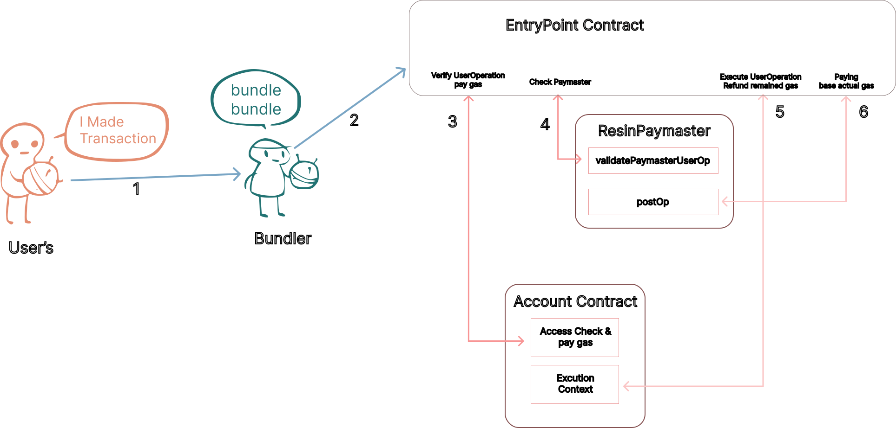
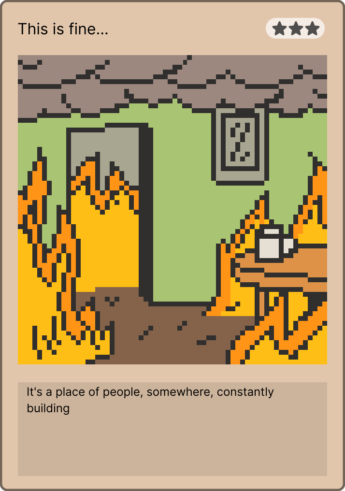
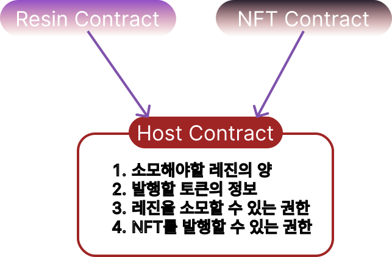
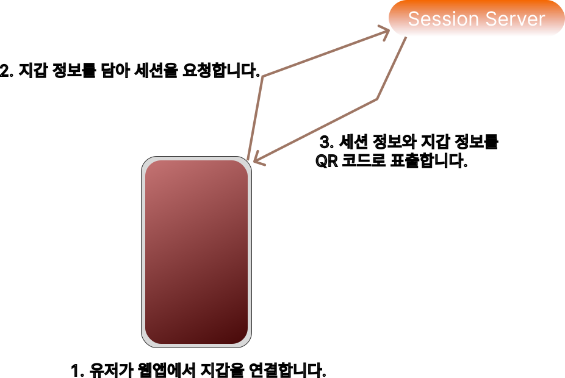
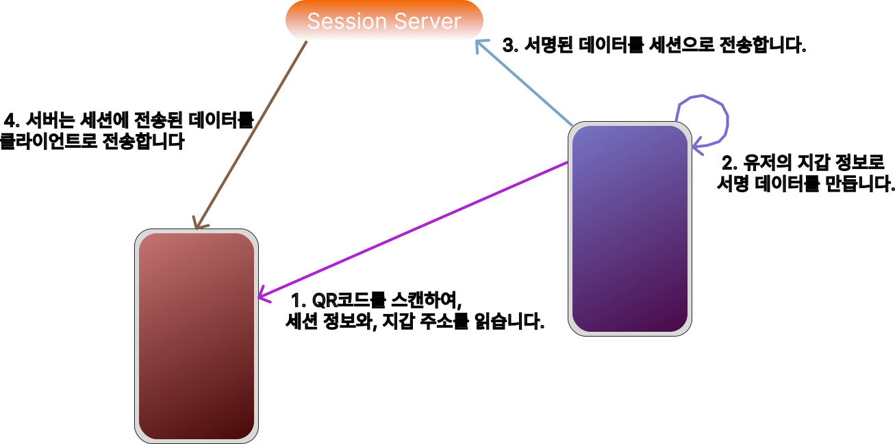
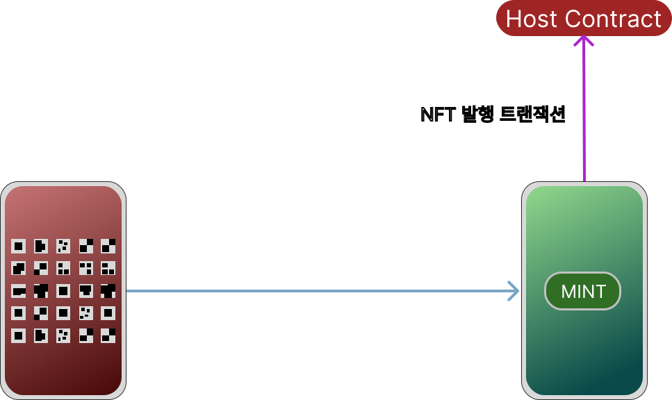

## 목차

## 시스템은 행동을 이끌어내도록 설계되어야 한다

몇 년째 재미를 느끼는지 모르겠지만 원신(Genshin Impact)을 하고 있습니다. 처음에는 IP의 기반이 없는 게임이 어떻게 사랑받는지 궁금해서 했던 게임이 지금은 매일 찾는 게임이 되었습니다. 정말 배울 점이 많았습니다. 유저를 학습시키는 방법과 업계 전반적으로 지불을 유도하는 방법이 아주 잘 설계되었다는 말을 할 수 있겠습니다.

이렇게 잘 설계된 게임의 시스템 중에는 레진이라는 것이 존재합니다. 대체로 플레이어들은 '피로도' 시스템으로 인식되는 부분이지만 플레이와 이야기를 진행시키는 데에는 아무런 영향을 미치지 않습니다. 이는 오직 캐릭터를 육성하는 재화를 얻는 것에만 초점이 맞춰져 있으며, 시간을 느긋하게 가지면서 육성을 한다면 이는 게임 플레이에 있어 허들이 되는 존재는 아닙니다. 레진을 모두 소모했다 하더라도, 레진을 재충전할 수 있는 재화도 게임 내에서 얻을 수 있으므로 플레이어의 스트레스를 줄인 것도 눈여겨볼 부분입니다.

일반적으로 피로도 시스템을 가지고 있는 콘텐츠 제공자는 유저들을 착실하게 모을 수 있는 수단으로 동작하면서도 콘텐츠의 소비 속도를 줄일 수 있다는 점으로 부각됩니다. 피로도의 소비 이유는 게임의 특성마다 다른데, 멀티플레이가 되는 게임에서는 타인 보다 뒤쳐지고. 싱글 플레이 게임이라면 진행도가 늦춰지기에 피로도를 모두 소진하는 것에 집중하여 게임에 대한 몰입도가 커지게 됩니다. 이 글에서는 이러한 시스템을 스마트 컨트랙트를 이용하여 구현하고, 몇 가지 프로젝트에 이를 도입하는 여정을 기록합니다. **그러나!** 코드를 모르더라도 이러한 아이디어에 대한 내용은 충분이 얻어가실 수 있으리라 생각합니다.

해당 글을 통해서 다음 조건을 만족하는 컨트랙트를 구현할 것이며 최대한 다양한 예시에 걸맞게 수정하기 쉬운 코드를 제공할 것입니다. 테스트 코드를 포함한 코드는 [Resin on Github](https://github.com/Nipol/Resin) 저장소에서 확인하실 수 있습니다.

 * 최대 220 포인트
 * 최대 1,400 예비 포인트
 * 8분마다 1포인트씩 회복
 * 220 포인트가 전부 회복된 경우 15분마다 예비 포인트 회복
 * 다른 외부 수단을 이용하여 포인트를 60씩 회복
 * 예비 포인트를 이용하여 최대 220포인트 회복 가능
 * 포인트를 타인에게 양도 불가

`블록체인`과 `스마트 컨트랙트`의 특징이라면 실시간 업데이트 비용이 비싸고, 원하는 시점에 정확하게 작동하는 것을 보장하지 않는다는 점입니다. 각 유저들마다 포인트를 회복하는 시점이 전부 다를 것이며 1포인트씩 증가시키는 로직을 구현할 수도 있겠으나 이런 로직을 특정된 서비스 제공자가 수행하는 경우, 업데이트 비용은 참여자들의 수만큼 선형적으로 증가하게 됩니다. 따라서 컨트랙트는 매번 업데이트되는 방식이 아니라 포인트가 사용된 시점을 지정하여 시간에 따라 포인트를 계산하도록 하여야 합니다.

```solidity
//SPDX-License-Identifier: UNLICENSED
pragma solidity ^0.8.0;

/**
 * @title   Resin
 * @author  yoonsung.eth
 * @notice  유저들은 최대 `220`를 가지며 해당 시스템을 한 번이라도 이용하였다면 예비포인트도 `1,400`를 가질 수 있습니다.
 */
contract Resin {
    // 사용자의 포인트 정보를 저장하는 구조체
    // EVM은 256 비트 단위로 저장하므로, 한 번에 저장 및 로드를 할 수 있도록 160bit로 맞췄습니다.
    struct Point {
        // 최대 220 포인트
        uint16 balance;

        // 최대 1400 예비 포인트
        uint16 rBalance;

        // 마지막 접근 시간
        uint128 lastAccess;
    }

    // 최대 포인트 수량
    uint16 constant MAX_POINT = 220;

    // 최대 예비 포인트 수량
    uint16 constant MAX_RESERVE_POINT = 1_400;

    // 포인트 회복 시간
    uint128 constant RECOVERY_TIME = 8 minutes;

    // 예비 포인트 회복 시간
    uint128 constant RECOVERY_RESERVE_TIME = 15 minutes;

    // 사용자 주소에 연결된 포인트 정보
    mapping(address => Point) public users;

    // 당장 해당 컨트랙트를 배포한 사용자가 소유자가 됩니다.
    address immutable owner;

    constructor() {
        owner = msg.sender;
    }

    /**
     * @notice  컨트랙트의 소유자가 사용자의 포인트를 `amount`만큼 소각 시킬 수 있습니다.
     * @param   user    대상이 되는 사용자의 주소
     * @param   amount  소각할 포인트의 수량
     */
    function consumeFrom(address user, uint16 amount) external {
        if (msg.sender != owner) revert();

        // 사용자의 포인트 정보를 스토리지 영역에서 메모리 영역으로 복사합니다.
        Point memory u = users[user];

        // 현재 포인트 값을 가져옵니다.
        (uint16 balance, uint16 rBalance) = balanceOf(user);

        // 포인트를 사용합니다
        balance -= amount;

        // 마지막 기록을 업데이트 합니다.
        (u.balance, u.rBalance, u.lastAccess) = (balance, rBalance, uint128(block.timestamp));

        // 업데이트 된 최종 정보를 저장합니다.
        users[user] = u;
    }

    /**
     * @notice  예비 포인트를 최대 포인트 220에 맞춰 충전합니다.
     */
    function recharge() external {
        // 사용자의 포인트 정보를 스토리지 영역에서 메모리 영역으로 복사합니다.
        Point memory u = users[msg.sender];

        // 현재 포인트 값을 가져옵니다.
        (uint16 balance, uint16 rBalance) = balanceOf(msg.sender);

        // 포인트가 220이면 실패
        if(balance == MAX_POINT) revert();

        // 최대 포인트를 채우기 위해 필요한 포인트 수량 계산
        uint16 req = MAX_POINT - balance;

        // 예비포인트가 필요 포인트 수량보다 많다면
        if(rBalance > req) {
            rBalance -= req;
            balance = MAX_POINT;
        } else {
            balance += rBalance;
            rBalance = 0;
        }

        // 마지막 기록을 업데이트 합니다.
        (u.balance, u.rBalance, u.lastAccess) = (balance, rBalance, uint128(block.timestamp));

        // 업데이트 된 최종 정보를 저장합니다.
        users[msg.sender] = u;
    }

    /**
     * @notice  해당 함수는 사용자의 현재 포인트와 예비 포인트를 반환합니다
     * @param   user        사용자의 주소
     * @return  balance     현재 포인트
     * @return  rBalance    현재 예비 포인트
     */
    function balanceOf(address user) public view returns (uint16 balance, uint16 rBalance) {
        // 사용자의 포인트 정보를 스토리지 영역에서 메모리 영역으로 복사합니다.
        Point memory u = users[user];

        // 해당 블록 안에서는 overflow 유무를 검사하지 않습니다
        unchecked {
            // 한 번도 시스템에서 사용된 주소가 아니라면 기본 포인트만 보여줍니다
            if (u.lastAccess == 0) return (MAX_POINT, 0);

            // 현재 시간에서 마지막 접근 시간을 빼서 지난 시간을 기록합니다
            uint128 timePassed = uint128(block.timestamp) - u.lastAccess;

            // 튜플을 이용하여 한번에 가져옵니다
            (balance, rBalance) = (u.balance, u.rBalance);

            // 필요한 포인트 수량을 계산합니다.
            uint16 reqP = MAX_POINT - balance;

            // 지난 시간을 기초 포인트로 환산합니다.
            uint16 termP = uint16(timePassed / RECOVERY_TIME);

            // 최종 포인트 수량 계산
            balance += reqP > termP ? termP : reqP;

            // 필요한 수량이 더 많은 경우
            // timePassed를 0으로 
            // 기간동안의 포인트가 더 크다면, 필요 포인트만큼 곱해서 시간을 뺌
            timePassed -= reqP > termP ? timePassed : (uint128(reqP) * RECOVERY_TIME);

            if(timePassed >= RECOVERY_RESERVE_TIME) {
                rBalance += uint16(timePassed / RECOVERY_RESERVE_TIME);
                if (rBalance > MAX_RESERVE_POINT) rBalance = MAX_RESERVE_POINT;
            }
        }
    }
}
```

보다 복잡한 테스트를 통해서 코드의 무결성을 확인해야 하지만, 대체로 기능은 잘 동작합니다. 이 구현은 사용자는 레진 컨트랙트와 직접적으로 상호작용하지 않으며, 적합한 포인트 수량만을 소모할 수 있도록 외부에서 레진 컨트랙트를 호출하는 방식으로 설계되었다는 것입니다.

무엇이든 작게 만들어 무결성을 확인하고, 그것들을 조합하는 것이 시스템을 구축하는 좋은 방법 중 하나이기에 레진 컨트랙트를 사용하는 다양한 예시를 확인해 보겠습니다.

## 포인트를 사용하는 몇가지 방법

이러한 피로도 시스템의 사용성을 확인하기 위해서 몇 가지 예시 프로젝트를 설명하고 이를 적용할 수 있는 코드를 소개하겠습니다. 이 예시들은 총 3가지인데, '직접 레진을 사용하는 경우'와 '타인이 간접적으로 사용하는 경우' 그리고 '포인트 사용을 대리하는 경우'로 한정했습니다.

### 레진으로 지불하는 Account Abstraction 가스비

레진이 쌓여야먄 이를 소모하여 트랜잭션을 보낼 수 있도록, 컨트랙트 계정의 트랜잭션 비용을 처리하는 데 사용할 수도 있습니다. 예를 들어, 가스비가 저렴한 네트워크에서 전반적인 속도를 조절하는 데 사용될 수 있습니다. 또한 아주 많은 유저를 대상으로 하는 인센티브가 주어지는 테스트에도 적합합니다. 한순간에 모든 것을 소진하는 방식보다 사용자들이 지속적으로 방법을 찾고, 소진된 레진의 수량에 따라 기여도를 계산하도록 할 수 있습니다. 이러한 활동들이 테스트 네트워크에서 이뤄지는 경우가 많기에, 유저들이 더 많은 것을 준비하지 않고 테스트에 참가할 수 있다는 장점도 있습니다.

<figure class="mx-auto">
  
  <figcaption>AA의 수수료를 대신 납부하는 Paymaster</figcaption>
</figure>

다음은, AA의 가스비를 대신 지불하면서 AA의 레진을 소모하는 `Paymaster` 컨트랙트의 예시 코드입니다.

```solidity
// SPDX-License-Identifier: MIT
pragma solidity ^0.8.0;

import "./IResin.sol";
import "./IPaymasterUser.sol";

// AA의 트랜잭션당 기본 포인트 20을 소모하면서, 실제로 사용된 가스비 10000 당 1포인트씩 추가 소모합니다.
contract ResinPaymaster is IPaymasterUser {
    IResin public r;

    constructor(address _resin) {
        r = IResin(_resin);
    }

    // UserOperation이 이 Paymaster에 의해 처리될 수 있는지
    function validatePaymasterUserOp(UserOperation calldata userOp, bytes32, uint256 maxCost) external returns (bytes memory, uint256) {
        if (msg.sender != 0x5FF137D4b0FDCD49DcA30c7CF57E578a026d2789) revert();

        (uint16 b, ) = r.balanceOf(userOp.sender);

        // 기본 포인트 20과 그 버퍼 30도 없다면, 
        if(b < 30) revert();

        // 유저 주소를 postOp에서 확인하기 위해 인코딩
        bytes memory ctx = abi.encode(userOp.sender);
        return (ctx, 0);
    }

    function postOp(PostOpMode mode, bytes calldata context, uint256 actualGasCost) external {
        // 트랜잭션이 어떤 상태이든지 포인트를 소모합니다.
        (mode);

        if (msg.sender != 0x5FF137D4b0FDCD49DcA30c7CF57E578a026d2789) revert();

        // 인코딩되어 넘어온 AA 주소 정보
        address aaUser = abi.decode(context, (address));

        // 기본 20포인트, 만 가스당 1포인트 추가 차감
        uint256 variablePoint = 20 + ((actualGasCost / 10000) * 1);
        r.consumeFrom(aaUser, variablePoint);
    }

    // 나머지 가스비 입금과 출금 로직...
}
```

이러한 로직을 통해 AA가 가지고 있는 레진 포인트를 사용하는 것으로 트랜잭션 수수료를 대신 처리할 수 있습니다. `Paymaster`가 비싼 트랜잭션 비용을 지불하는 것이 현실적이지 않을 수 있으나, 트랜잭션 비용이 저렴한 Rollup 계열 네트워크나 새롭게 런칭하는 네트워크 그리고 멤버십이 중요한 DAO의 구성원들에게 이익을 분배하는 방법으로도 사용할 수 있지 않나 싶습니다.

### 다른 사람이 가스비를 사용하여 레진을 소모하기

레진과 같은 포인트 시스템은 바로 사용되고 즉시 차감이 이뤄지는 것이 합당한 방법이지만, 이러한 사용을 타인에게 대리해야 하는 경우가 있습니다. 앞선 `Paymaster`의 경우 레진을 소모할 수 있는 권한이 등록되어 있어야 합니다. 그러나 모든 컨트랙트에 대해 이러한 권한을 제공하는 것에는 많은 거버넌스가 걸려있고 생태계에 참여하고자 하는 대상을 하나씩 선별하는 것은 불가능에 가깝기 때문에 '내 포인트 사용에 대한 증명'을 타인에게 전달하는 것으로 포인트를 소모하게끔 하는 방법이 필요합니다. 이러한 기능은 [EIP-2612](https://eips.ethereum.org/EIPS/eip-2612)와 같이 [EIP-712](https://eips.ethereum.org/EIPS/eip-712)를 이용하는 방법으로 특정한 행동(예를 들어 포인트 소모)을 타인이 수행할 수 있게 허가합니다. 다음은, 이를 기반으로 포인트를 소모할 수 있게 기존 레진 컨트랙트를 확장합니다.

```solidity
...

contract Resin {
    ...

    // EIP712 Typing Structures
    bytes32 public constant DOMAIN_TYPEHASH = keccak256(
        "EIP712Domain(string name,string version,uint256 chainId,address verifyingContract)"
    );

    bytes32 public constant POINT_TYPEHASH = keccak256(
        "Point(address from,address user,uint16 amount,uint256 nonce,uint256 deadline)"
    );

    bytes32 immutable public DOMAIN_SEPARATOR;

    // 사용자별 nonce 값
    mapping(address => uint) public nonces;

    constructor() {
        owner = msg.sender;
        // 해당 컨트랙트에 해당하는 고유 도메인 키를 생성합니다.
        DOMAIN_SEPARATOR = keccak256(
            abi.encode(
                DOMAIN_TYPEHASH,
                keccak256(bytes("Resin")), // 애플리케이션 이름
                keccak256(bytes("1")), // 버전
                block.chainid,
                address(this)
            )
        );
    }

    // EIP712 기반 서명 검증 및 수행
    function permit(
        address from,
        address user,
        uint16 amount,
        uint256 deadline,
        uint8 v,
        bytes32 r,
        bytes32 s
    ) external {
        // 해당 서명 데이터가 사용되어야 하는 시간
        if(block.timestamp > deadline) revert();

        // 내가 허용한 주소가 호출한 것인지 아닌지
        if(msg.sender != from) revert();

        // 유저가 서명한 데이터 구성 
        bytes32 digest = keccak256(
            abi.encodePacked(
                "\x19\x01",
                DOMAIN_SEPARATOR,
                keccak256(abi.encode(POINT_TYPEHASH, from, user, amount, nonces[user]++, deadline))
            )
        );

        address recoveredAddress = ecrecover(digest, v, r, s);
        if(recoveredAddress == address(0) || recoveredAddress != user) revert();

        // 포인트 차감, `consumeFrom` 함수는 앞서 external로 정의 되어 있었으므로 로직을 복사해옵니다.
        // 사용자의 포인트 정보를 스토리지 영역에서 메모리 영역으로 복사합니다.
        Point memory u = users[user];

        // 현재 포인트 값을 가져옵니다.
        (uint16 balance, uint16 rBalance) = balanceOf(user);

        // 포인트를 사용합니다
        balance -= amount;

        // 마지막 기록을 업데이트 합니다.
        (u.balance, u.rBalance, u.lastAccess) = (balance, rBalance, uint128(block.timestamp));

        // 업데이트 된 최종 정보를 저장합니다.
        users[user] = u;
    }

    ...
```

제시된 코드는 기존 레진 컨트랙트 코드를 확장하면서 타인에게 포인트 사용을 위임하도록 기능을 추가하였습니다. 이러한 위임은 서명 데이터를 통해서 이뤄지며 가장 중요한 것은 서명 데이터가 사용자 지갑의 모든 행동을 만들어 낼 수 있는 만큼, `포인트를 소모하는 행동`에 대한 서명 데이터를 만드는 것이 중요합니다. 유저는 유일한 데이터에 서명해야 하며 다음과 같은 구성의 데이터에 서명하게 됩니다. 

```
최종 해시 값 = hash("Resin", "1", 1, Resin 컨트랙트 주소, 내 포인트를 소모할 주소, 내 주소, 포인트 소모 수량, 현재 서명 카운트, 서명의 유효기간)
```

서명 카운트는 서명이 한 번 사용되면 1씩 증가하므로 `최종 해시 값`은 해시 함수의 특성으로 인해 전체 해시 값이 변경됩니다. 유저는 서명을 생성하고 내 포인트를 감소시킬 주소, 자신의 주소, 사용하고자 하는 포인트 수량, 유효기간과 서명 데이터를 전달하는 것으로 다른 컨트랙트 주소가 사용자의 포인트를 감소시킬 수 있습니다.

```solidity
    function mint(address from, address user, uint16 point, uint256 deadline, uint8 v, bytes32 r, bytes s) external {
        // 예시로, 이 함수를 호출하려면 포인트를 60을 소각하여야 합니다. 60이 아닌 값이 들어오면 해당 함수의 실행은 취소됩니다.
        if(point != 60) revert();

        // 사용자가 포인트를 소각하도록 허용
        r.permit(address(this), user, point, deadline, v, r, s);

        // 윗 함수가 올바르게 포인트를 소모했다면, 아래 함수가 실행될 것입니다.
        _mint();
    }
```

유저가 직접 `mint` 함수를 호출해야 한다면 해당 함수를 가지고 있는 컨트랙트는 레진 컨트랙트의 포인트 소각 권한을 가지고 있지 않더라도 유저의 포인트를 소각할 수 있게 됩니다. 레진 포인트를 기반으로 커뮤니티가 배포한 컨트랙트라면 레진 컨트랙트에 굳이 통합되지 않고도 사용자의 포인트를 소각 시킬 수 있다는 것은 분명 장점일 것입니다.

### Collective NFT

이번 예시는 다수의 사람들이 모인 단체에 정체성을 부여하기 위한 NFT 프로젝트입니다. 자신의 소속감을 위해서 NFT 시리즈를 발행하는 경우가 많은데 해당 NFT 또한 동일한 목적으로 만들어져 누구나 자신만의 NFT 시리즈를 만들 수 있습니다.

<figure class="mx-auto md:w-1/3">
  
  <figcaption><cite>첫 번째 시리즈</cite></figcaption>
</figure>

이러한 시스템의 첫 번째 시리즈로 `콩` 이 있습니다. 눈썹, 눈, 모자, 입, 배경에 해당하는 NFT를 장착하는 것으로 `콩`이 가지고 있는 능력치를 변경하게 됩니다. 이러한 NFT들은 레진 포인트를 소모하는 것으로 발행되는데, 포인트의 소모는 곳곳에서 열리는 모임에 참석하는 것으로 소모할 수 있습니다. 포인트를 통해서 참석에 제한을 두기를 바란 것이며 이러한 장치는 여전히 유효하다고 생각합니다.

<figure class="mx-auto md:w-1/2">
  
  <figcaption><cite>Bean을 꾸미기 위한 배경 카드 아이템,<br/>새로운 옵션을 생성하는 비용이 낮아지는 효과가 있습니다.</cite></figcaption>
</figure>

이 프로젝트에서 해야 하는 것은, "사용자가 특정 장소에서만 얻을 수 있는 비밀 정보를 가지고 NFT를 생성할 수 있어야 한다."라는 점이며, 동시에 많은 사용자들이 보내는 트랜잭션을 순서에 관계없이 처리할 수 있어야 합니다. 간단하게 사용자 시나리오를 구성하면, 다음과 같습니다. 

<figure class="mx-auto">
  
  <figcaption></figcaption>
</figure>

호스트는 피로도를 소비하며 NFT를 생성할 수 있는 컨트랙트와 유저가 NFT를 발행할 수 있는 웹페이지를 준비합니다. 저희가 집중해야 할 대부분이 Host 컨트랙트에 있습니다. 해당 컨트랙트로 NFT를 주조하기 위해서 호스트의 공개키를 복원할 수 있는 서명값을 받아야 합니다. 이 서명값을 특정 장소에서만 받을 수 있도록 하는 것이 이 로직의 핵심입니다.

<figure class="mx-auto">
  
  <figcaption></figcaption>
</figure>

유저가 웹페이지에 접속하여 지갑을 연결해두면 웹페이지가 연결된 지갑과 세션에 대한 정보를 QR로 출력할 수 있습니다. 이는 사용자와 호스트의 짧은 상호작용을 위해 사용자가 미리 준비해 둘 수 있는 영역이며, 세션의 관리와 호스트로부터 데이터를 수신 받을 수 있는 작은 백엔드 서버를 준비해야 합니다.

<figure class="mx-auto">
  
  <figcaption></figcaption>
</figure>

사용자의 웹페이지에서 표출된 QR코드를 호스트의 웹페이지를 통해서 읽어 사용자가 연결된 세션 정보와, 지갑 주소를 읽어냅니다. 호스트는 사용자의 지갑 주소를 조합하여 해당 지갑 주소를 허용하는 서명을 만들어, 서명된 데이터를 백엔드의 세션으로 전송합니다. 백엔드는 자동적으로 연결된 세션의 웹페이지로 서명 데이터를 전송하게 됩니다.

<figure class="mx-auto">
  
  <figcaption></figcaption>
</figure>

사용자의 웹페이지가 자동으로 서명 데이터를 수신 받으면, QR을 표시하고 있던 화면은 주조할 수 있는 버튼이 출력됩니다. 웹앱과 백엔드를 두고 세션 사이의 데이터를 전송하는 것은 상대적으로 쉬우며, 사용자의 지갑 주소를 대상으로 서명을 수행하기 때문에 서명 데이터가 유출되었더라도 서명에 사용된 지갑 주소 외에는 사용될 수는 없습니다. 웹앱과 백엔드 사이의 데이터를 전송하는 것은 기존 웹 기술의 영역이고, 실제 검증 로직이 존재하는 부분은 컨트랙트 코드입니다. 다음은 호스트가 사용할 수 있는 컨트랙트 코드입니다.

```solidity
//SPDX-License-Identifier: UNLICENSED
pragma solidity ^0.8.13;

import "../src/IResin.sol";
import "../src/INFT.sol";

/**
 * @title   Host
 * @author  yoonsung.eth
 * @notice  해당 컨트랙트는 유저에게 NFT를 발행할 수 있는 권한을 줍니다.
 * @dev     1. NFT의 발행권한이 해당 컨트랙트에 있을것
 *          2. 레진 소모 권한이 해당 컨트랙트에 있을것
 */
contract Host {
    // 생성할 토큰 정보
    uint256 constant TOKEN_INFO = 19900124;
    // 소모할 레진 포인트 수량
    uint16 constant RESIN_CONSUME = 80;
    // 레진 컨트랙트 주소
    IResin r;
    // 발행할 NFT 컨트랙트 주소
    INFT n;
    // 해당 컨트랙트의 소유자 주소
    address immutable owner;

    // 이미 특정 주소가 NFT를 발행했는지 확인
    mapping(msg.sender => bool) public isMinted;

    // resin 컨트랙트와, nft 컨트랙트 주소를 넣어줍니다.
    constructor(address resin, address nft) {
        r = IResin(resin);
        n = INFT(nft);
        owner = msg.sender;
    }

    function mint(bytes calldata signature) external {
        // 이 함수를 호출한 사용자가 이미 NFT를 발행했다면 호출 실패합니다.
        if(isMinted[msg.sender]) revert();

        // stored chainid
        uint256 chainId;

        // load chainid
        assembly {
            chainId := chainid()
        }

        // 컨트랙트 오너가 서명할 데이터 대상, hID = hash(토큰 아이디 + 함수 실행 주소 + 이 컨트랙트 주소 + 체인아이디)
        // 해당 ID는 충분히 독보적인 데이터입니다.
        bytes32 hID = keccak256(
            abi.encode(
                TOKEN_INFO,
                msg.sender,
                address(this),
                chainId
            )
        );

        // 서명 데이터를 v, r, s로 풀어서 메모리에 저장합니다.
        uint8 v;
        bytes32 r;
        bytes32 s;

        assembly {
            calldatacopy(mload(0x40), signature.offset, 0x20)
            calldatacopy(add(mload(0x40), 0x20), add(signature.offset, 0x20), 0x20)
            calldatacopy(add(mload(0x40), 0x5f), add(signature.offset, 0x40), 0x2)

            // check signature malleability
            if gt(mload(add(mload(0x40), 0x20)), 0x7FFFFFFFFFFFFFFFFFFFFFFFFFFFFFFF5D576E7357A4501DDFE92F46681B20A0) {
                mstore(0x0, 0x01)
                return(0x0, 0x20)
            }

            r := mload(mload(0x40))
            s := mload(add(mload(0x40), 0x20))
            v := mload(add(mload(0x40), 0x40))
        }

        // 서명 데이터로 복원된 공개키를 해당 컨트랙트의 소유자와 비교하여 틀리면 함수 실패
        if(ecrecover(hID, v, r, s) != owner) revert();

        // 포인트 소각
        r.consumeFrom(msg.sender, RESIN_CONSUME);

        // NFT 발행
        n.mint(TOKEN_INFO, msg.sender);

        // NFT가 발행되었다는 기록
        isMinted[msg.sender] = true;
    }
}
```

코드에서 알 수 있는 것은 사용자가 NFT를 주조할 수 있도록 허용하면서도, 이러한 인증이 유출되었더라도 다른 사용자가 인증을 도용하여 NFT를 생성하는 것도 불가능하다는 점입니다. 핵심 로직은 컨트랙트에 있으므로 상대적으로 웹에서 세션을 관리하는 것은 통로의 역할만 수행하므로 이 글에서는 별도의 구현을 하지 않을 것입니다. 다만, [MiniSession on Github](https://github.com/Nipol/MiniSession)를 통해서 예시 코드를 확인할 수 있습니다.

[libp2p](https://libp2p.io/) 와 같은 도구를 이용하여 브라우저에서 브라우저로 데이터를 전송할 수도 있습니다. 세션 서버를 관리할 일이 없고, 공유기 뒤의 제한된 환경이나 다양한 네트워크 상황을 통제할 수 있는 만큼 더 나은 선택이 될 것이라 생각됩니다.

### 최소한의 회의

<figure class="mx-auto">
  
  <figcaption><cite>사람들이 모닥불에 둘러앉아 회의하는 모습</cite> - DALL·E 3</figcaption>
</figure>

회사에서는 회의와 본인의 업무 시간을 분배하는 경우가 힘든 경우가 종종 있습니다. 사실 이는 어렵지 않습니다. 회의를 준비하는 구성원은 회의 참가자들이 빠르게 결정할 수 있도록 준비를 잘 하는 것이고, 회의에 참여하는 사람은 회의가 어떤 내용으로 진행될지 미리 예습을 하는 것입니다.

그러나 실제로 잘 진행되지 않으며 서로의 업무 시간을 뺏고 있다고 느끼는 경우가 있습니다. 그렇다고 일부의 사람들이 회의에 참여하지 않는 것은 전반적인 대화의 품질을 떨어트리거나 구성원들 간의 고착화가 일어날 가능성이 있으므로, 최대한 다양한 사람들이 참여하는 것이 필요합니다. 여기에 포인트 시스템을 적용하여 회사의 구성원들이 자율적으로 회의에 참여하고, 과다하게 회의를 소집하거나 참여하는 경우 인센티브를 줄이도록 설계하는 것입니다.

다음과 같은 기본 사항이 존재합니다.

* 회사 구성원은 주 5일 근무합니다.
* 구성원은 주 최대 30 포인트, 일 최대 6포인트를 부여받습니다.
* 1포인트는 한 시간 단위로 소모되어야 합니다.
* 구성원은 한 주에 최소 8 포인트 이상 소모하여야 하며, 22 포인트 이상 소모하는 경우 과다하게 회의에 참여하는 경우입니다.
* 회의 소집인은, 참여자들의 포인트를 소모하는 주체입니다.
* 소집인은 매주 `(전체 구성원의 수 * 30) * 0.2` 포인트 이상을 소모할 수 없습니다. 
    * 이러한 비율은 회사의 특성과 구성원의 특징에 따라 조정되어야 합니다.

많은 회사들이 각자의 거버넌스를 가지고 회사만의 문화를 만들고 싶어 하지만, 이런 장치가 거버넌스 문화를 더 이끌어 낼 수 있다고 생각합니다. 회의에 피로도 시스템을 도입하고 필수적으로 소모해야 하는 포인트가 정해져 있다면 공개적인 회의를 구성하는 기폭제가 될 수 있을 것으로 기대합니다.

## 궁극의 목표, 스트레스 받지 않는 피로도 시스템

앞선 예시들은 이러한 포인트 시스템을 이용하는 경우들 중 극히 일부이며, 가장 중요한 것은 사용자들에게 포인트 시스템을 인식시키는 방법이 중요하다고 생각합니다. 사용자들이 시스템에 녹아들기 위해서 학습할 내용은 많지만 이 모든 것들을 한 번에 학습 시키는 것이 불가능하며, 이탈률을 줄일 고민을 더욱 중요하게 여겨야 한다고 생각합니다. 일상생활에서의 피로도 시스템이 이러한 논의를 시작하기에 좋은 장치가 되면 좋겠습니다.

## Disclaimer
이 글에서 나타나는 모든 내용은 언제든 변경될 수 있으며, 코드나 소프트웨어의 제시된 작동을 보장하지 않습니다. 모든 언급된 정보는 교육 목적일 뿐이며 투자 조언으로 받아들여서는 안됩니다.